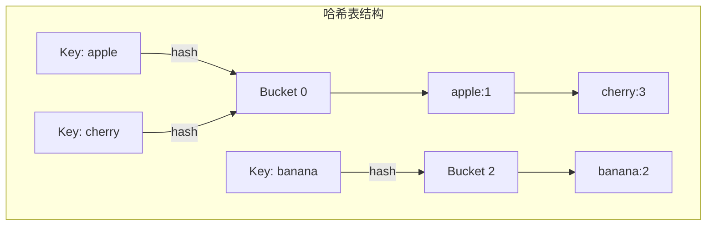

# 哈希表

## 概念说明

哈希表（Hash Table）通过哈希函数将键映射到数组索引，实现 O(1) 平均时间复杂度的查找、插入和删除。Go 内置的 `map` 就是哈希表实现。

算法题中，哈希表常用于：
- 快速查找（两数之和）
- 计数统计（字母异位词）
- 缓存设计（LRU）

## 核心原理



Go map 底层使用拉链法解决哈希冲突，每个 bucket 存储 8 个键值对，溢出时使用 overflow bucket 链接。

## 高频面试题

### 1. 两数之和（LeetCode 1）⭐ 🔥🔥🔥

```go
// twoSum 两数之和
// 思路：用哈希表存储已遍历的数及其索引，查找 target-nums[i] 是否存在
// 时间复杂度：O(n)，空间复杂度：O(n)
func twoSum(nums []int, target int) []int {
    m := make(map[int]int) // 值 -> 索引
    for i, num := range nums {
        if j, ok := m[target-num]; ok {
            return []int{j, i}
        }
        m[num] = i
    }
    return nil
}
```

### 2. 字母异位词分组（LeetCode 49）⭐⭐ 🔥🔥🔥

```go
// groupAnagrams 字母异位词分组
// 思路：将每个单词排序后作为 key，相同 key 的单词归为一组
// 时间复杂度：O(n * k * log(k))，k 为单词最大长度
func groupAnagrams(strs []string) [][]string {
    groups := make(map[string][]string)
    for _, s := range strs {
        // 将字符串排序作为 key
        bs := []byte(s)
        sort.Slice(bs, func(i, j int) bool { return bs[i] < bs[j] })
        key := string(bs)
        groups[key] = append(groups[key], s)
    }
    result := make([][]string, 0, len(groups))
    for _, group := range groups {
        result = append(result, group)
    }
    return result
}
```

### 3. LRU 缓存（LeetCode 146）⭐⭐⭐ 🔥🔥🔥

```go
// LRUCache LRU 缓存实现
// 思路：哈希表 + 双向链表，哈希表实现 O(1) 查找，双向链表维护访问顺序
type LRUNode struct {
    key, value int
    prev, next *LRUNode
}

type LRUCache struct {
    capacity   int
    cache      map[int]*LRUNode
    head, tail *LRUNode // 哨兵节点
}

func NewLRUCache(capacity int) *LRUCache {
    head := &LRUNode{}
    tail := &LRUNode{}
    head.next = tail
    tail.prev = head
    return &LRUCache{
        capacity: capacity,
        cache:    make(map[int]*LRUNode),
        head:     head,
        tail:     tail,
    }
}

func (c *LRUCache) Get(key int) int {
    if node, ok := c.cache[key]; ok {
        c.moveToHead(node) // 访问后移到头部（最近使用）
        return node.value
    }
    return -1
}

func (c *LRUCache) Put(key, value int) {
    if node, ok := c.cache[key]; ok {
        node.value = value
        c.moveToHead(node)
        return
    }
    node := &LRUNode{key: key, value: value}
    c.cache[key] = node
    c.addToHead(node)
    if len(c.cache) > c.capacity {
        removed := c.removeTail() // 移除最久未使用的
        delete(c.cache, removed.key)
    }
}

// addToHead 将节点添加到头部
func (c *LRUCache) addToHead(node *LRUNode) {
    node.prev = c.head
    node.next = c.head.next
    c.head.next.prev = node
    c.head.next = node
}

// removeNode 从链表中移除节点
func (c *LRUCache) removeNode(node *LRUNode) {
    node.prev.next = node.next
    node.next.prev = node.prev
}

// moveToHead 将节点移到头部
func (c *LRUCache) moveToHead(node *LRUNode) {
    c.removeNode(node)
    c.addToHead(node)
}

// removeTail 移除尾部节点（最久未使用）
func (c *LRUCache) removeTail() *LRUNode {
    node := c.tail.prev
    c.removeNode(node)
    return node
}
```

## 代码示例

> 💻 完整可运行代码：[code-examples/01-go-core/algorithm/hashtable/](https://github.com/your-repo/code-examples/01-go-core/algorithm/hashtable/)
> 🏷️ Demo 模式：Part A（直接运行）

## 常见面试题

### Q1: 请手写 LRU 缓存，要求 Get 和 Put 都是 O(1)

**难度**：⭐⭐⭐ | **频率**：🔥🔥🔥

**答题思路**：

1. 哈希表实现 O(1) 查找
2. 双向链表维护访问顺序
3. 最近访问的放头部，淘汰尾部

**标准答案**：

使用 `map[int]*Node` + 双向链表。Get 时将节点移到头部；Put 时如果 key 存在则更新并移到头部，不存在则新建节点加到头部，超容量时删除尾部节点。

**深入追问**：

- LRU 和 LFU 的区别？
- Go 标准库中有类似的缓存实现吗？
- 如何实现线程安全的 LRU？

## 常见陷阱

1. **map 遍历无序**：Go map 遍历顺序是随机的，不要依赖遍历顺序
2. **LRU 双向链表边界**：使用哨兵节点（dummy head/tail）可以避免大量 nil 判断
3. **哈希冲突**：面试中要能解释拉链法和开放寻址法的区别

## 参考资料

- [LeetCode 1. 两数之和](https://leetcode.cn/problems/two-sum/)
- [LeetCode 49. 字母异位词分组](https://leetcode.cn/problems/group-anagrams/)
- [LeetCode 146. LRU 缓存](https://leetcode.cn/problems/lru-cache/)
