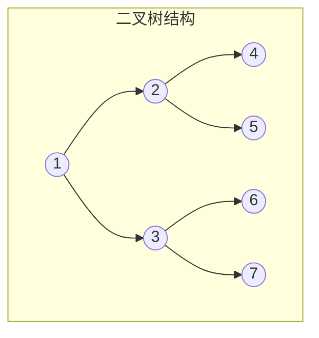

# 树与二叉树

## 概念说明

树是一种非线性数据结构，由节点和边组成。二叉树是每个节点最多有两个子节点的树。面试中树相关的题目出现频率极高，尤其是二叉树的遍历、BST 操作和最近公共祖先。

## 核心原理



### 二叉树节点定义

```go
type TreeNode struct {
    Val   int
    Left  *TreeNode
    Right *TreeNode
}
```

### 四种遍历方式

| 遍历方式 | 顺序 | 上图结果 |
|---------|------|---------|
| 前序遍历 | 根→左→右 | 1,2,4,5,3,6,7 |
| 中序遍历 | 左→根→右 | 4,2,5,1,6,3,7 |
| 后序遍历 | 左→右→根 | 4,5,2,6,7,3,1 |
| 层序遍历 | 逐层从左到右 | 1,2,3,4,5,6,7 |

## 高频面试题

### 1. 二叉树的中序遍历（LeetCode 94）⭐⭐ 🔥🔥🔥

```go
// inorderTraversal 中序遍历（递归）
func inorderTraversal(root *TreeNode) []int {
    var result []int
    var inorder func(node *TreeNode)
    inorder = func(node *TreeNode) {
        if node == nil {
            return
        }
        inorder(node.Left)          // 遍历左子树
        result = append(result, node.Val) // 访问根节点
        inorder(node.Right)         // 遍历右子树
    }
    inorder(root)
    return result
}

// inorderIterative 中序遍历（迭代，用栈模拟）
func inorderIterative(root *TreeNode) []int {
    var result []int
    var stack []*TreeNode
    curr := root
    for curr != nil || len(stack) > 0 {
        // 一路向左，全部入栈
        for curr != nil {
            stack = append(stack, curr)
            curr = curr.Left
        }
        // 弹出栈顶，访问节点
        curr = stack[len(stack)-1]
        stack = stack[:len(stack)-1]
        result = append(result, curr.Val)
        curr = curr.Right // 转向右子树
    }
    return result
}
```

### 2. 二叉树的层序遍历（LeetCode 102）⭐⭐ 🔥🔥🔥

```go
// levelOrder 层序遍历（BFS）
// 思路：使用队列，每次处理一层的所有节点
func levelOrder(root *TreeNode) [][]int {
    if root == nil {
        return nil
    }
    var result [][]int
    queue := []*TreeNode{root}
    for len(queue) > 0 {
        size := len(queue) // 当前层的节点数
        var level []int
        for i := 0; i < size; i++ {
            node := queue[0]
            queue = queue[1:]
            level = append(level, node.Val)
            if node.Left != nil {
                queue = append(queue, node.Left)
            }
            if node.Right != nil {
                queue = append(queue, node.Right)
            }
        }
        result = append(result, level)
    }
    return result
}
```

### 3. 验证二叉搜索树（LeetCode 98）⭐⭐ 🔥🔥🔥

```go
// isValidBST 验证二叉搜索树
// 思路：BST 的中序遍历结果是严格递增的
func isValidBST(root *TreeNode) bool {
    var prev *int
    var validate func(node *TreeNode) bool
    validate = func(node *TreeNode) bool {
        if node == nil {
            return true
        }
        if !validate(node.Left) {
            return false
        }
        if prev != nil && node.Val <= *prev {
            return false
        }
        prev = &node.Val
        return validate(node.Right)
    }
    return validate(root)
}
```

### 4. 二叉树的最近公共祖先（LeetCode 236）⭐⭐⭐ 🔥🔥🔥

```go
// lowestCommonAncestor 最近公共祖先
// 思路：递归查找，如果当前节点是 p 或 q，或者左右子树各找到一个，则当前节点是 LCA
func lowestCommonAncestor(root, p, q *TreeNode) *TreeNode {
    if root == nil || root == p || root == q {
        return root
    }
    left := lowestCommonAncestor(root.Left, p, q)
    right := lowestCommonAncestor(root.Right, p, q)
    if left != nil && right != nil {
        return root // p 和 q 分别在左右子树，当前节点就是 LCA
    }
    if left != nil {
        return left
    }
    return right
}
```

## 代码示例

> 💻 完整可运行代码：[code-examples/01-go-core/algorithm/tree/](https://github.com/your-repo/code-examples/01-go-core/algorithm/tree/)
> 🏷️ Demo 模式：Part A（直接运行）

## 常见面试题

### Q1: 二叉树前中后序遍历的递归和迭代写法？

**难度**：⭐⭐ | **频率**：🔥🔥🔥

**答题思路**：

1. 递归写法简单直观，三种遍历只是访问根节点的时机不同
2. 迭代写法用栈模拟递归过程
3. 中序迭代最常考：一路向左入栈，弹出访问，转向右子树

**标准答案**：

递归时间 O(n) 空间 O(h)（h 为树高）；迭代同样时间 O(n) 空间 O(h)，但避免了递归栈溢出风险。

**深入追问**：

- Morris 遍历了解吗？如何实现 O(1) 空间的中序遍历？
- 如何通过前序和中序遍历结果重建二叉树？

## 常见陷阱

1. **空节点判断**：递归终止条件必须处理 `node == nil`
2. **BST 验证**：不能只比较父子节点，要确保整棵左子树都小于根节点
3. **层序遍历**：记录每层节点数 `size`，否则无法区分层次

## 参考资料

- [LeetCode 94. 二叉树的中序遍历](https://leetcode.cn/problems/binary-tree-inorder-traversal/)
- [LeetCode 102. 二叉树的层序遍历](https://leetcode.cn/problems/binary-tree-level-order-traversal/)
- [LeetCode 98. 验证二叉搜索树](https://leetcode.cn/problems/validate-binary-search-tree/)
- [LeetCode 236. 二叉树的最近公共祖先](https://leetcode.cn/problems/lowest-common-ancestor-of-a-binary-tree/)
