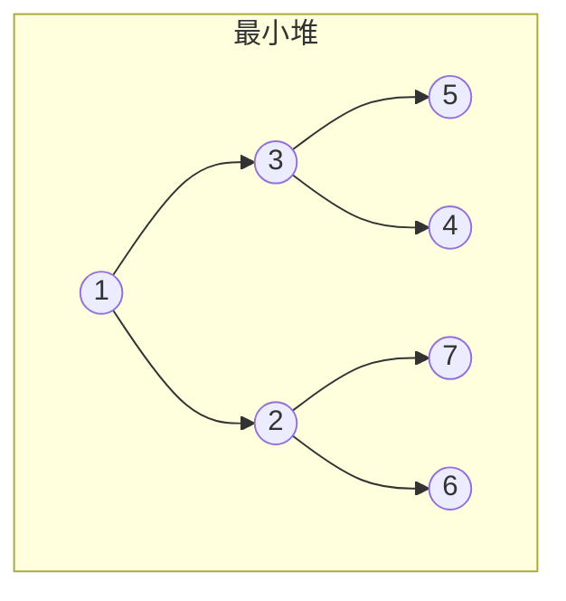

# 堆

## 概念说明

堆（Heap）是一种特殊的完全二叉树，分为最大堆和最小堆。Go 标准库 `container/heap` 提供了堆的接口，只需实现 `heap.Interface` 即可使用。

堆的核心应用：
- **TopK 问题**：维护大小为 K 的堆
- **合并 K 个有序链表**：用最小堆维护 K 个链表的当前最小值
- **优先队列**：任务调度、Dijkstra 算法

## 核心原理



堆的性质：
- 最小堆：父节点 ≤ 子节点
- 最大堆：父节点 ≥ 子节点
- 插入和删除的时间复杂度：O(log n)
- 获取最值：O(1)

### Go container/heap 接口

```go
type Interface interface {
    sort.Interface        // Len, Less, Swap
    Push(x interface{})   // 添加元素
    Pop() interface{}     // 移除并返回最小（或最大）元素
}
```

## 高频面试题

### 1. 数组中的第 K 个最大元素（LeetCode 215）⭐⭐ 🔥🔥🔥

```go
// findKthLargest 第 K 大元素
// 思路：维护大小为 K 的最小堆，堆顶就是第 K 大
// 时间复杂度：O(n log k)，空间复杂度：O(k)
type IntHeap []int

func (h IntHeap) Len() int           { return len(h) }
func (h IntHeap) Less(i, j int) bool { return h[i] < h[j] } // 最小堆
func (h IntHeap) Swap(i, j int)      { h[i], h[j] = h[j], h[i] }
func (h *IntHeap) Push(x interface{}) { *h = append(*h, x.(int)) }
func (h *IntHeap) Pop() interface{} {
    old := *h
    n := len(old)
    x := old[n-1]
    *h = old[:n-1]
    return x
}

func findKthLargest(nums []int, k int) int {
    h := &IntHeap{}
    heap.Init(h)
    for _, num := range nums {
        heap.Push(h, num)
        if h.Len() > k {
            heap.Pop(h) // 弹出最小的，保持堆大小为 k
        }
    }
    return (*h)[0] // 堆顶就是第 K 大
}
```

### 2. 合并 K 个升序链表（LeetCode 23）⭐⭐⭐ 🔥🔥🔥

```go
// mergeKLists 合并 K 个升序链表
// 思路：用最小堆维护 K 个链表的当前头节点，每次取最小的
// 时间复杂度：O(n log k)，n 为总节点数，k 为链表数
```

## 代码示例

> 💻 完整可运行代码：[code-examples/01-go-core/algorithm/tree/](https://github.com/skyhe58/guide-go/tree/main/code-examples/01-go-core/algorithm/tree/)
> 🏷️ Demo 模式：Part A（直接运行）

## 常见面试题

### Q1: TopK 问题有哪些解法？

**难度**：⭐⭐⭐ | **频率**：🔥🔥🔥

**答题思路**：

1. 排序法：O(n log n)
2. 堆法：O(n log k)，维护大小为 K 的堆
3. 快速选择法：O(n) 平均，基于快排 partition

**标准答案**：

面试中推荐堆法（稳定 O(n log k)）或快速选择法（平均 O(n)）。堆法适合数据流场景（数据量未知），快速选择法适合静态数组。

**深入追问**：

- 如果数据量非常大（无法全部加载到内存），怎么求 TopK？
- Go 标准库 `container/heap` 的使用方式？

## 常见陷阱

1. **heap.Interface 实现**：Go 的 heap 需要同时实现 `sort.Interface` 和 `Push/Pop`
2. **最大堆 vs 最小堆**：求第 K 大用最小堆，求第 K 小用最大堆
3. **heap.Init**：使用前必须调用 `heap.Init` 初始化

## 参考资料

- [LeetCode 215. 数组中的第K个最大元素](https://leetcode.cn/problems/kth-largest-element-in-an-array/)
- [LeetCode 23. 合并K个升序链表](https://leetcode.cn/problems/merge-k-sorted-lists/)
- [Go 标准库 container/heap](https://pkg.go.dev/container/heap)
