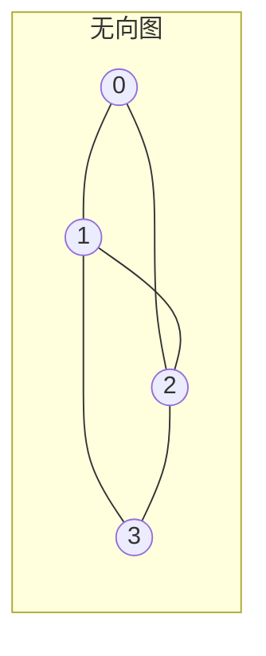

# 图

## 概念说明

图（Graph）由顶点（Vertex）和边（Edge）组成，是比树更通用的数据结构。图的遍历算法 BFS 和 DFS 是面试中的基础考点，也是很多高级算法（最短路径、拓扑排序）的基础。

## 核心原理



### 图的表示方式

```go
// 邻接表（最常用）
graph := map[int][]int{
    0: {1, 2},
    1: {0, 2, 3},
    2: {0, 1, 3},
    3: {1, 2},
}

// 邻接矩阵
matrix := [][]int{
    {0, 1, 1, 0},
    {1, 0, 1, 1},
    {1, 1, 0, 1},
    {0, 1, 1, 0},
}
```

## 高频面试题

### 1. BFS 广度优先搜索

```go
// bfs 广度优先搜索
// 思路：使用队列，逐层遍历
// 时间复杂度：O(V+E)，V 为顶点数，E 为边数
func bfs(graph map[int][]int, start int) []int {
    visited := make(map[int]bool)
    queue := []int{start}
    visited[start] = true
    var result []int
    for len(queue) > 0 {
        node := queue[0]
        queue = queue[1:]
        result = append(result, node)
        for _, neighbor := range graph[node] {
            if !visited[neighbor] {
                visited[neighbor] = true
                queue = append(queue, neighbor)
            }
        }
    }
    return result
}
```

### 2. DFS 深度优先搜索

```go
// dfs 深度优先搜索
// 思路：使用递归或栈，沿一条路径走到底再回溯
// 时间复杂度：O(V+E)
func dfs(graph map[int][]int, start int) []int {
    visited := make(map[int]bool)
    var result []int
    var dfsHelper func(node int)
    dfsHelper = func(node int) {
        visited[node] = true
        result = append(result, node)
        for _, neighbor := range graph[node] {
            if !visited[neighbor] {
                dfsHelper(neighbor)
            }
        }
    }
    dfsHelper(start)
    return result
}
```

### 3. 岛屿数量（LeetCode 200）⭐⭐ 🔥🔥🔥

```go
// numIslands 岛屿数量
// 思路：遍历网格，遇到 '1' 就 DFS 将整个岛屿标记为已访问
func numIslands(grid [][]byte) int {
    if len(grid) == 0 {
        return 0
    }
    rows, cols := len(grid), len(grid[0])
    count := 0
    var dfsGrid func(r, c int)
    dfsGrid = func(r, c int) {
        if r < 0 || r >= rows || c < 0 || c >= cols || grid[r][c] == '0' {
            return
        }
        grid[r][c] = '0' // 标记为已访问
        dfsGrid(r+1, c)
        dfsGrid(r-1, c)
        dfsGrid(r, c+1)
        dfsGrid(r, c-1)
    }
    for r := 0; r < rows; r++ {
        for c := 0; c < cols; c++ {
            if grid[r][c] == '1' {
                count++
                dfsGrid(r, c)
            }
        }
    }
    return count
}
```

## 代码示例

> 💻 完整可运行代码：[code-examples/01-go-core/algorithm/tree/](https://github.com/skyhe58/guide-go/tree/main/code-examples/01-go-core/algorithm/tree/)
> 🏷️ Demo 模式：Part A（直接运行）

## 常见面试题

### Q1: BFS 和 DFS 的区别和应用场景？

**难度**：⭐⭐ | **频率**：🔥🔥🔥

**答题思路**：

1. BFS 用队列，逐层遍历，适合求最短路径
2. DFS 用栈/递归，深入遍历，适合路径搜索、连通性判断
3. BFS 空间复杂度可能更高（存储整层节点）

**标准答案**：

BFS 适合最短路径、层序遍历；DFS 适合路径搜索、拓扑排序、连通分量。时间复杂度都是 O(V+E)。

**深入追问**：

- 如何用 BFS 求无权图的最短路径？
- 拓扑排序用 BFS 还是 DFS？

## 常见陷阱

1. **visited 标记**：必须在入队/递归前标记，否则会重复访问
2. **邻接表 vs 邻接矩阵**：稀疏图用邻接表，稠密图用邻接矩阵

## 参考资料

- [LeetCode 200. 岛屿数量](https://leetcode.cn/problems/number-of-islands/)
- [图论基础](https://oi-wiki.org/graph/)
