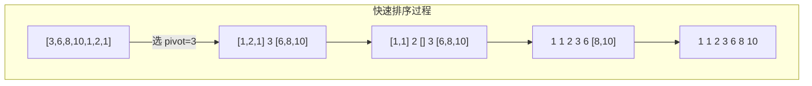

# 排序算法

## 概念说明

排序是算法面试的基础，面试中最常考的是快速排序、归并排序和堆排序。Go 标准库 `sort` 包使用了 pdqsort（Pattern-Defeating Quicksort），是快排的优化变体，值得深入学习。

## 核心原理

### 排序算法对比

| 算法 | 平均时间 | 最坏时间 | 空间 | 稳定性 |
|------|---------|---------|------|--------|
| 快速排序 | O(n log n) | O(n²) | O(log n) | 不稳定 |
| 归并排序 | O(n log n) | O(n log n) | O(n) | 稳定 |
| 堆排序 | O(n log n) | O(n log n) | O(1) | 不稳定 |



## 高频面试题

### 1. 快速排序

```go
// quickSort 快速排序
// 思路：选择 pivot，将数组分为小于和大于 pivot 的两部分，递归排序
// 时间复杂度：平均 O(n log n)，最坏 O(n²)
// 空间复杂度：O(log n)（递归栈）
func quickSort(nums []int, left, right int) {
    if left >= right {
        return
    }
    pivot := partition(nums, left, right)
    quickSort(nums, left, pivot-1)
    quickSort(nums, pivot+1, right)
}

// partition 分区函数
func partition(nums []int, left, right int) int {
    pivot := nums[right] // 选最后一个元素作为 pivot
    i := left            // i 指向小于 pivot 区域的右边界
    for j := left; j < right; j++ {
        if nums[j] < pivot {
            nums[i], nums[j] = nums[j], nums[i]
            i++
        }
    }
    nums[i], nums[right] = nums[right], nums[i]
    return i
}
```

### 2. 归并排序

```go
// mergeSort 归并排序
// 思路：分治法，将数组一分为二，分别排序后合并
// 时间复杂度：O(n log n)，空间复杂度：O(n)
func mergeSort(nums []int) []int {
    if len(nums) <= 1 {
        return nums
    }
    mid := len(nums) / 2
    left := mergeSort(nums[:mid])
    right := mergeSort(nums[mid:])
    return merge(left, right)
}

// merge 合并两个有序数组
func merge(left, right []int) []int {
    result := make([]int, 0, len(left)+len(right))
    i, j := 0, 0
    for i < len(left) && j < len(right) {
        if left[i] <= right[j] {
            result = append(result, left[i])
            i++
        } else {
            result = append(result, right[j])
            j++
        }
    }
    result = append(result, left[i:]...)
    result = append(result, right[j:]...)
    return result
}
```

### 3. 堆排序

```go
// heapSort 堆排序
// 思路：建立最大堆，依次将堆顶（最大值）与末尾交换，缩小堆范围
// 时间复杂度：O(n log n)，空间复杂度：O(1)
func heapSort(nums []int) {
    n := len(nums)
    // 建堆：从最后一个非叶子节点开始下沉
    for i := n/2 - 1; i >= 0; i-- {
        siftDown(nums, i, n)
    }
    // 排序：依次将堆顶与末尾交换
    for i := n - 1; i > 0; i-- {
        nums[0], nums[i] = nums[i], nums[0]
        siftDown(nums, 0, i)
    }
}

// siftDown 下沉操作
func siftDown(nums []int, i, n int) {
    for {
        largest := i
        left, right := 2*i+1, 2*i+2
        if left < n && nums[left] > nums[largest] {
            largest = left
        }
        if right < n && nums[right] > nums[largest] {
            largest = right
        }
        if largest == i {
            break
        }
        nums[i], nums[largest] = nums[largest], nums[i]
        i = largest
    }
}
```

### Go sort 包源码分析

Go 1.19+ 的 `sort.Sort` 使用 pdqsort（Pattern-Defeating Quicksort），结合了快排、堆排和插入排序的优点：

- 小数组（≤12）使用插入排序
- 检测到近乎有序的数据时使用优化策略
- 检测到最坏情况时退化为堆排序
- 正常情况使用三路快排

```go
// Go 标准库 sort 包使用示例
import "sort"

nums := []int{3, 1, 4, 1, 5, 9}
sort.Ints(nums) // 升序排序

// 自定义排序
sort.Slice(nums, func(i, j int) bool {
    return nums[i] > nums[j] // 降序
})
```

## 代码示例

> 💻 完整可运行代码：[code-examples/01-go-core/algorithm/sorting/](https://github.com/skyhe58/guide-go/tree/main/code-examples/01-go-core/algorithm/sorting/)
> 🏷️ Demo 模式：Part A（直接运行）

## 常见面试题

### Q1: 快排的时间复杂度为什么是 O(n log n)？最坏情况是什么？

**难度**：⭐⭐⭐ | **频率**：🔥🔥🔥

**答题思路**：

1. 每次 partition 将数组分为两半，递归深度 O(log n)
2. 每层处理 O(n) 个元素
3. 最坏情况：每次 pivot 选到最大或最小值，退化为 O(n²)

**标准答案**：

通过随机选择 pivot 或三数取中法可以避免最坏情况。Go 标准库使用 pdqsort，在检测到最坏情况时自动切换为堆排序。

**深入追问**：

- 快排和归并排序的区别？各自适用场景？
- Go sort 包底层用的什么算法？为什么？

## 常见陷阱

1. **快排 pivot 选择**：固定选第一个/最后一个元素在有序数组上退化为 O(n²)
2. **归并排序空间**：需要额外 O(n) 空间，不是原地排序
3. **稳定性**：快排和堆排序不稳定，归并排序稳定

## 参考资料

- [Go sort 包源码](https://cs.opensource.google/go/go/+/refs/tags/go1.22.0:src/sort/)
- [pdqsort 论文](https://arxiv.org/abs/2106.05123)
- [排序算法可视化](https://visualgo.net/en/sorting)
