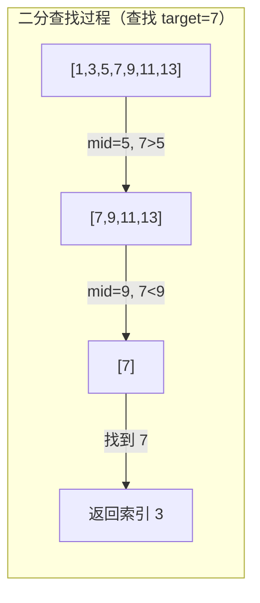

# 二分查找

## 概念说明

二分查找是在有序数组中查找目标值的高效算法，时间复杂度 O(log n)。面试中二分查找的变体非常多，关键在于确定搜索区间和边界条件。

## 核心原理



### 基础模板

```go
// binarySearch 基础二分查找
// 左闭右闭区间 [left, right]
func binarySearch(nums []int, target int) int {
    left, right := 0, len(nums)-1
    for left <= right {
        mid := left + (right-left)/2 // 防止溢出
        if nums[mid] == target {
            return mid
        } else if nums[mid] < target {
            left = mid + 1
        } else {
            right = mid - 1
        }
    }
    return -1
}
```

## 高频面试题

### 1. 搜索旋转排序数组（LeetCode 33）⭐⭐⭐ 🔥🔥🔥

```go
// searchRotated 搜索旋转排序数组
// 思路：二分后至少有一半是有序的，判断 target 在有序的那一半还是无序的那一半
// 时间复杂度：O(log n)
func searchRotated(nums []int, target int) int {
    left, right := 0, len(nums)-1
    for left <= right {
        mid := left + (right-left)/2
        if nums[mid] == target {
            return mid
        }
        // 左半部分有序
        if nums[left] <= nums[mid] {
            if nums[left] <= target && target < nums[mid] {
                right = mid - 1 // target 在左半部分
            } else {
                left = mid + 1 // target 在右半部分
            }
        } else {
            // 右半部分有序
            if nums[mid] < target && target <= nums[right] {
                left = mid + 1 // target 在右半部分
            } else {
                right = mid - 1 // target 在左半部分
            }
        }
    }
    return -1
}
```

### 2. 在排序数组中查找元素的第一个和最后一个位置（LeetCode 34）⭐⭐ 🔥🔥🔥

```go
// searchRange 查找元素的第一个和最后一个位置
func searchRange(nums []int, target int) []int {
    return []int{findFirst(nums, target), findLast(nums, target)}
}

func findFirst(nums []int, target int) int {
    left, right := 0, len(nums)-1
    result := -1
    for left <= right {
        mid := left + (right-left)/2
        if nums[mid] == target {
            result = mid
            right = mid - 1 // 继续向左找
        } else if nums[mid] < target {
            left = mid + 1
        } else {
            right = mid - 1
        }
    }
    return result
}

func findLast(nums []int, target int) int {
    left, right := 0, len(nums)-1
    result := -1
    for left <= right {
        mid := left + (right-left)/2
        if nums[mid] == target {
            result = mid
            left = mid + 1 // 继续向右找
        } else if nums[mid] < target {
            left = mid + 1
        } else {
            right = mid - 1
        }
    }
    return result
}
```

## 代码示例

> 💻 完整可运行代码：[code-examples/01-go-core/algorithm/sorting/](https://github.com/skyhe58/guide-go/tree/main/code-examples/01-go-core/algorithm/sorting/)
> 🏷️ Demo 模式：Part A（直接运行）

## 常见面试题

### Q1: 二分查找的边界条件怎么确定？

**难度**：⭐⭐ | **频率**：🔥🔥🔥

**答题思路**：

1. 确定搜索区间：左闭右闭 `[left, right]` 还是左闭右开 `[left, right)`
2. 循环条件：左闭右闭用 `left <= right`，左闭右开用 `left < right`
3. 更新边界：根据区间类型决定 `mid+1` 还是 `mid`

**标准答案**：

推荐使用左闭右闭区间，循环条件 `left <= right`，更新时 `left = mid + 1` 或 `right = mid - 1`。

**深入追问**：

- `mid = left + (right-left)/2` 为什么不用 `(left+right)/2`？
- Go 标准库 `sort.Search` 的实现原理？

## 常见陷阱

1. **死循环**：边界更新不正确导致 `left` 和 `right` 不收敛
2. **整数溢出**：`(left+right)/2` 可能溢出，用 `left + (right-left)/2`
3. **旋转数组**：必须先判断哪一半有序，再决定搜索方向

## 参考资料

- [LeetCode 33. 搜索旋转排序数组](https://leetcode.cn/problems/search-in-rotated-sorted-array/)
- [LeetCode 34. 在排序数组中查找元素的第一个和最后一个位置](https://leetcode.cn/problems/find-first-and-last-position-of-element-in-sorted-array/)
- [Go 标准库 sort.Search](https://pkg.go.dev/sort#Search)
