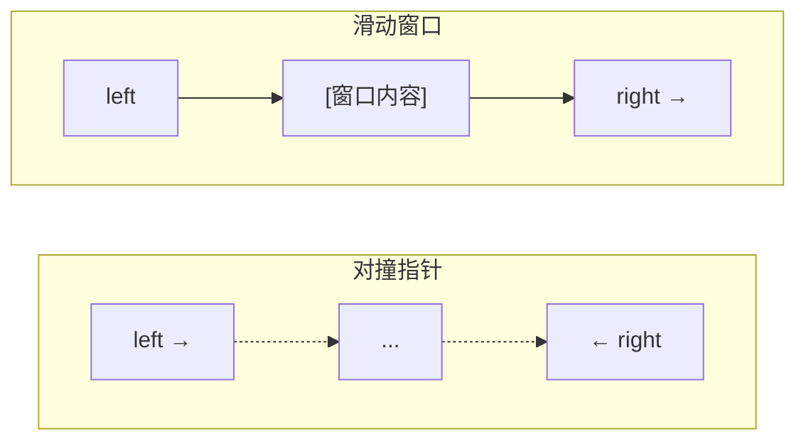

# 双指针与滑动窗口

## 概念说明

**双指针**：使用两个指针在数组或链表上移动，通过指针的相对位置关系来解决问题。常见类型：对撞指针（从两端向中间）、快慢指针（同向不同速）。

**滑动窗口**：双指针的特殊形式，维护一个可变大小的窗口在数组上滑动，适合解决子串/子数组问题。

## 核心原理



## 高频面试题

### 1. 三数之和（LeetCode 15）⭐⭐ 🔥🔥🔥

```go
// threeSum 三数之和
// 思路：排序 + 固定一个数 + 双指针找另外两个数
// 时间复杂度：O(n²)，空间复杂度：O(1)（不计结果）
func threeSum(nums []int) [][]int {
    sort.Ints(nums)
    var result [][]int
    for i := 0; i < len(nums)-2; i++ {
        if nums[i] > 0 {
            break // 最小值大于 0，不可能凑出三数之和为 0
        }
        if i > 0 && nums[i] == nums[i-1] {
            continue // 跳过重复元素
        }
        left, right := i+1, len(nums)-1
        for left < right {
            sum := nums[i] + nums[left] + nums[right]
            if sum == 0 {
                result = append(result, []int{nums[i], nums[left], nums[right]})
                for left < right && nums[left] == nums[left+1] {
                    left++ // 跳过重复
                }
                for left < right && nums[right] == nums[right-1] {
                    right-- // 跳过重复
                }
                left++
                right--
            } else if sum < 0 {
                left++
            } else {
                right--
            }
        }
    }
    return result
}
```

### 2. 无重复字符的最长子串（LeetCode 3）⭐⭐ 🔥🔥🔥

```go
// lengthOfLongestSubstring 无重复字符的最长子串
// 思路：滑动窗口，用 map 记录字符最后出现的位置
// 时间复杂度：O(n)，空间复杂度：O(min(m,n))，m 为字符集大小
func lengthOfLongestSubstring(s string) int {
    charIndex := make(map[byte]int) // 字符 -> 最后出现的索引
    maxLen := 0
    left := 0
    for right := 0; right < len(s); right++ {
        if idx, ok := charIndex[s[right]]; ok && idx >= left {
            left = idx + 1 // 窗口左边界跳到重复字符的下一个位置
        }
        charIndex[s[right]] = right
        if right-left+1 > maxLen {
            maxLen = right - left + 1
        }
    }
    return maxLen
}
```

### 3. 盛最多水的容器（LeetCode 11）⭐⭐ 🔥🔥

```go
// maxArea 盛最多水的容器
// 思路：对撞指针，每次移动较短的那一边
func maxArea(height []int) int {
    left, right := 0, len(height)-1
    maxWater := 0
    for left < right {
        h := min(height[left], height[right])
        area := h * (right - left)
        if area > maxWater {
            maxWater = area
        }
        if height[left] < height[right] {
            left++
        } else {
            right--
        }
    }
    return maxWater
}

func min(a, b int) int {
    if a < b {
        return a
    }
    return b
}
```

## 代码示例

> 💻 完整可运行代码：[code-examples/01-go-core/algorithm/sorting/](https://github.com/skyhe58/guide-go/tree/main/code-examples/01-go-core/algorithm/sorting/)
> 🏷️ Demo 模式：Part A（直接运行）

## 常见面试题

### Q1: 滑动窗口的模板是什么？

**难度**：⭐⭐ | **频率**：🔥🔥🔥

**答题思路**：

1. 初始化左右指针 `left = 0`
2. 右指针向右扩展窗口
3. 当窗口不满足条件时，左指针收缩窗口
4. 在每一步更新答案

**标准答案**：

```go
left := 0
for right := 0; right < len(s); right++ {
    // 扩展窗口：加入 s[right]
    for /* 窗口不满足条件 */ {
        // 收缩窗口：移除 s[left]
        left++
    }
    // 更新答案
}
```

**深入追问**：

- 滑动窗口和双指针的关系？
- 如何处理窗口内的字符计数？

## 常见陷阱

1. **去重**：三数之和必须跳过重复元素，否则结果有重复
2. **窗口边界**：滑动窗口的左边界更新条件要仔细考虑
3. **排序前提**：对撞指针通常需要数组有序

## 参考资料

- [LeetCode 15. 三数之和](https://leetcode.cn/problems/3sum/)
- [LeetCode 3. 无重复字符的最长子串](https://leetcode.cn/problems/longest-substring-without-repeating-characters/)
- [LeetCode 11. 盛最多水的容器](https://leetcode.cn/problems/container-with-most-water/)
