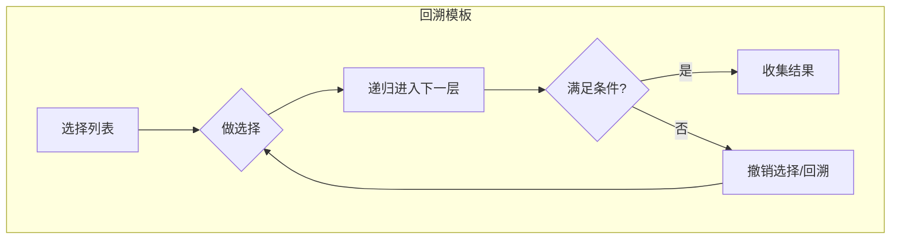

# 回溯算法

## 概念说明

回溯算法是一种通过穷举所有可能来找到所有解的算法。它在搜索过程中尝试分步解决问题，当发现当前步骤不满足条件时，回退到上一步重新选择（剪枝）。

回溯算法的本质是 DFS + 剪枝。

## 核心原理



### 回溯模板

```go
func backtrack(路径, 选择列表) {
    if 满足结束条件 {
        收集结果
        return
    }
    for 选择 in 选择列表 {
        做选择
        backtrack(路径, 选择列表)
        撤销选择
    }
}
```

## 高频面试题

### 1. 全排列（LeetCode 46）⭐⭐ 🔥🔥🔥

```go
// permute 全排列
// 思路：回溯，每次从未使用的数中选一个加入路径
func permute(nums []int) [][]int {
    var result [][]int
    used := make([]bool, len(nums))
    var path []int
    var backtrack func()
    backtrack = func() {
        if len(path) == len(nums) {
            tmp := make([]int, len(path))
            copy(tmp, path)
            result = append(result, tmp)
            return
        }
        for i := 0; i < len(nums); i++ {
            if used[i] {
                continue
            }
            used[i] = true
            path = append(path, nums[i])
            backtrack()
            path = path[:len(path)-1] // 撤销选择
            used[i] = false
        }
    }
    backtrack()
    return result
}
```

### 2. 子集（LeetCode 78）⭐⭐ 🔥🔥🔥

```go
// subsets 子集
// 思路：每个元素有选和不选两种状态
func subsets(nums []int) [][]int {
    var result [][]int
    var path []int
    var backtrack func(start int)
    backtrack = func(start int) {
        tmp := make([]int, len(path))
        copy(tmp, path)
        result = append(result, tmp) // 每个节点都是一个子集
        for i := start; i < len(nums); i++ {
            path = append(path, nums[i])
            backtrack(i + 1) // 从 i+1 开始，避免重复
            path = path[:len(path)-1]
        }
    }
    backtrack(0)
    return result
}
```

### 3. N 皇后（LeetCode 51）⭐⭐⭐ 🔥🔥🔥

```go
// solveNQueens N 皇后
// 思路：逐行放置皇后，检查列、对角线是否冲突
func solveNQueens(n int) [][]string {
    var result [][]string
    board := make([][]byte, n)
    for i := range board {
        board[i] = make([]byte, n)
        for j := range board[i] {
            board[i][j] = '.'
        }
    }
    cols := make([]bool, n)       // 列是否被占用
    diag1 := make([]bool, 2*n-1)  // 主对角线（行-列+n-1）
    diag2 := make([]bool, 2*n-1)  // 副对角线（行+列）

    var backtrack func(row int)
    backtrack = func(row int) {
        if row == n {
            solution := make([]string, n)
            for i := range board {
                solution[i] = string(board[i])
            }
            result = append(result, solution)
            return
        }
        for col := 0; col < n; col++ {
            if cols[col] || diag1[row-col+n-1] || diag2[row+col] {
                continue // 剪枝：列或对角线冲突
            }
            board[row][col] = 'Q'
            cols[col] = true
            diag1[row-col+n-1] = true
            diag2[row+col] = true
            backtrack(row + 1)
            board[row][col] = '.' // 撤销
            cols[col] = false
            diag1[row-col+n-1] = false
            diag2[row+col] = false
        }
    }
    backtrack(0)
    return result
}
```

## 代码示例

> 💻 完整可运行代码：[code-examples/01-go-core/algorithm/dp/](https://github.com/your-repo/code-examples/01-go-core/algorithm/dp/)
> 🏷️ Demo 模式：Part A（直接运行）

## 常见面试题

### Q1: 回溯和 DFS 的区别？

**难度**：⭐⭐ | **频率**：🔥🔥

**答题思路**：

1. 回溯是 DFS 的一种应用，强调"撤销选择"
2. DFS 是图/树的遍历方式
3. 回溯通常用于求所有解，DFS 用于遍历或搜索

**标准答案**：

回溯 = DFS + 状态重置。回溯在递归返回时撤销之前的选择，恢复状态，以便尝试其他分支。

**深入追问**：

- 如何对回溯算法进行剪枝优化？
- 排列和组合问题的回溯有什么区别？

## 常见陷阱

1. **忘记撤销选择**：回溯的核心是"做选择 → 递归 → 撤销选择"
2. **结果拷贝**：Go 中 slice 是引用类型，收集结果时必须 `copy`
3. **去重**：含重复元素的排列/组合需要排序 + 跳过相同元素

## 参考资料

- [LeetCode 46. 全排列](https://leetcode.cn/problems/permutations/)
- [LeetCode 78. 子集](https://leetcode.cn/problems/subsets/)
- [LeetCode 51. N 皇后](https://leetcode.cn/problems/n-queens/)
