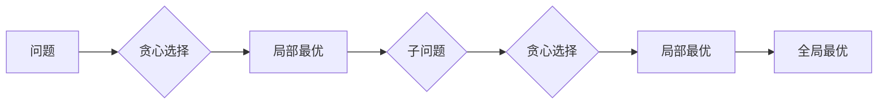

# 贪心算法

## 概念说明

贪心算法在每一步选择中都采取当前状态下的最优选择（局部最优），期望通过局部最优达到全局最优。贪心算法不一定能得到全局最优解，但对于满足贪心选择性质的问题，贪心是最高效的解法。

## 核心原理



贪心算法适用条件：
1. **贪心选择性质**：局部最优选择能导致全局最优
2. **最优子结构**：问题的最优解包含子问题的最优解

## 高频面试题

### 1. 买卖股票的最佳时机 II（LeetCode 122）⭐ 🔥🔥🔥

```go
// maxProfit 买卖股票（可多次交易）
// 贪心策略：只要今天比昨天贵，就昨天买今天卖
func maxProfit(prices []int) int {
    profit := 0
    for i := 1; i < len(prices); i++ {
        if prices[i] > prices[i-1] {
            profit += prices[i] - prices[i-1]
        }
    }
    return profit
}
```

### 2. 跳跃游戏（LeetCode 55）⭐⭐ 🔥🔥🔥

```go
// canJump 跳跃游戏
// 贪心策略：维护能到达的最远位置
func canJump(nums []int) bool {
    maxReach := 0
    for i := 0; i < len(nums); i++ {
        if i > maxReach {
            return false // 当前位置超过最远可达位置
        }
        if i+nums[i] > maxReach {
            maxReach = i + nums[i]
        }
    }
    return true
}
```

### 3. 分发糖果（LeetCode 135）⭐⭐⭐ 🔥🔥

```go
// candy 分发糖果
// 贪心策略：两次遍历，先从左到右保证右边比左边大的多一个，再从右到左保证左边比右边大的多一个
func candy(ratings []int) int {
    n := len(ratings)
    candies := make([]int, n)
    for i := range candies {
        candies[i] = 1 // 每人至少一个
    }
    // 从左到右：右边评分高的比左边多一个
    for i := 1; i < n; i++ {
        if ratings[i] > ratings[i-1] {
            candies[i] = candies[i-1] + 1
        }
    }
    // 从右到左：左边评分高的比右边多一个
    for i := n - 2; i >= 0; i-- {
        if ratings[i] > ratings[i+1] && candies[i] <= candies[i+1] {
            candies[i] = candies[i+1] + 1
        }
    }
    total := 0
    for _, c := range candies {
        total += c
    }
    return total
}
```

## 代码示例

> 💻 完整可运行代码：[code-examples/01-go-core/algorithm/dp/](https://github.com/your-repo/code-examples/01-go-core/algorithm/dp/)
> 🏷️ Demo 模式：Part A（直接运行）

## 常见面试题

### Q1: 如何判断一个问题能否用贪心算法？

**难度**：⭐⭐ | **频率**：🔥🔥

**答题思路**：

1. 问题具有贪心选择性质（局部最优 → 全局最优）
2. 问题具有最优子结构
3. 通常需要数学证明或反证法

**标准答案**：

贪心算法没有固定的判断方法，通常需要直觉 + 证明。常见的贪心场景：区间调度、活动选择、哈夫曼编码、最小生成树（Kruskal/Prim）。如果不确定能否用贪心，可以先用 DP 解，再看是否能简化为贪心。

**深入追问**：

- 贪心和动态规划的区别？
- 举一个贪心失败的例子？

## 常见陷阱

1. **贪心不一定正确**：不是所有问题都能用贪心，需要证明贪心选择性质
2. **局部最优 ≠ 全局最优**：如硬币找零问题，某些面额组合下贪心会失败

## 参考资料

- [LeetCode 122. 买卖股票的最佳时机 II](https://leetcode.cn/problems/best-time-to-buy-and-sell-stock-ii/)
- [LeetCode 55. 跳跃游戏](https://leetcode.cn/problems/jump-game/)
- [LeetCode 135. 分发糖果](https://leetcode.cn/problems/candy/)
