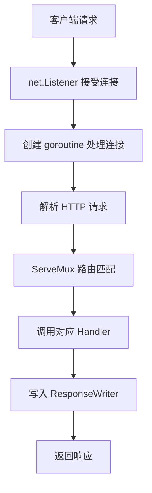
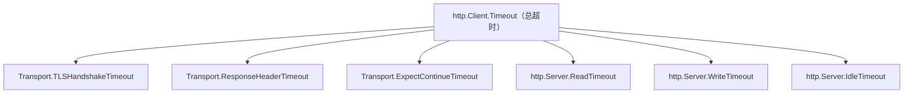

# net/http 标准库

## 概念说明

Go 标准库 `net/http` 是一个功能完备的 HTTP 框架，无需任何第三方依赖即可构建生产级 Web 服务。许多知名项目（如 Prometheus、etcd）直接使用标准库处理 HTTP 请求。Go 1.22 增强了 `ServeMux` 的路由模式匹配能力（支持方法和路径参数），进一步缩小了与第三方路由库的差距。

理解 `net/http` 是学习所有 Go Web 框架的基础——Gin、Echo、Fiber 等框架本质上都是对标准库的封装和增强。

## 核心原理

### Handler 接口

`net/http` 的核心是 `Handler` 接口，只有一个方法：

```go
type Handler interface {
    ServeHTTP(ResponseWriter, *Request)
}
```

任何实现了 `ServeHTTP` 方法的类型都可以处理 HTTP 请求。`HandlerFunc` 是一个适配器，让普通函数也能作为 Handler：

```go
type HandlerFunc func(ResponseWriter, *Request)

func (f HandlerFunc) ServeHTTP(w ResponseWriter, r *Request) {
    f(w, r)
}
```

### 请求处理流程



**关键点**：每个请求由独立的 goroutine 处理，天然支持高并发。

### ServeMux 路由（Go 1.22 增强）

Go 1.22 之前，`DefaultServeMux` 只支持简单的路径前缀匹配。Go 1.22 引入了增强路由：

```go
mux := http.NewServeMux()

// Go 1.22+ 支持方法匹配
mux.HandleFunc("GET /api/users", listUsers)
mux.HandleFunc("POST /api/users", createUser)

// Go 1.22+ 支持路径参数
mux.HandleFunc("GET /api/users/{id}", getUser)
mux.HandleFunc("DELETE /api/users/{id}", deleteUser)
```

### 中间件链

中间件是 Go Web 开发的核心模式。中间件本质是一个接受 `http.Handler` 并返回 `http.Handler` 的函数：

```go
type Middleware func(http.Handler) http.Handler

func LoggingMiddleware(next http.Handler) http.Handler {
    return http.HandlerFunc(func(w http.ResponseWriter, r *http.Request) {
        start := time.Now()
        next.ServeHTTP(w, r)
        log.Printf("%s %s %v", r.Method, r.URL.Path, time.Since(start))
    })
}
```

中间件链的执行顺序：


### HTTP 客户端与超时配置

```go
client := &http.Client{
    Timeout: 10 * time.Second,
    Transport: &http.Transport{
        MaxIdleConns:        100,
        MaxIdleConnsPerHost: 10,
        IdleConnTimeout:     90 * time.Second,
    },
}
```

**超时层次**：



### 优雅关闭（Graceful Shutdown）

```go
srv := &http.Server{Addr: ":8080", Handler: mux}

go func() {
    if err := srv.ListenAndServe(); err != http.ErrServerClosed {
        log.Fatal(err)
    }
}()

// 等待中断信号
quit := make(chan os.Signal, 1)
signal.Notify(quit, syscall.SIGINT, syscall.SIGTERM)
<-quit

// 给予 5 秒处理剩余请求
ctx, cancel := context.WithTimeout(context.Background(), 5*time.Second)
defer cancel()
srv.Shutdown(ctx)
```

## 标准库方案

```go
package main

import (
    "encoding/json"
    "log"
    "net/http"
)

type User struct {
    ID   int    `json:"id"`
    Name string `json:"name"`
}

func main() {
    mux := http.NewServeMux()

    // Go 1.22+ 路由
    mux.HandleFunc("GET /api/users/{id}", func(w http.ResponseWriter, r *http.Request) {
        id := r.PathValue("id")
        user := User{ID: 1, Name: "Go 开发者"}
        w.Header().Set("Content-Type", "application/json")
        json.NewEncoder(w).Encode(user)
        _ = id
    })

    log.Println("Server starting on :8080")
    log.Fatal(http.ListenAndServe(":8080", mux))
}
```

## 第三方库方案

标准库 `net/http` 在 Go 1.22 增强后已能满足大部分需求。如果需要更丰富的功能（参数验证、分组路由、Swagger 集成），可以选择 Gin 等框架。详见 [框架选型对比](./06-comparison.md)。

## 代码示例

> 💻 完整可运行代码：[code-examples/02-web-data/web-framework/net-http-server/](https://github.com/skyhe58/guide-go/tree/main/code-examples/02-web-data/web-framework/net-http-server/)
> 🏷️ Demo 模式：Part A（直接运行）

## 常见面试题

### Q1: net/http 的 Handler 接口是什么？为什么这样设计？

**难度**：⭐⭐⭐ | **频率**：🔥🔥🔥

**答题思路**：

1. Handler 接口只有一个 `ServeHTTP` 方法
2. `HandlerFunc` 适配器让普通函数也能作为 Handler
3. 这种设计体现了 Go 的接口哲学——小接口、隐式实现
4. 中间件模式正是基于 Handler 接口的组合

**标准答案**：

Handler 接口定义了 `ServeHTTP(ResponseWriter, *Request)` 方法。任何实现该方法的类型都能处理 HTTP 请求。`HandlerFunc` 是一个类型适配器，将普通函数转换为 Handler。这种设计遵循 Go 的"Accept interfaces, return structs"原则，使得中间件链可以通过函数组合实现。

### Q2: 如何实现 HTTP 服务的优雅关闭？

**难度**：⭐⭐⭐ | **频率**：🔥🔥🔥

**标准答案**：

使用 `http.Server.Shutdown(ctx)` 方法。步骤：1）监听系统信号（SIGINT/SIGTERM）；2）收到信号后调用 `Shutdown`，它会停止接受新连接，等待已有请求处理完成；3）通过 context 设置超时，防止无限等待。

**深入追问**：

- Shutdown 和 Close 的区别？（Shutdown 优雅关闭，Close 立即关闭）
- 如何处理长连接（WebSocket）的关闭？

## 常见陷阱

1. **忘记设置超时**：默认 `http.Server` 没有超时限制，可能导致 goroutine 泄漏
2. **DefaultServeMux 的安全风险**：`http.HandleFunc` 注册到全局 DefaultServeMux，第三方库可能注入路由
3. **ResponseWriter 写入顺序**：必须先设置 Header，再写入 Body；WriteHeader 只能调用一次
4. **并发安全**：Handler 会被多个 goroutine 并发调用，共享状态需要加锁

## 参考资料

- [Go 官方文档 - net/http](https://pkg.go.dev/net/http)
- [Go 1.22 Release Notes - Enhanced routing patterns](https://go.dev/doc/go1.22)
- [Go Blog - HTTP/2 Server Push](https://go.dev/blog/h2push)
