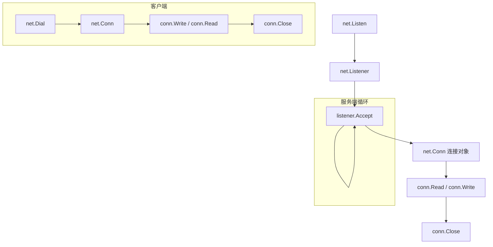
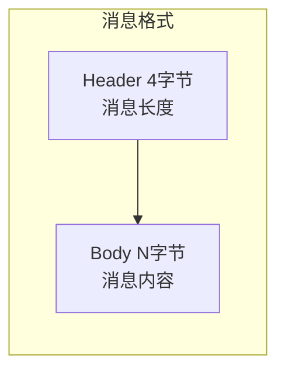
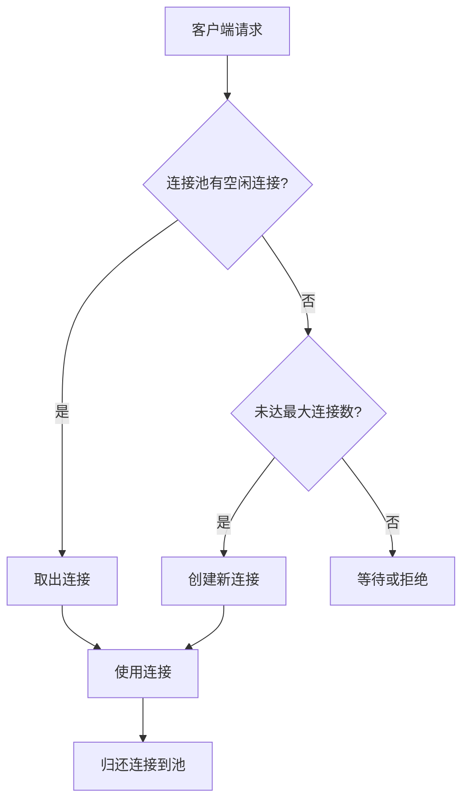

# TCP 编程

## 概念说明

Go 的 `net` 包提供了底层网络编程能力。TCP 编程是理解 HTTP、gRPC、WebSocket 等上层协议的基础。Go 的并发模型（goroutine + channel）天然适合处理大量并发 TCP 连接——每个连接一个 goroutine，代码简洁且高效。

## 核心原理

### net.Listener 与 net.Conn



```go
// 服务端
listener, err := net.Listen("tcp", ":9090")
for {
    conn, err := listener.Accept()
    go handleConn(conn) // 每个连接一个 goroutine
}

// 客户端
conn, err := net.Dial("tcp", "localhost:9090")
```

### 自定义协议设计

TCP 是字节流协议，没有消息边界。需要自定义协议解决"粘包"问题：



常见方案：
- **固定长度**：每条消息固定 N 字节
- **分隔符**：用特殊字符（如 `\n`）分隔消息
- **长度前缀**：消息头包含消息体长度（最常用）

```go
// 长度前缀协议：4 字节长度头 + 消息体
func encode(msg []byte) []byte {
    length := uint32(len(msg))
    buf := make([]byte, 4+len(msg))
    binary.BigEndian.PutUint32(buf[:4], length)
    copy(buf[4:], msg)
    return buf
}

func decode(reader io.Reader) ([]byte, error) {
    header := make([]byte, 4)
    if _, err := io.ReadFull(reader, header); err != nil {
        return nil, err
    }
    length := binary.BigEndian.Uint32(header)
    body := make([]byte, length)
    if _, err := io.ReadFull(reader, body); err != nil {
        return nil, err
    }
    return body, nil
}
```

### 连接池

频繁创建和关闭 TCP 连接开销很大。连接池复用已建立的连接：



```go
type ConnPool struct {
    mu       sync.Mutex
    conns    chan net.Conn
    factory  func() (net.Conn, error)
    maxConns int
}
```

## 标准库方案

```go
package main

import (
    "bufio"
    "fmt"
    "net"
)

func main() {
    // TCP 服务端
    listener, _ := net.Listen("tcp", ":9090")
    defer listener.Close()

    for {
        conn, _ := listener.Accept()
        go func(c net.Conn) {
            defer c.Close()
            scanner := bufio.NewScanner(c)
            for scanner.Scan() {
                msg := scanner.Text()
                fmt.Fprintf(c, "Echo: %s\n", msg)
            }
        }(conn)
    }
}
```

## 代码示例

> 💻 完整可运行代码：[code-examples/02-web-data/web-framework/net-http-server/](https://github.com/skyhe58/guide-go/tree/main/code-examples/02-web-data/web-framework/net-http-server/)
> 🏷️ Demo 模式：Part A（直接运行）

## 常见面试题

### Q1: TCP 粘包问题是什么？Go 中如何解决？

**难度**：⭐⭐⭐ | **频率**：🔥🔥

**答题思路**：

1. TCP 是字节流协议，没有消息边界
2. 发送方多次 Write 可能被合并发送（Nagle 算法）
3. 接收方一次 Read 可能读到多条消息或半条消息
4. 解决方案：固定长度、分隔符、长度前缀

**标准答案**：

TCP 粘包是因为 TCP 是面向字节流的协议，没有消息边界的概念。Go 中常用长度前缀协议解决：消息头用固定字节（如 4 字节）表示消息体长度，接收方先读取长度，再按长度读取完整消息体。可以使用 `io.ReadFull` 确保读取指定字节数。

### Q2: Go 的 TCP 服务器为什么每个连接用一个 goroutine？

**难度**：⭐⭐ | **频率**：🔥🔥

**标准答案**：

Go 的 goroutine 非常轻量（初始栈仅 2KB），创建百万级 goroutine 的开销远小于操作系统线程。每个连接一个 goroutine 的模型代码简洁（同步阻塞风格），底层由 Go 运行时的 netpoller（基于 epoll/kqueue）实现非阻塞 I/O，兼顾了开发效率和运行性能。

**深入追问**：

- Go 的 netpoller 是什么？（基于 epoll/kqueue 的 I/O 多路复用，对 goroutine 透明）
- 如何限制并发连接数？（使用 semaphore 或 channel 限流）

## 常见陷阱

1. **忘记关闭连接**：使用 `defer conn.Close()` 确保连接释放
2. **读取不完整**：`conn.Read` 不保证一次读取完整数据，需要循环读取或使用 `io.ReadFull`
3. **超时设置**：使用 `conn.SetDeadline` 防止连接长时间阻塞
4. **goroutine 泄漏**：客户端断开后，服务端 goroutine 需要正确退出

## 参考资料

- [Go 官方文档 - net](https://pkg.go.dev/net)
- [Go Blog - Go Concurrency Patterns](https://go.dev/blog/pipelines)
- [The Go Programming Language - Chapter 8: Goroutines and Channels](https://www.gopl.io/)
