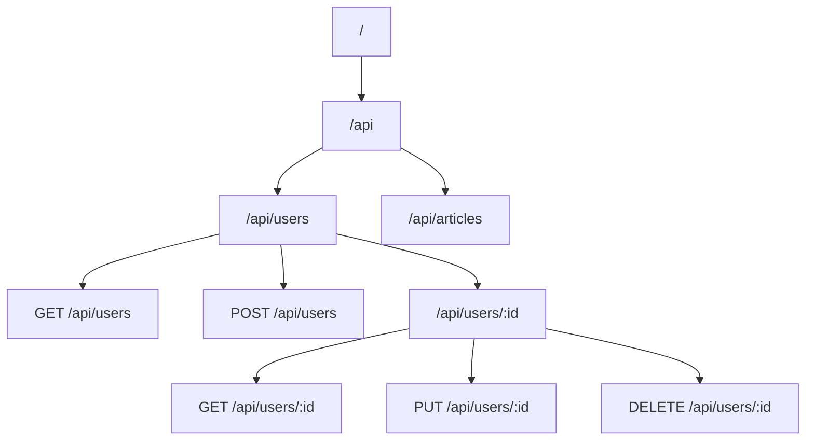
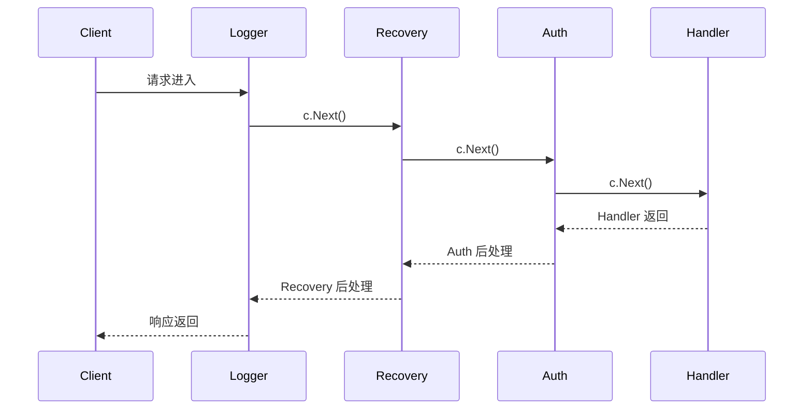

# Gin 框架

## 概念说明

Gin 是 Go 生态中使用率最高的 Web 框架（2025 年使用率达 48%），以高性能和简洁 API 著称。Gin 基于 `httprouter` 实现路由，性能远超标准库的 `ServeMux`。国内大厂（字节跳动、B 站等）广泛使用 Gin 或基于 Gin 的框架。

Gin 的核心优势：
- **高性能路由**：基于 Radix Tree，路由匹配速度极快
- **中间件机制**：洋葱模型，支持全局/分组/路由级别中间件
- **参数绑定与验证**：自动绑定 JSON/Query/Form 参数，集成 `go-playground/validator`
- **错误管理**：内置错误收集机制
- **渲染支持**：JSON/XML/YAML/HTML 多种响应格式

## 核心原理

### 路由树（Radix Tree）



Gin 为每个 HTTP 方法维护一棵独立的 Radix Tree，路由匹配时间复杂度为 O(路径长度)。

### 中间件执行流程（洋葱模型）



```go
func MyMiddleware() gin.HandlerFunc {
    return func(c *gin.Context) {
        // 前处理
        start := time.Now()
        
        c.Next() // 调用下一个中间件/Handler
        
        // 后处理
        latency := time.Since(start)
        log.Printf("耗时: %v", latency)
    }
}
```

### 参数绑定与验证

Gin 使用 `go-playground/validator` 进行参数验证：

```go
type CreateUserReq struct {
    Name  string `json:"name" binding:"required,min=2,max=50"`
    Email string `json:"email" binding:"required,email"`
    Age   int    `json:"age" binding:"required,gte=1,lte=150"`
}

func CreateUser(c *gin.Context) {
    var req CreateUserReq
    if err := c.ShouldBindJSON(&req); err != nil {
        c.JSON(400, gin.H{"error": err.Error()})
        return
    }
    // 处理业务逻辑...
}
```

### 分组路由

```go
r := gin.Default()

// 公开路由
public := r.Group("/api/v1")
{
    public.POST("/login", login)
    public.POST("/register", register)
}

// 需要认证的路由
auth := r.Group("/api/v1")
auth.Use(AuthMiddleware())
{
    auth.GET("/users/:id", getUser)
    auth.PUT("/users/:id", updateUser)
}

// 管理员路由
admin := r.Group("/api/v1/admin")
admin.Use(AuthMiddleware(), AdminMiddleware())
{
    admin.GET("/users", listAllUsers)
    admin.DELETE("/users/:id", deleteUser)
}
```

### 自定义错误处理

```go
// 统一错误响应格式
type ErrorResponse struct {
    Code    int    `json:"code"`
    Message string `json:"message"`
}

// 自定义错误处理中间件
func ErrorHandler() gin.HandlerFunc {
    return func(c *gin.Context) {
        c.Next()
        
        // 检查是否有错误
        if len(c.Errors) > 0 {
            err := c.Errors.Last()
            c.JSON(c.Writer.Status(), ErrorResponse{
                Code:    c.Writer.Status(),
                Message: err.Error(),
            })
        }
    }
}
```

### 请求日志中间件

```go
func RequestLogger() gin.HandlerFunc {
    return func(c *gin.Context) {
        start := time.Now()
        path := c.Request.URL.Path
        
        c.Next()
        
        log.Printf("[%s] %s %s %d %v",
            c.ClientIP(),
            c.Request.Method,
            path,
            c.Writer.Status(),
            time.Since(start),
        )
    }
}
```

## 标准库方案

对于简单的 REST API，Go 1.22+ 的标准库已经足够：

```go
mux := http.NewServeMux()
mux.HandleFunc("GET /api/users/{id}", getUser)
mux.HandleFunc("POST /api/users", createUser)
```

但标准库缺少参数验证、分组路由、Swagger 集成等功能，复杂项目推荐使用 Gin。

## 第三方库方案

### Swagger 集成（swaggo）

```go
// 安装 swag CLI
// go install github.com/swaggo/swag/cmd/swag@latest

// @Summary 获取用户
// @Description 根据 ID 获取用户信息
// @Tags users
// @Param id path int true "用户 ID"
// @Success 200 {object} User
// @Router /api/users/{id} [get]
func GetUser(c *gin.Context) {
    // ...
}
```

## 代码示例

> 💻 完整可运行代码：[code-examples/02-web-data/web-framework/gin-rest-api/](https://github.com/skyhe58/guide-go/tree/main/code-examples/02-web-data/web-framework/gin-rest-api/)
> 🏷️ Demo 模式：Part A（直接运行）

## 常见面试题

### Q1: Gin 的路由是如何实现的？

**难度**：⭐⭐⭐ | **频率**：🔥🔥🔥

**答题思路**：

1. Gin 基于 httprouter，使用 Radix Tree（压缩前缀树）
2. 每个 HTTP 方法一棵树
3. 路由匹配时间复杂度 O(路径长度)
4. 支持路径参数（`:id`）和通配符（`*path`）

**标准答案**：

Gin 使用 Radix Tree（基数树/压缩前缀树）实现路由。每个 HTTP 方法（GET/POST 等）维护一棵独立的树。路由注册时将路径插入树中，匹配时从根节点向下查找，时间复杂度为 O(路径长度)。相比标准库的线性匹配，Radix Tree 在路由数量多时性能优势明显。

### Q2: Gin 中间件的执行顺序是什么？c.Next() 和 c.Abort() 的区别？

**难度**：⭐⭐⭐ | **频率**：🔥🔥🔥

**标准答案**：

Gin 中间件采用洋葱模型。`c.Next()` 调用链中的下一个中间件，执行完后返回继续执行当前中间件的后续代码。`c.Abort()` 终止后续中间件的执行，但当前中间件的后续代码仍会执行。`c.AbortWithStatus()` 终止并设置状态码。

**深入追问**：

- 如何在中间件之间传递数据？（`c.Set()` / `c.Get()`）
- 全局中间件和分组中间件的执行顺序？（全局先于分组）

### Q3: Gin 如何做参数验证？

**难度**：⭐⭐ | **频率**：🔥🔥

**标准答案**：

Gin 集成了 `go-playground/validator`，通过结构体标签定义验证规则。使用 `c.ShouldBindJSON()` 等方法自动绑定并验证参数。支持 `required`、`min`、`max`、`email`、`oneof` 等内置验证器，也支持自定义验证器。

## 常见陷阱

1. **gin.Default() vs gin.New()**：`Default()` 自带 Logger 和 Recovery 中间件，生产环境建议用 `New()` 自定义
2. **c.JSON 后忘记 return**：`c.JSON()` 不会终止 Handler 执行，需要显式 return
3. **并发读写 gin.Context**：`gin.Context` 不是并发安全的，goroutine 中使用需要 `c.Copy()`
4. **绑定错误信息不友好**：默认的验证错误信息是英文，需要自定义翻译

## 参考资料

- [Gin 官方文档](https://gin-gonic.com/docs/)
- [Gin GitHub](https://github.com/gin-gonic/gin)
- [go-playground/validator](https://github.com/go-playground/validator)
- [swaggo/swag](https://github.com/swaggo/swag)
