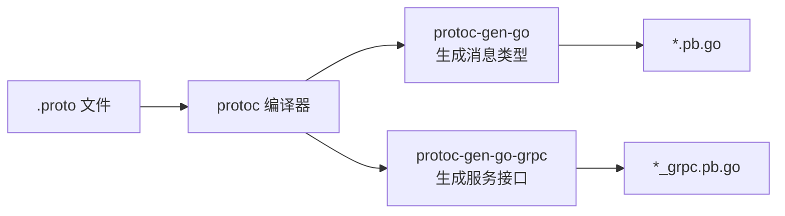
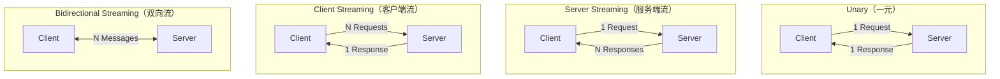
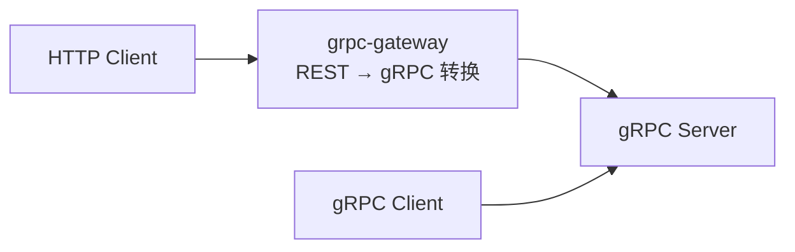

# gRPC

## 概念说明

gRPC 是 Google 开源的高性能 RPC 框架，基于 HTTP/2 和 Protocol Buffers。在微服务架构中，gRPC 是服务间通信的事实标准——Kubernetes、etcd、Istio 等云原生项目都使用 gRPC。

gRPC 的核心优势：
- **高性能**：基于 HTTP/2 多路复用，Protocol Buffers 二进制序列化
- **强类型**：通过 `.proto` 文件定义接口，自动生成客户端和服务端代码
- **四种通信模式**：Unary、Server Streaming、Client Streaming、Bidirectional Streaming
- **跨语言**：支持 Go、Java、Python、C++ 等多种语言

## 核心原理

### Protocol Buffers

Protocol Buffers（protobuf）是 gRPC 的默认序列化格式：

```protobuf
syntax = "proto3";

package user;
option go_package = "./pb";

// 定义服务
service UserService {
    rpc GetUser(GetUserRequest) returns (User);              // Unary
    rpc ListUsers(ListUsersRequest) returns (stream User);   // Server Streaming
    rpc CreateUsers(stream User) returns (CreateUsersResponse); // Client Streaming
    rpc Chat(stream ChatMessage) returns (stream ChatMessage);  // Bidirectional
}

message User {
    int64 id = 1;
    string name = 2;
    string email = 3;
}

message GetUserRequest {
    int64 id = 1;
}
```

### protoc 编译流程



```bash
protoc --go_out=. --go-grpc_out=. user.proto
```

### 四种通信模式



| 模式 | 场景 | 示例 |
|------|------|------|
| Unary | 普通请求-响应 | 获取用户信息 |
| Server Streaming | 服务端推送大量数据 | 实时日志推送、文件下载 |
| Client Streaming | 客户端上传大量数据 | 文件上传、批量导入 |
| Bidirectional | 实时双向通信 | 聊天、实时协作 |

### 拦截器（Interceptor）

gRPC 拦截器类似 HTTP 中间件，分为 Unary 拦截器和 Stream 拦截器：

```go
// Unary 拦截器
func LoggingInterceptor(
    ctx context.Context,
    req interface{},
    info *grpc.UnaryServerInfo,
    handler grpc.UnaryHandler,
) (interface{}, error) {
    start := time.Now()
    resp, err := handler(ctx, req) // 调用实际处理函数
    log.Printf("Method: %s, Duration: %v, Error: %v",
        info.FullMethod, time.Since(start), err)
    return resp, err
}

// 注册拦截器
server := grpc.NewServer(
    grpc.UnaryInterceptor(LoggingInterceptor),
)
```

### 错误处理

gRPC 使用 `status` 包定义标准错误码：

```go
import "google.golang.org/grpc/status"
import "google.golang.org/grpc/codes"

// 返回错误
return nil, status.Errorf(codes.NotFound, "user %d not found", id)

// 检查错误
st, ok := status.FromError(err)
if ok && st.Code() == codes.NotFound {
    // 处理 NotFound 错误
}
```

### grpc-gateway

grpc-gateway 将 gRPC 服务同时暴露为 RESTful API：



### 负载均衡

gRPC 支持客户端负载均衡：

```go
conn, err := grpc.Dial(
    "dns:///my-service:50051",
    grpc.WithDefaultServiceConfig(`{"loadBalancingPolicy":"round_robin"}`),
)
```

## 标准库方案

Go 标准库没有内置 gRPC 支持，需要使用 `google.golang.org/grpc` 包。

## 第三方库方案

| 库 | 用途 |
|----|------|
| `google.golang.org/grpc` | gRPC Go 实现 |
| `google.golang.org/protobuf` | Protocol Buffers Go 实现 |
| `grpc-ecosystem/grpc-gateway` | gRPC 转 REST |
| `grpc-ecosystem/go-grpc-middleware` | 常用拦截器集合 |

## 代码示例

> 💻 完整可运行代码：[code-examples/02-web-data/web-framework/grpc-examples/](../../code-examples/02-web-data/web-framework/grpc-examples/)
> 🏷️ Demo 模式：Part A（直接运行，简化演示 gRPC 概念）

## 常见面试题

### Q1: gRPC 的四种通信模式分别是什么？适用场景？

**难度**：⭐⭐⭐ | **频率**：🔥🔥🔥

**答题思路**：

1. 列举四种模式：Unary、Server Streaming、Client Streaming、Bidirectional Streaming
2. 每种模式给出一个实际场景
3. 说明底层基于 HTTP/2 Stream 实现

**标准答案**：

gRPC 支持四种通信模式：1）Unary（一元）：一请求一响应，最常用，如获取用户信息；2）Server Streaming：客户端发一个请求，服务端返回数据流，如实时日志推送；3）Client Streaming：客户端发送数据流，服务端返回一个响应，如文件上传；4）Bidirectional Streaming：双向数据流，如聊天应用。底层都基于 HTTP/2 的 Stream 实现。

### Q2: gRPC vs REST，如何选择？

**难度**：⭐⭐⭐ | **频率**：🔥🔥🔥

**标准答案**：

| 维度 | gRPC | REST |
|------|------|------|
| 协议 | HTTP/2 | HTTP/1.1 或 HTTP/2 |
| 序列化 | Protocol Buffers（二进制） | JSON（文本） |
| 性能 | 高（二进制 + 多路复用） | 较低 |
| 接口定义 | .proto 文件（强类型） | OpenAPI/Swagger（可选） |
| 浏览器支持 | 需要 grpc-web | 原生支持 |
| 适用场景 | 微服务内部通信 | 对外 API、前后端交互 |

**深入追问**：

- 如何同时提供 gRPC 和 REST？（grpc-gateway）
- gRPC 的错误码体系和 HTTP 状态码有什么区别？

## 常见陷阱

1. **proto 文件版本**：始终使用 `syntax = "proto3"`，proto2 和 proto3 语义不同
2. **消息大小限制**：gRPC 默认消息大小限制 4MB，大文件需要用 Streaming
3. **连接管理**：gRPC 连接是长连接，需要注意连接池和负载均衡
4. **错误码使用**：使用标准 gRPC 错误码（codes 包），不要自定义数字错误码

## 参考资料

- [gRPC 官方文档](https://grpc.io/docs/languages/go/)
- [Protocol Buffers 语法指南](https://protobuf.dev/programming-guides/proto3/)
- [grpc-gateway](https://github.com/grpc-ecosystem/grpc-gateway)
- [Go gRPC 最佳实践](https://grpc.io/docs/guides/performance/)
