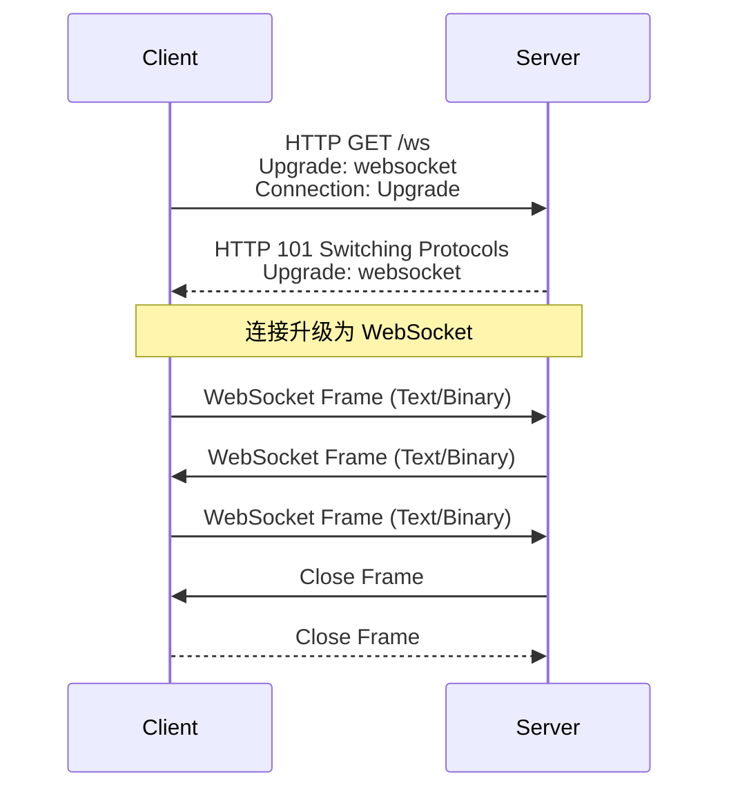
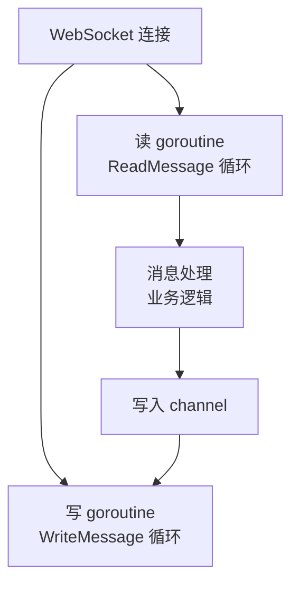
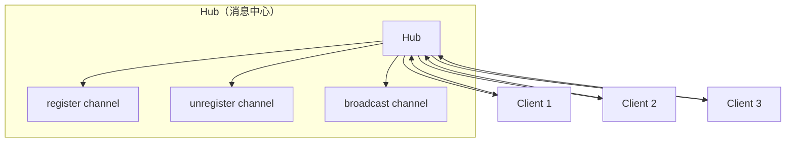

# WebSocket

## 概念说明

WebSocket 是一种在单个 TCP 连接上进行全双工通信的协议。与 HTTP 的请求-响应模式不同，WebSocket 建立连接后，客户端和服务端可以随时互相发送消息，非常适合实时通信场景（聊天、实时通知、在线协作、股票行情等）。

Go 生态中常用的 WebSocket 库：
- **gorilla/websocket**：最成熟、使用最广泛的 WebSocket 库
- **nhooyr.io/websocket**：更现代的实现，API 更简洁，支持 context

## 核心原理

### WebSocket 握手流程



### 消息类型

| 类型 | 说明 | 用途 |
|------|------|------|
| TextMessage | 文本消息（UTF-8） | JSON 数据、聊天消息 |
| BinaryMessage | 二进制消息 | 文件传输、音视频数据 |
| PingMessage | 心跳检测（客户端发） | 保持连接活跃 |
| PongMessage | 心跳响应（服务端回） | 响应 Ping |
| CloseMessage | 关闭连接 | 优雅断开 |

### 并发模型



**关键点**：gorilla/websocket 的 `Conn` 不是并发安全的——读和写可以并发，但多个 goroutine 不能同时写。通常用一个 goroutine 读、一个 goroutine 写的模式。

### Hub 模式（广播）



## 标准库方案

Go 标准库没有内置 WebSocket 支持，但 `golang.org/x/net/websocket` 提供了基础实现（不推荐生产使用）。

## 第三方库方案

### gorilla/websocket

```go
var upgrader = websocket.Upgrader{
    ReadBufferSize:  1024,
    WriteBufferSize: 1024,
    CheckOrigin: func(r *http.Request) bool {
        return true // 生产环境需要检查 Origin
    },
}

func wsHandler(w http.ResponseWriter, r *http.Request) {
    conn, err := upgrader.Upgrade(w, r, nil)
    if err != nil {
        log.Println("Upgrade error:", err)
        return
    }
    defer conn.Close()

    for {
        msgType, msg, err := conn.ReadMessage()
        if err != nil {
            break
        }
        // Echo 回去
        conn.WriteMessage(msgType, msg)
    }
}
```

### nhooyr.io/websocket

```go
func wsHandler(w http.ResponseWriter, r *http.Request) {
    conn, err := websocket.Accept(w, r, nil)
    if err != nil {
        return
    }
    defer conn.Close(websocket.StatusNormalClosure, "")

    ctx := r.Context()
    for {
        typ, msg, err := conn.Read(ctx)
        if err != nil {
            break
        }
        conn.Write(ctx, typ, msg)
    }
}
```

## 代码示例

> 💻 完整可运行代码：[code-examples/02-web-data/web-framework/websocket/](../../code-examples/02-web-data/web-framework/websocket/)
> 🏷️ Demo 模式：Part A（直接运行）

## 常见面试题

### Q1: WebSocket 和 HTTP 长轮询的区别？

**难度**：⭐⭐ | **频率**：🔥🔥

**答题思路**：

1. HTTP 长轮询：客户端发请求，服务端 hold 住直到有数据，返回后客户端再次请求
2. WebSocket：一次握手后建立持久连接，双方可随时发送消息
3. WebSocket 更高效（无重复 HTTP 头开销），延迟更低

**标准答案**：

HTTP 长轮询是客户端反复发起 HTTP 请求等待服务端响应，每次响应后需要重新建立连接，有额外的 HTTP 头开销。WebSocket 通过一次 HTTP 升级握手建立持久的全双工连接，之后双方可以随时发送消息，没有重复的连接建立开销，延迟更低，适合高频实时通信场景。

### Q2: Go 中如何处理 WebSocket 的并发读写？

**难度**：⭐⭐⭐ | **频率**：🔥🔥

**标准答案**：

gorilla/websocket 的 Conn 支持一个 goroutine 读和一个 goroutine 写并发，但不支持多个 goroutine 同时写。通常采用"读写分离"模式：一个 goroutine 循环 ReadMessage，一个 goroutine 从 channel 接收消息并 WriteMessage。需要写消息时，将消息发送到 channel，由写 goroutine 统一处理。

**深入追问**：

- 如何实现 WebSocket 的心跳检测？（Ping/Pong + SetReadDeadline）
- 如何实现广播（给所有连接发消息）？（Hub 模式）

## 常见陷阱

1. **忘记检查 Origin**：`CheckOrigin` 默认拒绝跨域请求，开发时需要配置
2. **并发写入**：多个 goroutine 同时调用 `WriteMessage` 会导致数据损坏
3. **连接泄漏**：客户端异常断开时，服务端需要正确检测并清理连接
4. **消息大小**：默认消息大小有限制，大消息需要设置 `SetReadLimit`

## 参考资料

- [gorilla/websocket](https://github.com/gorilla/websocket)
- [nhooyr.io/websocket](https://github.com/nhooyr/websocket)
- [RFC 6455 - The WebSocket Protocol](https://tools.ietf.org/html/rfc6455)
- [MDN - WebSocket API](https://developer.mozilla.org/en-US/docs/Web/API/WebSocket)
