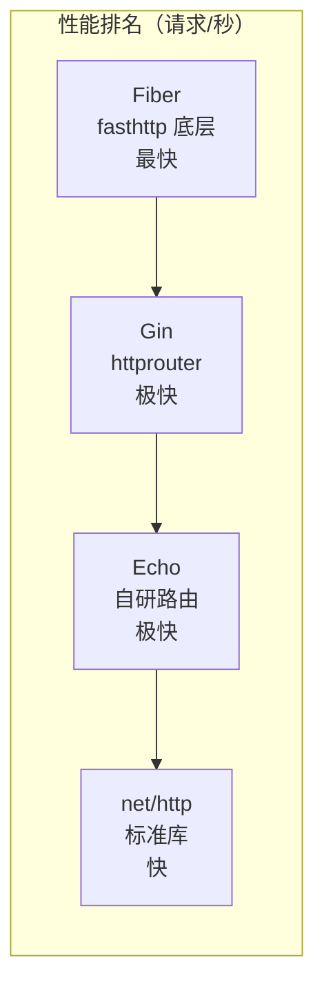
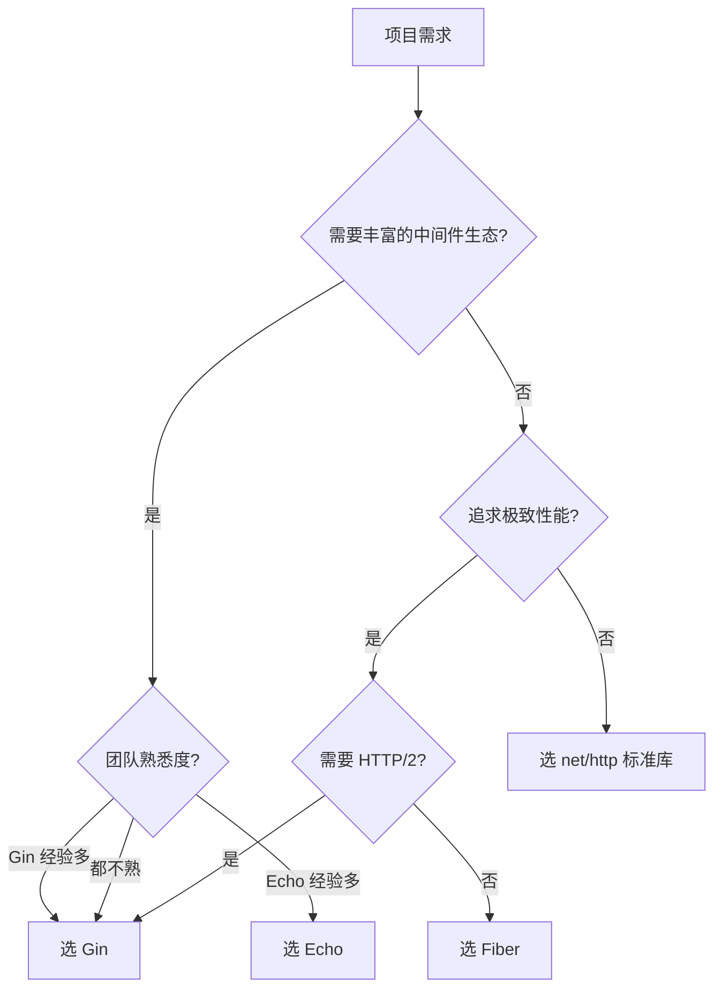

# 框架选型对比

## 概念说明

Go Web 框架生态与 Java（Spring Boot 一家独大）不同，Go 社区有多个优秀的 Web 框架并存。选择合适的框架需要综合考虑性能、生态、学习曲线和团队情况。本文对比 Go 四大主流 Web 框架：net/http 标准库、Gin、Echo、Fiber。

## 核心原理

### 框架全面对比

| 维度 | net/http（标准库） | Gin | Echo | Fiber |
|------|-------------------|-----|------|-------|
| **路由实现** | ServeMux（Go 1.22 增强） | Radix Tree（httprouter） | Radix Tree | Radix Tree（fasthttp） |
| **性能** | ★★★★ | ★★★★★ | ★★★★★ | ★★★★★+ |
| **使用率（2025）** | 增长中 | 48%（最高） | ~15% | ~10% |
| **中间件** | 手动实现 | 内置洋葱模型 | 内置洋葱模型 | 内置 |
| **参数验证** | 无内置 | go-playground/validator | go-playground/validator | 内置 |
| **路由分组** | 无内置 | ✅ | ✅ | ✅ |
| **Swagger** | 无内置 | swaggo | swaggo | swagger |
| **HTTP/2** | ✅ 原生支持 | ✅ | ✅ | ❌（fasthttp 不支持） |
| **net/http 兼容** | — | ✅ 完全兼容 | ✅ 完全兼容 | ❌（基于 fasthttp） |
| **学习曲线** | 低 | 低 | 低 | 中（fasthttp 差异） |
| **社区生态** | Go 官方 | 最活跃 | 活跃 | 活跃 |
| **GitHub Stars** | — | 80k+ | 30k+ | 35k+ |

### 性能对比

> ⚠️ 性能差异在大多数业务场景中可以忽略不计。框架选型应优先考虑生态、兼容性和团队熟悉度。

### 适用场景

### 各框架详细分析

#### net/http 标准库

**优势**：
- 零依赖，Go 官方维护
- Go 1.22 增强路由后功能大幅提升
- 与所有 Go 生态库完全兼容
- 适合学习 Go 网络编程原理

**劣势**：
- 缺少参数验证、分组路由等高级功能
- 中间件需要手动实现
- 无内置 Swagger 支持

**适用场景**：简单 API、微服务内部接口、对依赖有严格要求的项目

#### Gin

**优势**：
- 使用率最高，社区最活跃，中文资料最丰富
- 性能优秀（Radix Tree 路由）
- 完全兼容 net/http，可以使用所有标准库中间件
- 国内大厂广泛使用（字节跳动、B 站等）

**劣势**：
- 依赖 httprouter（但非常稳定）
- 错误处理不够优雅（需要自定义）

**适用场景**：大多数 Web 项目、REST API、国内团队首选

#### Echo

**优势**：
- API 设计优雅，代码简洁
- 内置更多功能（JWT、CORS、Rate Limiter）
- 性能与 Gin 相当

**劣势**：
- 国内使用率低于 Gin，中文资料较少
- 社区规模小于 Gin

**适用场景**：追求 API 优雅性的项目、海外团队

#### Fiber

**优势**：
- 基于 fasthttp，性能最高
- API 风格类似 Express.js，前端转 Go 友好
- 内置功能丰富

**劣势**：
- 基于 fasthttp，不兼容 net/http 生态
- 不支持 HTTP/2
- 部分标准库中间件无法直接使用

**适用场景**：极致性能需求、不需要 HTTP/2 的场景

## 代码示例

> 💻 完整可运行代码：[code-examples/02-web-data/web-framework/](https://github.com/skyhe58/guide-go/tree/main/code-examples/02-web-data/web-framework/)
> 🏷️ Demo 模式：Part A（直接运行）

## 常见面试题

### Q1: Go Web 框架如何选型？

**难度**：⭐⭐⭐ | **频率**：🔥🔥🔥

**答题思路**：

1. 先说明 Go 框架生态特点（多框架并存，不像 Java 的 Spring 一家独大）
2. 列举主流框架及其特点
3. 给出选型建议（大多数场景选 Gin）
4. 提到 Go 1.22 标准库增强

**标准答案**：

Go Web 框架选型主要考虑：1）大多数项目选 Gin——使用率最高、生态最好、兼容 net/http；2）追求极致性能且不需要 HTTP/2 选 Fiber；3）简单项目或对依赖有严格要求选 net/http 标准库（Go 1.22 增强后功能已足够）；4）Echo 是 Gin 的优秀替代品。关键原则：框架性能差异在业务场景中通常可忽略，优先考虑生态和团队熟悉度。

### Q2: Gin 和标准库 net/http 的区别？

**难度**：⭐⭐ | **频率**：🔥🔥🔥

**标准答案**：

Gin 基于 httprouter 实现 Radix Tree 路由，性能优于标准库的 ServeMux。Gin 提供了中间件机制、参数绑定与验证、分组路由、Swagger 集成等开箱即用的功能。标准库在 Go 1.22 增强了路由（支持方法和路径参数），但仍缺少参数验证等高级功能。Gin 完全兼容 net/http，底层仍然使用标准库的 Server。

## 常见陷阱

1. **过度关注性能**：框架间的性能差异在实际业务中通常不是瓶颈，数据库和网络 I/O 才是
2. **Fiber 兼容性**：Fiber 基于 fasthttp，不兼容 net/http 生态，迁移成本高
3. **盲目跟风**：选择团队最熟悉的框架，而不是最新最热的
4. **忽略标准库**：Go 1.22 后标准库路由能力大幅提升，简单项目无需引入框架

## 参考资料

- [Gin GitHub](https://github.com/gin-gonic/gin)
- [Echo GitHub](https://github.com/labstack/echo)
- [Fiber GitHub](https://github.com/gofiber/fiber)
- [Go 1.22 Release Notes](https://go.dev/doc/go1.22)
- [JetBrains Go 开发者调查 2025](https://blog.jetbrains.com/go/)
