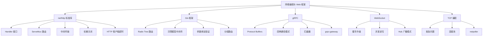

# 网络编程与 Web 框架面试指南

> 本指南汇总网络编程与 Web 框架模块的高频面试题，按考察频率排序。每道题标注难度和出现频率，帮助你高效准备面试。

## 🔥🔥🔥 最高频（几乎必考）

### Q1: net/http 的 Handler 接口设计

**难度**：⭐⭐⭐ | **频率**：🔥🔥🔥 | **关联**：[net/http 标准库](./01-net-http.md)

**标准答案**：

`Handler` 接口只有一个方法 `ServeHTTP(ResponseWriter, *Request)`。`HandlerFunc` 是一个适配器类型，让普通函数也能作为 Handler。这种设计体现了 Go 的小接口哲学——接口越小，实现越灵活。中间件模式正是基于 Handler 接口的函数组合。

**深入追问**：
- `http.Handle` 和 `http.HandleFunc` 的区别？（前者接受 Handler 接口，后者接受函数）
- 为什么 Go 1.22 要增强 ServeMux？（之前不支持方法匹配和路径参数，需要第三方路由库）

---

### Q2: HTTP 服务优雅关闭的实现

**难度**：⭐⭐⭐ | **频率**：🔥🔥🔥 | **关联**：[net/http 标准库](./01-net-http.md)

**标准答案**：

1. 使用 `signal.Notify` 监听 SIGINT/SIGTERM 信号
2. 收到信号后调用 `http.Server.Shutdown(ctx)`
3. Shutdown 会停止接受新连接，等待已有请求处理完成
4. 通过 context 设置超时（如 5 秒），防止无限等待
5. 超时后强制关闭

```go
quit := make(chan os.Signal, 1)
signal.Notify(quit, syscall.SIGINT, syscall.SIGTERM)
<-quit

ctx, cancel := context.WithTimeout(context.Background(), 5*time.Second)
defer cancel()
srv.Shutdown(ctx)
```

**深入追问**：
- `Shutdown` 和 `Close` 的区别？（Shutdown 等待请求完成，Close 立即关闭）
- 如何处理 WebSocket 长连接的关闭？（需要在 Shutdown 前通知 WebSocket 客户端）

---

### Q3: Gin 的路由实现原理

**难度**：⭐⭐⭐ | **频率**：🔥🔥🔥 | **关联**：[Gin 框架](./03-gin.md)

**标准答案**：

Gin 基于 httprouter，使用 Radix Tree（基数树/压缩前缀树）实现路由。每个 HTTP 方法维护一棵独立的树。路由注册时将路径插入树中，匹配时从根节点向下查找。时间复杂度为 O(路径长度)，不受路由数量影响。支持路径参数（`:id`）和通配符（`*path`）。

**深入追问**：
- Radix Tree 和 Trie 的区别？（Radix Tree 是压缩的 Trie，合并只有一个子节点的路径）
- 为什么每个 HTTP 方法一棵树？（避免方法匹配的额外开销）

---

### Q4: Gin 中间件执行机制

**难度**：⭐⭐⭐ | **频率**：🔥🔥🔥 | **关联**：[Gin 框架](./03-gin.md)

**标准答案**：

Gin 中间件采用洋葱模型（类似 Koa）。中间件按注册顺序执行，`c.Next()` 调用下一个中间件，返回后继续执行当前中间件的后续代码。`c.Abort()` 终止后续中间件执行（但当前中间件的后续代码仍会执行）。

执行顺序：Logger 前处理 → Auth 前处理 → Handler → Auth 后处理 → Logger 后处理

**深入追问**：
- `c.Set()` / `c.Get()` 如何在中间件间传递数据？（存储在 gin.Context 的 Keys map 中）
- 全局中间件和分组中间件的执行顺序？（全局 → 分组 → 路由级别）

---

### Q5: gRPC 四种通信模式

**难度**：⭐⭐⭐ | **频率**：🔥🔥🔥 | **关联**：[gRPC](./04-grpc.md)

**标准答案**：

1. **Unary**：一请求一响应，最常用（如获取用户信息）
2. **Server Streaming**：客户端发一个请求，服务端返回数据流（如实时日志推送）
3. **Client Streaming**：客户端发送数据流，服务端返回一个响应（如文件上传）
4. **Bidirectional Streaming**：双向数据流（如聊天应用）

底层都基于 HTTP/2 的 Stream 实现，一个 TCP 连接可以承载多个 Stream。

**深入追问**：
- gRPC 为什么选择 HTTP/2？（多路复用、头部压缩、服务端推送）
- Streaming 模式下如何处理错误？（通过 Stream 的 error 返回，或使用 trailer metadata）

---

### Q6: gRPC vs REST 如何选择？

**难度**：⭐⭐⭐ | **频率**：🔥🔥🔥 | **关联**：[gRPC](./04-grpc.md)

**标准答案**：

- **gRPC**：适合微服务内部通信，Protocol Buffers 二进制序列化性能高，强类型接口定义，支持 Streaming
- **REST**：适合对外 API 和前后端交互，浏览器原生支持，JSON 可读性好，调试方便
- **同时提供**：使用 grpc-gateway 将 gRPC 服务同时暴露为 REST API

**深入追问**：
- Protocol Buffers 和 JSON 的性能差异？（protobuf 序列化速度快 3-10 倍，体积小 3-10 倍）
- gRPC 的错误码体系？（16 个标准错误码，如 NotFound、PermissionDenied、Internal）

---

## 🔥🔥 高频

### Q7: Go Web 框架选型

**难度**：⭐⭐ | **频率**：🔥🔥 | **关联**：[框架选型对比](./06-comparison.md)

**标准答案**：

大多数项目选 Gin（使用率最高、生态最好）。追求极致性能选 Fiber（基于 fasthttp，但不兼容 net/http）。简单项目选标准库（Go 1.22 增强后功能足够）。关键原则：框架性能差异在业务场景中通常可忽略，优先考虑生态和团队熟悉度。

---

### Q8: TCP 粘包问题

**难度**：⭐⭐⭐ | **频率**：🔥🔥 | **关联**：[TCP 编程](./02-tcp.md)

**标准答案**：

TCP 是字节流协议，没有消息边界。解决方案：1）固定长度消息；2）分隔符（如 `\n`）；3）长度前缀（最常用）——消息头用固定字节表示消息体长度，接收方先读长度再读消息体。Go 中使用 `io.ReadFull` 确保读取指定字节数。

---

### Q9: WebSocket 和 HTTP 的区别

**难度**：⭐⭐ | **频率**：🔥🔥 | **关联**：[WebSocket](./05-websocket.md)

**标准答案**：

HTTP 是请求-响应模式，每次通信需要客户端发起请求。WebSocket 通过一次 HTTP 升级握手建立持久的全双工连接，之后双方可以随时发送消息。WebSocket 适合实时通信（聊天、通知、行情），HTTP 适合传统的请求-响应场景。

---

### Q10: HTTP 超时配置

**难度**：⭐⭐⭐ | **频率**：🔥🔥 | **关联**：[net/http 标准库](./01-net-http.md)

**标准答案**：

Go HTTP 有多层超时配置：
- **客户端**：`http.Client.Timeout`（总超时）、`Transport.TLSHandshakeTimeout`、`Transport.ResponseHeaderTimeout`
- **服务端**：`http.Server.ReadTimeout`（读取请求超时）、`WriteTimeout`（写入响应超时）、`IdleTimeout`（空闲连接超时）

生产环境必须设置超时，否则可能导致 goroutine 泄漏和资源耗尽。

---

## 🔥 中频

### Q11: gRPC 拦截器

**难度**：⭐⭐⭐ | **频率**：🔥 | **关联**：[gRPC](./04-grpc.md)

**标准答案**：

gRPC 拦截器类似 HTTP 中间件，分为 Unary 拦截器和 Stream 拦截器，分别用于一元调用和流式调用。拦截器可以实现日志记录、认证、限流、错误处理等横切关注点。通过 `grpc.ChainUnaryInterceptor` 可以链式组合多个拦截器。

---

### Q12: Go 的 netpoller 机制

**难度**：⭐⭐⭐⭐ | **频率**：🔥 | **关联**：[TCP 编程](./02-tcp.md)

**标准答案**：

Go 的 netpoller 是基于 epoll（Linux）/kqueue（macOS）的 I/O 多路复用机制，对 goroutine 透明。当 goroutine 执行网络 I/O 时，如果数据未就绪，goroutine 会被挂起（park），netpoller 监控 fd 就绪后唤醒 goroutine。这使得开发者可以用同步阻塞的代码风格编写高性能网络程序。

---

## 面试知识图谱



## 参考资料

- [Go 官方文档 - net/http](https://pkg.go.dev/net/http)
- [Gin 官方文档](https://gin-gonic.com/docs/)
- [gRPC 官方文档](https://grpc.io/docs/languages/go/)
- [gorilla/websocket](https://github.com/gorilla/websocket)
