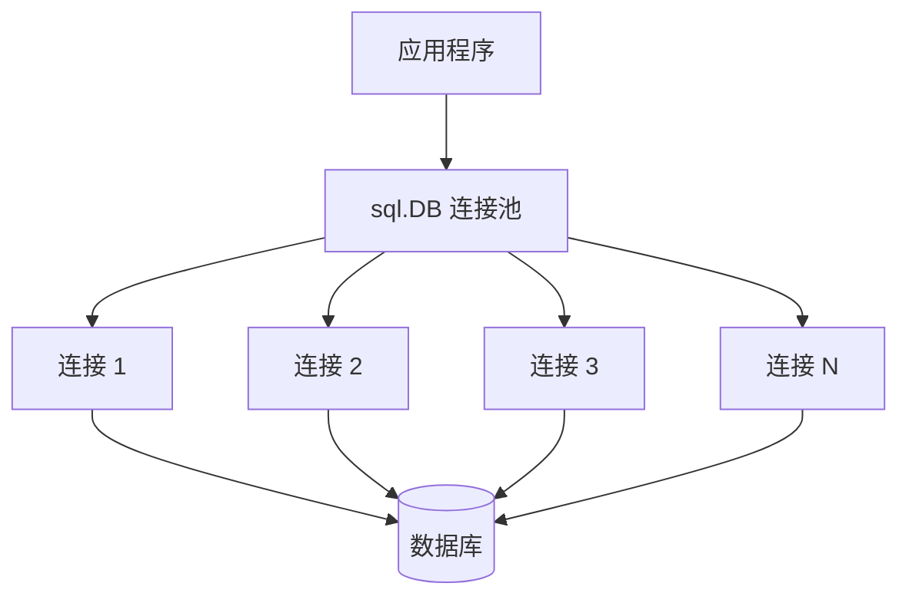

# database/sql 标准库

## 概念说明

`database/sql` 是 Go 标准库提供的数据库访问抽象层，定义了统一的接口规范。它本身不包含任何数据库驱动，需要配合具体驱动使用（如 `go-sql-driver/mysql`、`pgx`）。

核心设计：
- **连接池管理**：自动管理数据库连接的创建、复用和回收
- **预编译语句**：防止 SQL 注入，提升重复查询性能
- **事务支持**：通过 `Tx` 对象管理事务生命周期
- **Null 类型处理**：`sql.NullString`、`sql.NullInt64` 等处理可空字段

## 核心原理

### 连接池



关键配置：
```go
db.SetMaxOpenConns(25)           // 最大打开连接数
db.SetMaxIdleConns(10)           // 最大空闲连接数
db.SetConnMaxLifetime(5 * time.Minute) // 连接最大生命周期
db.SetConnMaxIdleTime(3 * time.Minute) // 空闲连接最大存活时间
```

### Scanner 与 Valuer 接口

```go
// sql.Scanner：从数据库读取值时的自定义解析
type Scanner interface {
    Scan(src interface{}) error
}

// driver.Valuer：写入数据库时的自定义序列化
type Valuer interface {
    Value() (driver.Value, error)
}
```

## 标准库方案

```go
// 查询单行
var name string
err := db.QueryRow("SELECT name FROM users WHERE id = $1", id).Scan(&name)

// 查询多行
rows, err := db.Query("SELECT id, name FROM users WHERE age > $1", 18)
defer rows.Close()
for rows.Next() {
    var id int
    var name string
    rows.Scan(&id, &name)
}

// 执行写操作
result, err := db.Exec("INSERT INTO users (name, email) VALUES ($1, $2)", name, email)
lastID, _ := result.LastInsertId()
affected, _ := result.RowsAffected()

// 事务
tx, err := db.Begin()
_, err = tx.Exec("UPDATE accounts SET balance = balance - $1 WHERE id = $2", amount, fromID)
_, err = tx.Exec("UPDATE accounts SET balance = balance + $1 WHERE id = $2", amount, toID)
if err != nil {
    tx.Rollback()
    return err
}
tx.Commit()
```

## 常见面试题

### Q1: database/sql 的连接池是如何工作的？

**难度**：⭐⭐⭐ | **频率**：🔥🔥🔥

**标准答案**：

`sql.DB` 内部维护一个连接池，调用 `Query`/`Exec` 时从池中获取连接，使用完毕后归还。通过 `SetMaxOpenConns` 控制最大连接数，`SetMaxIdleConns` 控制空闲连接数，`SetConnMaxLifetime` 控制连接最大生命周期。连接池是并发安全的。

## 常见陷阱

1. **忘记关闭 rows**：`rows.Close()` 必须调用，否则连接不会归还到池中
2. **连接泄漏**：长时间持有 `rows` 或 `tx` 不释放会耗尽连接池
3. **Null 值处理**：直接 Scan 到 `string` 类型遇到 NULL 会报错，需用 `sql.NullString`

## 参考资料

- [Go 官方文档 - database/sql](https://pkg.go.dev/database/sql)
- [Go database/sql tutorial](http://go-database-sql.org/)
