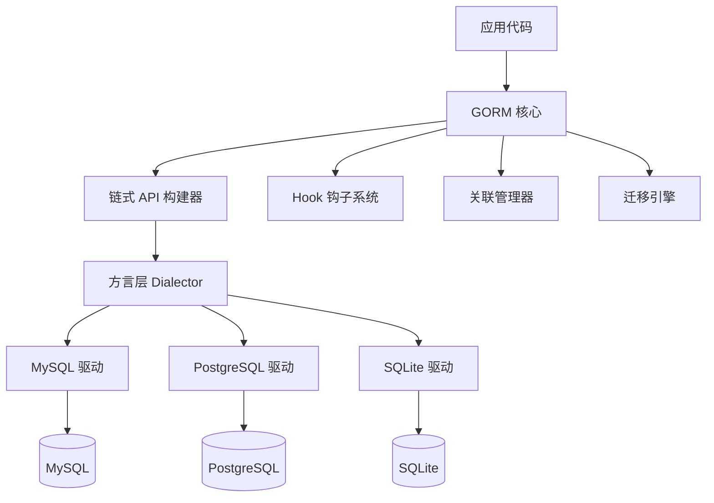
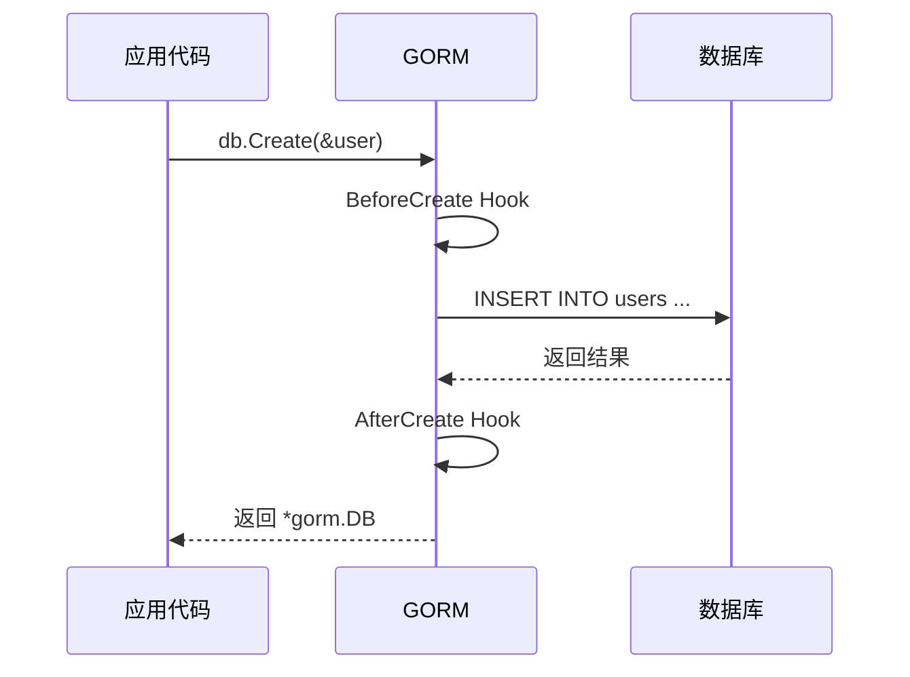

# GORM

## 概念说明

GORM 是 Go 语言中最流行的 ORM（Object-Relational Mapping）框架，提供了全功能的数据库操作抽象。它将数据库表映射为 Go 结构体，通过链式 API 实现 CRUD 操作，大幅降低了数据库操作的复杂度。

核心特性：
- **模型定义**：通过结构体标签（`gorm:"..."` tag）定义表结构、字段约束、索引
- **CRUD 操作**：链式 API，支持条件查询、分页、排序、聚合
- **关联关系**：一对一、一对多、多对多、多态关联
- **Hook 钩子**：BeforeCreate、AfterCreate 等生命周期回调
- **自动迁移**：AutoMigrate 自动同步结构体到数据库表
- **Scope 作用域**：封装常用查询条件，实现查询复用
- **软删除**：内置 `gorm.DeletedAt` 字段支持逻辑删除
- **日志与慢查询**：可配置的日志级别和慢查询阈值

## 核心原理

### GORM 架构



### 模型定义

GORM 使用结构体标签定义数据库映射关系：

```go
type User struct {
    gorm.Model              // 内嵌：ID, CreatedAt, UpdatedAt, DeletedAt
    Name     string         `gorm:"size:100;not null;index"`
    Email    string         `gorm:"uniqueIndex;size:255"`
    Age      int            `gorm:"default:0"`
    Role     string         `gorm:"type:varchar(20);default:'user'"`
    Profile  Profile        // 一对一关联
    Articles []Article      // 一对多关联
}

// gorm.Model 等价于：
// type Model struct {
//     ID        uint           `gorm:"primarykey"`
//     CreatedAt time.Time
//     UpdatedAt time.Time
//     DeletedAt gorm.DeletedAt `gorm:"index"`
// }
```

### Hook 生命周期



Hook 执行顺序：
- **Create**：BeforeSave → BeforeCreate → 执行 SQL → AfterCreate → AfterSave
- **Update**：BeforeSave → BeforeUpdate → 执行 SQL → AfterUpdate → AfterSave
- **Delete**：BeforeDelete → 执行 SQL → AfterDelete
- **Query**：AfterFind

### Scope 作用域

Scope 是 GORM 的查询复用机制，将常用查询条件封装为函数：

```go
// 定义 Scope
func ActiveUsers(db *gorm.DB) *gorm.DB {
    return db.Where("status = ?", "active")
}

func Paginate(page, pageSize int) func(db *gorm.DB) *gorm.DB {
    return func(db *gorm.DB) *gorm.DB {
        offset := (page - 1) * pageSize
        return db.Offset(offset).Limit(pageSize)
    }
}

// 使用 Scope
db.Scopes(ActiveUsers, Paginate(1, 10)).Find(&users)
```

### 软删除

GORM 内置软删除支持，包含 `gorm.DeletedAt` 字段的模型在删除时不会物理删除，而是设置 `deleted_at` 时间戳：

```go
// 软删除：UPDATE users SET deleted_at = NOW() WHERE id = 1
db.Delete(&user, 1)

// 查询时自动过滤已删除记录
db.Find(&users) // SELECT * FROM users WHERE deleted_at IS NULL

// 查询包含已删除记录
db.Unscoped().Find(&users) // SELECT * FROM users

// 物理删除
db.Unscoped().Delete(&user, 1) // DELETE FROM users WHERE id = 1
```

## 第三方库方案

### 安装

```bash
go get -u gorm.io/gorm
go get -u gorm.io/driver/mysql      # MySQL 驱动
go get -u gorm.io/driver/postgres   # PostgreSQL 驱动
```

### CRUD 操作

```go
// 创建
user := User{Name: "张三", Email: "zhangsan@example.com", Age: 25}
result := db.Create(&user)
// result.RowsAffected  // 影响行数
// result.Error         // 错误信息
// user.ID              // 自动填充主键

// 批量创建
users := []User{{Name: "A"}, {Name: "B"}, {Name: "C"}}
db.Create(&users)

// 查询
var user User
db.First(&user, 1)                          // 按主键查询
db.First(&user, "name = ?", "张三")          // 条件查询
db.Where("age > ?", 18).Find(&users)        // 多条件查询
db.Select("name", "age").Find(&users)       // 选择字段
db.Order("created_at desc").Find(&users)    // 排序
db.Limit(10).Offset(20).Find(&users)        // 分页

// 更新
db.Model(&user).Update("name", "李四")                    // 单字段更新
db.Model(&user).Updates(User{Name: "李四", Age: 30})      // 多字段更新（零值不更新）
db.Model(&user).Updates(map[string]interface{}{"age": 0}) // Map 更新（零值也更新）

// 删除
db.Delete(&user, 1)                         // 软删除（如果有 DeletedAt 字段）
db.Where("age < ?", 18).Delete(&User{})     // 条件删除
```

### 关联关系

```go
// 一对多
type User struct {
    gorm.Model
    Name     string
    Articles []Article // 一个用户有多篇文章
}

type Article struct {
    gorm.Model
    Title  string
    UserID uint   // 外键
    User   User   // 关联
}

// 预加载
db.Preload("Articles").Find(&users)

// 多对多
type Article struct {
    gorm.Model
    Title string
    Tags  []Tag `gorm:"many2many:article_tags;"` // 多对多
}

type Tag struct {
    gorm.Model
    Name     string
    Articles []Article `gorm:"many2many:article_tags;"`
}
```

### 日志配置

```go
import "gorm.io/gorm/logger"

db, err := gorm.Open(mysql.Open(dsn), &gorm.Config{
    Logger: logger.Default.LogMode(logger.Info), // Silent/Error/Warn/Info
    // 慢查询阈值
    // Logger: logger.New(log.New(os.Stdout, "\r\n", log.LstdFlags),
    //     logger.Config{
    //         SlowThreshold: 200 * time.Millisecond,
    //         LogLevel:      logger.Warn,
    //     }),
})
```

## 代码示例

> 💻 完整可运行代码：[code-examples/02-web-data/database/gorm-examples/](https://github.com/your-repo/code-examples/02-web-data/database/gorm-examples/)
> 🏷️ Demo 模式：Part A（内存模拟 GORM 概念）/ Part B（连接真实 MySQL/PostgreSQL）

## 常见面试题

### Q1: GORM 的零值问题如何解决？

**难度**：⭐⭐⭐ | **频率**：🔥🔥🔥

**标准答案**：

GORM 使用结构体更新时，零值字段（如 `0`、`""`、`false`）不会被更新。解决方案：
1. 使用 `map[string]interface{}` 代替结构体
2. 使用指针类型（`*int`、`*string`）
3. 使用 `db.Select("field").Updates(...)` 指定更新字段

### Q2: GORM 的 Preload 和 Joins 有什么区别？

**难度**：⭐⭐⭐ | **频率**：🔥🔥

**标准答案**：

- `Preload`：分两次查询，先查主表再查关联表，适合一对多关联
- `Joins`：使用 SQL JOIN 一次查询，适合一对一关联或需要关联条件过滤的场景
- `Preload` 不会产生笛卡尔积问题，`Joins` 在一对多时可能产生重复数据

### Q3: GORM 的 Hook 有哪些使用场景？

**难度**：⭐⭐ | **频率**：🔥🔥

**标准答案**：

常见使用场景：
- `BeforeCreate`：自动生成 UUID、密码加密、数据校验
- `AfterCreate`：发送通知、写入审计日志
- `BeforeUpdate`：更新时间戳、数据校验
- `AfterDelete`：清理关联数据、发送事件

## 常见陷阱

1. **零值不更新**：使用结构体 `Updates` 时零值字段被忽略，需用 `map` 或指针类型
2. **N+1 查询**：遍历关联数据时未使用 `Preload`，导致大量 SQL 查询
3. **事务中 panic**：GORM 事务中 panic 不会自动回滚，需配合 `defer tx.Rollback()`
4. **AutoMigrate 局限**：只能添加字段和索引，不能删除字段或修改字段类型

## 参考资料

- [GORM 官方文档](https://gorm.io/zh_CN/docs/)
- [GORM GitHub](https://github.com/go-gorm/gorm)
