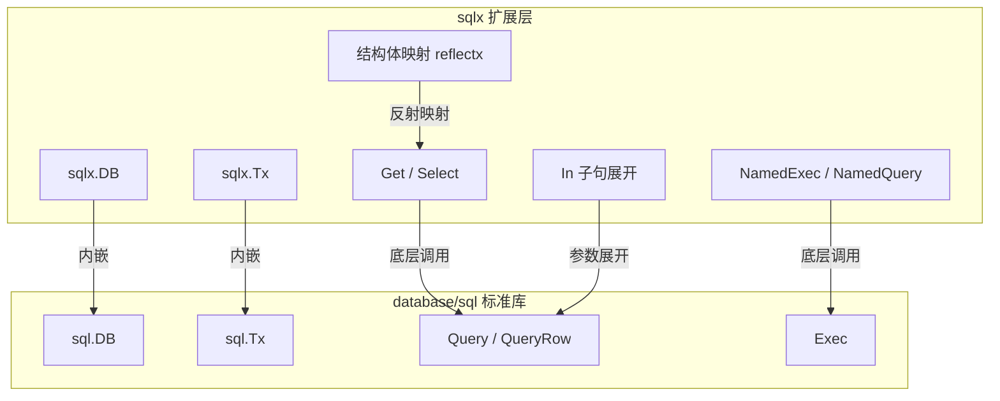

# sqlx

## 概念说明

`sqlx` 是 `database/sql` 的轻量级扩展库，由 Jason Moiron 开发。它不是 ORM，而是在标准库基础上增加了结构体映射、命名参数、批量操作等实用功能，同时保持与 `database/sql` 完全兼容。

核心特性：
- **结构体映射**：自动将查询结果映射到 Go 结构体（通过 `db` tag）
- **命名参数**：支持 `:name` 风格的命名参数绑定
- **批量操作**：`NamedExec` 批量插入、`In` 子句展开
- **Get/Select**：简化单行/多行查询，自动 Scan
- **完全兼容**：`sqlx.DB` 内嵌 `sql.DB`，可无缝替换

设计哲学：**不隐藏 SQL，只减少样板代码**。

## 核心原理

### sqlx 与 database/sql 的关系



### 结构体映射原理

sqlx 通过 `db` 标签将数据库列名映射到结构体字段：

```go
type User struct {
    ID        int       `db:"id"`
    Name      string    `db:"name"`
    Email     string    `db:"email"`
    CreatedAt time.Time `db:"created_at"`
}

// sqlx 内部使用 reflectx 包进行反射映射
// 1. 解析结构体的 db 标签
// 2. 构建列名到字段的映射表（缓存）
// 3. 查询结果按列名自动 Scan 到对应字段
```

### 命名参数

```go
// 使用 :name 风格的命名参数
query := `INSERT INTO users (name, email) VALUES (:name, :email)`

// NamedExec 从结构体或 map 中提取参数值
user := User{Name: "张三", Email: "zhangsan@example.com"}
db.NamedExec(query, user)

// 也支持 map
params := map[string]interface{}{
    "name":  "张三",
    "email": "zhangsan@example.com",
}
db.NamedExec(query, params)
```

## 第三方库方案

### 安装

```bash
go get github.com/jmoiron/sqlx
```

### 基本 CRUD

```go
// 连接数据库
db, err := sqlx.Connect("mysql", "root:root123@tcp(localhost:3306)/testdb?parseTime=true")

// 查询单行 — Get
var user User
err = db.Get(&user, "SELECT * FROM users WHERE id = ?", 1)

// 查询多行 — Select
var users []User
err = db.Select(&users, "SELECT * FROM users WHERE age > ?", 18)

// 执行写操作
result, err := db.Exec("INSERT INTO users (name, email) VALUES (?, ?)", "张三", "zhangsan@example.com")

// 命名参数插入
_, err = db.NamedExec(`INSERT INTO users (name, email) VALUES (:name, :email)`, user)
```

### 批量操作

```go
// 批量插入
users := []User{
    {Name: "A", Email: "a@example.com"},
    {Name: "B", Email: "b@example.com"},
    {Name: "C", Email: "c@example.com"},
}
_, err := db.NamedExec(`INSERT INTO users (name, email) VALUES (:name, :email)`, users)

// IN 子句展开
query, args, err := sqlx.In("SELECT * FROM users WHERE id IN (?)", []int{1, 2, 3})
query = db.Rebind(query) // 转换占位符风格
var users []User
db.Select(&users, query, args...)
```

### 事务

```go
tx, err := db.Beginx()
if err != nil {
    return err
}
defer tx.Rollback()

_, err = tx.NamedExec(`UPDATE accounts SET balance = balance - :amount WHERE id = :from_id`,
    map[string]interface{}{"amount": 100, "from_id": 1})
if err != nil {
    return err
}

_, err = tx.NamedExec(`UPDATE accounts SET balance = balance + :amount WHERE id = :to_id`,
    map[string]interface{}{"amount": 100, "to_id": 2})
if err != nil {
    return err
}

return tx.Commit()
```

## 代码示例

> 💻 完整可运行代码：[code-examples/02-web-data/database/sqlx-examples/](https://github.com/your-repo/code-examples/02-web-data/database/sqlx-examples/)
> 🏷️ Demo 模式：Part A（内存模拟 sqlx 概念）/ Part B（连接真实 MySQL）

## 常见面试题

### Q1: sqlx 和 GORM 有什么区别？如何选型？

**难度**：⭐⭐⭐ | **频率**：🔥🔥🔥

**标准答案**：

| 维度 | sqlx | GORM |
|------|------|------|
| 定位 | SQL 增强工具 | 全功能 ORM |
| SQL 控制 | 手写 SQL，完全控制 | 链式 API 生成 SQL |
| 学习曲线 | 低（会 SQL 即可） | 中（需学习 GORM API） |
| 性能 | 接近原生 | 有反射和抽象开销 |
| 适用场景 | 复杂查询、性能敏感 | 快速开发、标准 CRUD |

### Q2: sqlx 的 Get 和 Select 有什么区别？

**难度**：⭐⭐ | **频率**：🔥🔥

**标准答案**：

- `Get`：查询单行，映射到单个结构体，底层调用 `QueryRow`
- `Select`：查询多行，映射到结构体切片，底层调用 `Query`
- `Get` 在无结果时返回 `sql.ErrNoRows`，`Select` 返回空切片

## 常见陷阱

1. **忘记 db 标签**：结构体字段没有 `db` 标签时，sqlx 使用字段名的小写形式匹配列名
2. **IN 子句需要 Rebind**：使用 `sqlx.In` 后必须调用 `db.Rebind` 转换占位符
3. **Select 大结果集**：`Select` 会一次性加载所有结果到内存，大数据量应使用 `Queryx` 逐行处理

## 参考资料

- [sqlx GitHub](https://github.com/jmoiron/sqlx)
- [sqlx 文档](https://jmoiron.github.io/sqlx/)
- [Illustrated Guide to SQLX](https://jmoiron.github.io/sqlx/)
