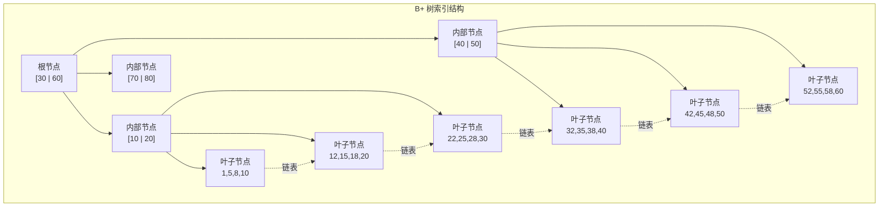
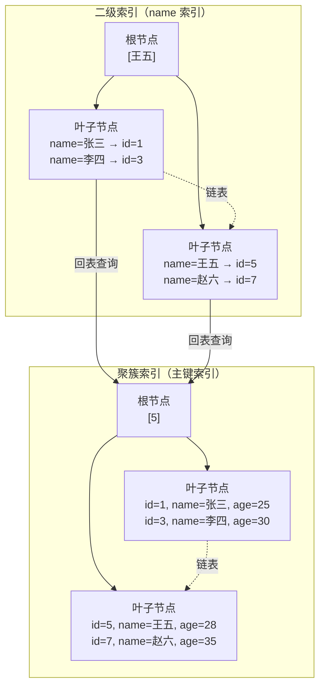
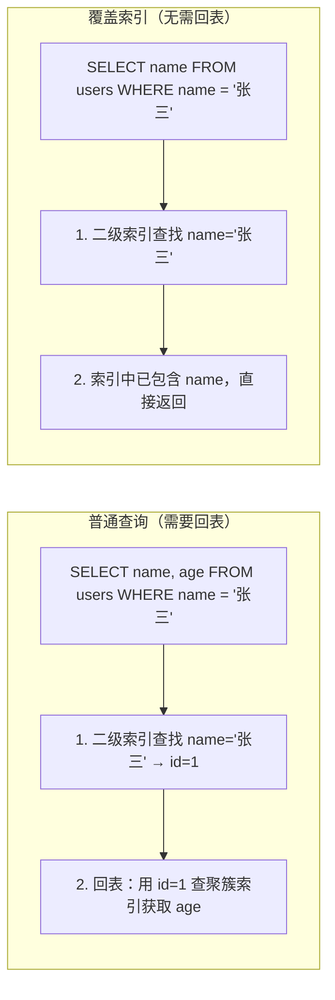

# MySQL 索引原理

## 概念说明

索引是数据库中用于加速查询的数据结构。MySQL InnoDB 引擎使用 B+ 树作为索引的底层数据结构，通过减少磁盘 I/O 次数来提升查询性能。理解索引原理是数据库优化和面试的核心知识点。

核心概念：
- **B+ 树**：多路平衡搜索树，所有数据存储在叶子节点，叶子节点通过链表连接
- **聚簇索引**：数据按主键顺序物理存储，InnoDB 表只有一个聚簇索引
- **二级索引**：非主键索引，叶子节点存储主键值（需要回表）
- **覆盖索引**：查询的字段全部在索引中，无需回表
- **索引失效**：某些查询条件导致索引无法使用，退化为全表扫描

## 核心原理

### B+ 树结构



B+ 树特点：
- **非叶子节点只存索引键**：不存数据，一个节点可以存更多键，树更矮
- **叶子节点存储数据**：所有数据都在叶子节点，查询路径长度一致
- **叶子节点链表连接**：支持高效的范围查询
- **树高度通常 3-4 层**：千万级数据只需 3-4 次磁盘 I/O

### 聚簇索引 vs 二级索引



关键区别：
- **聚簇索引**：叶子节点存储完整行数据，一张表只有一个
- **二级索引**：叶子节点存储主键值，查询非索引字段需要**回表**

### 覆盖索引



覆盖索引：查询的所有字段都包含在索引中，无需回表，性能最优。

### 联合索引与最左前缀原则

```sql
-- 联合索引 (name, age, city)
CREATE INDEX idx_name_age_city ON users(name, age, city);

-- ✅ 命中索引
WHERE name = '张三'                          -- 最左前缀
WHERE name = '张三' AND age = 25             -- 最左前缀
WHERE name = '张三' AND age = 25 AND city = '北京'  -- 全部命中

-- ❌ 不命中索引
WHERE age = 25                               -- 跳过了 name
WHERE city = '北京'                          -- 跳过了 name 和 age
WHERE age = 25 AND city = '北京'             -- 跳过了 name
```

### 索引失效场景

| 场景 | 示例 | 原因 |
|------|------|------|
| 对索引列使用函数 | `WHERE YEAR(created_at) = 2024` | 函数破坏了 B+ 树的有序性 |
| 隐式类型转换 | `WHERE phone = 13800138000`（phone 是 varchar） | 触发隐式转换，等同于函数调用 |
| LIKE 左模糊 | `WHERE name LIKE '%三'` | 无法利用 B+ 树的前缀匹配 |
| OR 条件 | `WHERE name = '张三' OR age = 25`（age 无索引） | OR 中有一个条件无索引则全表扫描 |
| 不等于 | `WHERE status != 1` | 需要扫描大部分数据，优化器选择全表扫描 |
| IS NOT NULL | `WHERE name IS NOT NULL` | 大部分数据非 NULL 时优化器放弃索引 |
| 联合索引不满足最左前缀 | `WHERE age = 25`（索引是 name,age） | 跳过了最左列 |

## 标准库方案

索引原理是数据库层面的知识，Go 代码中通过 SQL 语句创建和使用索引：

```go
// 创建索引
db.Exec("CREATE INDEX idx_users_email ON users(email)")
db.Exec("CREATE UNIQUE INDEX idx_users_phone ON users(phone)")
db.Exec("CREATE INDEX idx_users_name_age ON users(name, age)")

// 使用 EXPLAIN 分析查询是否命中索引
rows, _ := db.Query("EXPLAIN SELECT * FROM users WHERE email = ?", "test@example.com")
```

## 代码示例

> 💻 完整可运行代码：[code-examples/02-web-data/database/database-sql/](https://github.com/your-repo/code-examples/02-web-data/database/database-sql/)
> 🏷️ Demo 模式：Part A（内存模拟 B+ 树索引原理）

## 常见面试题

### Q1: 为什么 MySQL 使用 B+ 树而不是 B 树或哈希表？

**难度**：⭐⭐⭐⭐ | **频率**：🔥🔥🔥

**答题思路**：

1. 对比 B 树：B+ 树非叶子节点不存数据，同一层可存更多键，树更矮，磁盘 I/O 更少
2. 对比哈希表：哈希表不支持范围查询和排序
3. B+ 树叶子节点链表连接，天然支持范围查询

**标准答案**：

B+ 树相比 B 树：非叶子节点只存键不存数据，单个节点可以存储更多索引键，树的高度更低（通常 3-4 层），减少磁盘 I/O。叶子节点通过双向链表连接，支持高效的范围查询和排序。

相比哈希表：哈希索引只支持等值查询，不支持范围查询（`>`、`<`、`BETWEEN`）和排序（`ORDER BY`），也不支持最左前缀匹配。

### Q2: 什么是回表？如何避免？

**难度**：⭐⭐⭐ | **频率**：🔥🔥🔥

**标准答案**：

回表是指通过二级索引查到主键后，再用主键到聚簇索引中查找完整行数据的过程。避免回表的方法：
1. **覆盖索引**：将查询需要的字段都包含在索引中
2. **索引下推（ICP）**：MySQL 5.6+ 在索引层面过滤更多条件，减少回表次数

### Q3: 联合索引的最左前缀原则是什么？

**难度**：⭐⭐⭐ | **频率**：🔥🔥🔥

**标准答案**：

联合索引 `(a, b, c)` 按照从左到右的顺序构建 B+ 树。查询条件必须从最左列开始才能使用索引。`WHERE a=1` 可以用，`WHERE a=1 AND b=2` 可以用，`WHERE b=2` 不能用（跳过了 a）。MySQL 8.0 引入了索引跳跃扫描（Index Skip Scan），在某些场景下可以跳过最左列。

## 常见陷阱

1. **索引不是越多越好**：每个索引都需要维护 B+ 树，写操作（INSERT/UPDATE/DELETE）会变慢
2. **小表不需要索引**：数据量小时全表扫描可能比走索引更快
3. **选择性低的字段不适合建索引**：如性别字段只有男/女，索引效果差
4. **字符串字段建索引注意长度**：可以使用前缀索引 `INDEX(name(10))` 减少索引大小

## 参考资料

- [MySQL 官方文档 - 索引](https://dev.mysql.com/doc/refman/8.0/en/optimization-indexes.html)
- [高性能 MySQL（第四版）](https://www.oreilly.com/library/view/high-performance-mysql/9781492080503/)
