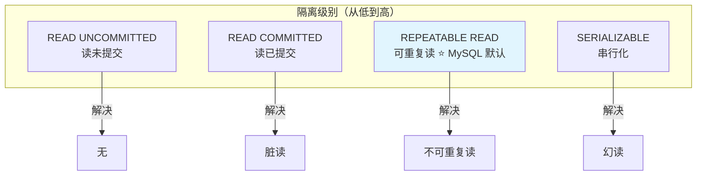
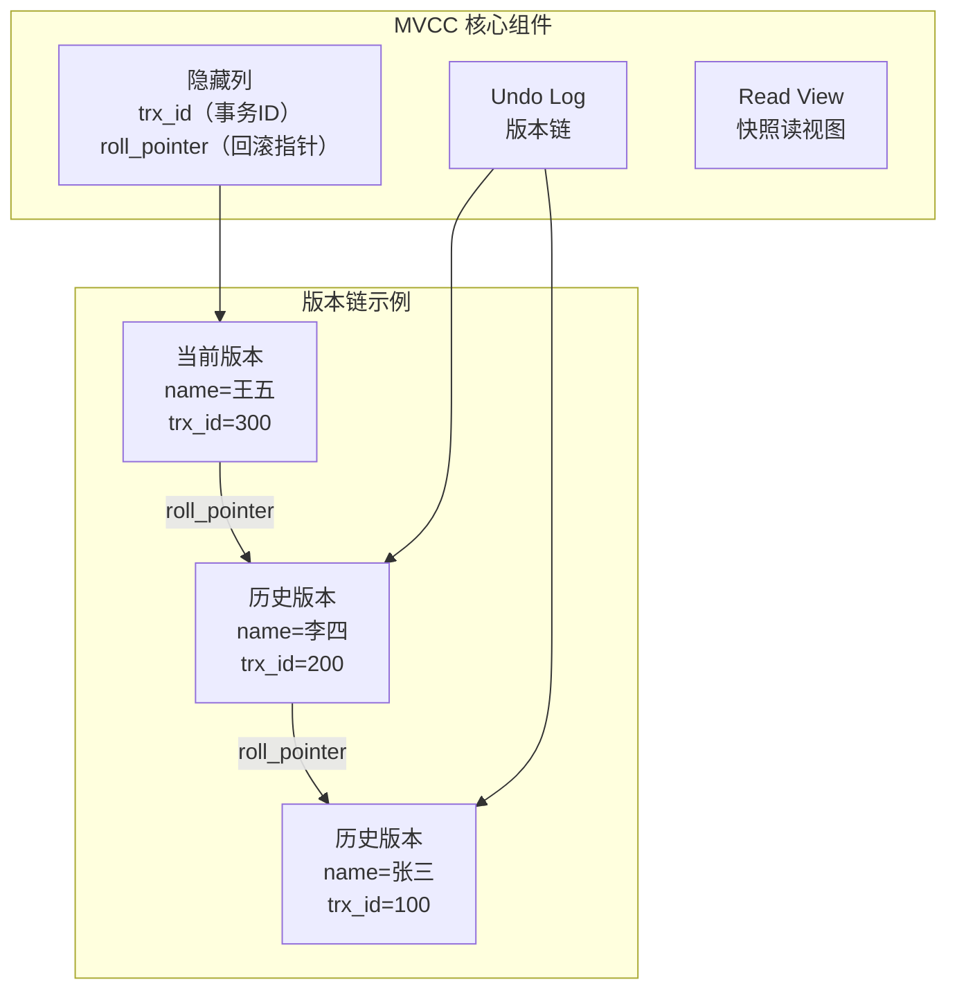
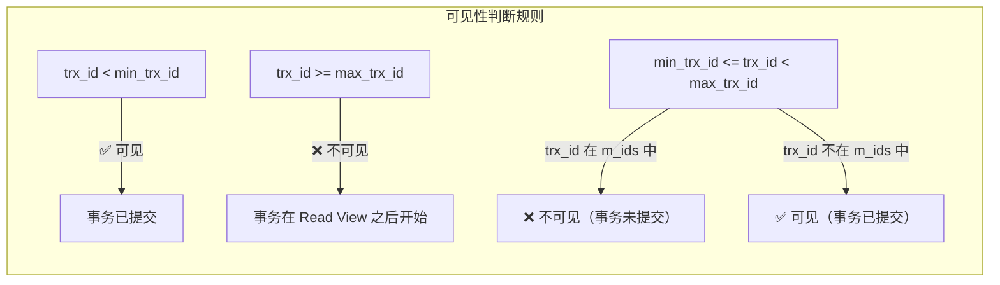

# MySQL 事务与隔离级别

## 概念说明

事务（Transaction）是数据库操作的最小工作单元，具有 ACID 四大特性。MySQL InnoDB 引擎通过 MVCC（多版本并发控制）机制实现事务隔离，是面试中最高频的数据库知识点之一。

### ACID 特性

| 特性 | 含义 | InnoDB 实现方式 |
|------|------|----------------|
| **A**tomicity（原子性） | 事务中的操作要么全部成功，要么全部回滚 | undo log |
| **C**onsistency（一致性） | 事务前后数据库状态保持一致 | 由 A+I+D 共同保证 |
| **I**solation（隔离性） | 并发事务之间互不干扰 | MVCC + 锁 |
| **D**urability（持久性） | 事务提交后数据永久保存 | redo log |

## 核心原理

### 事务隔离级别



### 并发问题

| 问题 | 描述 | 示例 |
|------|------|------|
| **脏读** | 读到其他事务未提交的数据 | 事务 A 修改了数据但未提交，事务 B 读到了修改后的数据，事务 A 回滚 |
| **不可重复读** | 同一事务内两次读取同一数据结果不同 | 事务 A 第一次读 balance=100，事务 B 修改为 200 并提交，事务 A 第二次读 balance=200 |
| **幻读** | 同一事务内两次查询结果集行数不同 | 事务 A 查询 age>20 得到 3 行，事务 B 插入一行 age=25 并提交，事务 A 再查得到 4 行 |

### MVCC 实现原理

MVCC（Multi-Version Concurrency Control）通过为每行数据维护多个版本，实现读写不阻塞。



### Read View 可见性判断

Read View 包含四个关键字段：

```
m_ids:        当前活跃（未提交）的事务 ID 列表
min_trx_id:   m_ids 中的最小值
max_trx_id:   下一个将要分配的事务 ID（当前最大事务 ID + 1）
creator_trx_id: 创建该 Read View 的事务 ID
```



### RC 与 RR 的 Read View 差异

| 隔离级别 | Read View 创建时机 | 效果 |
|---------|-------------------|------|
| READ COMMITTED | 每次 SELECT 都创建新的 Read View | 能看到其他事务已提交的最新数据 |
| REPEATABLE READ | 事务中第一次 SELECT 时创建，后续复用 | 整个事务期间看到的数据一致 |

## 标准库方案

```go
// Go 中使用事务
tx, err := db.Begin()
if err != nil {
    return err
}
defer tx.Rollback() // 确保异常时回滚

_, err = tx.Exec("UPDATE accounts SET balance = balance - ? WHERE id = ?", 100, 1)
if err != nil {
    return err
}

_, err = tx.Exec("UPDATE accounts SET balance = balance + ? WHERE id = ?", 100, 2)
if err != nil {
    return err
}

return tx.Commit()

// 设置隔离级别
tx, err := db.BeginTx(ctx, &sql.TxOptions{
    Isolation: sql.LevelRepeatableRead,
    ReadOnly:  false,
})
```

## 代码示例

> 💻 完整可运行代码：[code-examples/02-web-data/database/database-sql/](https://github.com/your-repo/code-examples/02-web-data/database/database-sql/)
> 🏷️ Demo 模式：Part A（内存模拟事务隔离级别和 MVCC）

## 常见面试题

### Q1: MySQL 的默认隔离级别是什么？为什么选择这个级别？

**难度**：⭐⭐⭐ | **频率**：🔥🔥🔥

**标准答案**：

MySQL 默认隔离级别是 REPEATABLE READ（可重复读）。选择这个级别是因为：
1. 避免了脏读和不可重复读
2. 通过 MVCC + 间隙锁（Next-Key Lock）在很大程度上避免了幻读
3. 性能和一致性的平衡点

注意：PostgreSQL 默认是 READ COMMITTED。

### Q2: MVCC 是如何实现的？

**难度**：⭐⭐⭐⭐ | **频率**：🔥🔥🔥

**答题思路**：

1. 隐藏列：trx_id 和 roll_pointer
2. Undo Log 版本链
3. Read View 可见性判断
4. RC 和 RR 的 Read View 创建时机差异

**标准答案**：

InnoDB 为每行数据维护两个隐藏列：`trx_id`（最后修改该行的事务 ID）和 `roll_pointer`（指向 undo log 中该行的上一个版本）。通过 roll_pointer 形成版本链。

读取数据时，创建 Read View（包含当前活跃事务列表），沿版本链查找第一个对当前事务可见的版本。RC 级别每次 SELECT 创建新 Read View，RR 级别整个事务复用第一次的 Read View。

### Q3: MySQL 的 RR 级别能完全避免幻读吗？

**难度**：⭐⭐⭐⭐ | **频率**：🔥🔥🔥

**标准答案**：

不能完全避免。MVCC 的快照读可以避免幻读，但当前读（`SELECT ... FOR UPDATE`）需要依赖间隙锁（Next-Key Lock）来防止幻读。在某些特殊场景下（如先快照读再当前读），仍可能出现幻读。

## 常见陷阱

1. **长事务**：长时间不提交的事务会导致 undo log 膨胀，影响性能
2. **隐式提交**：DDL 语句（CREATE TABLE 等）会隐式提交当前事务
3. **死锁**：两个事务互相等待对方持有的锁，InnoDB 会自动检测并回滚代价较小的事务

## 参考资料

- [MySQL 官方文档 - InnoDB 事务模型](https://dev.mysql.com/doc/refman/8.0/en/innodb-transaction-model.html)
- [MySQL 官方文档 - MVCC](https://dev.mysql.com/doc/refman/8.0/en/innodb-multi-versioning.html)
