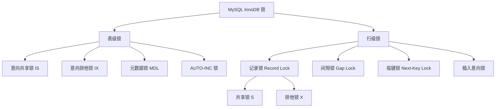
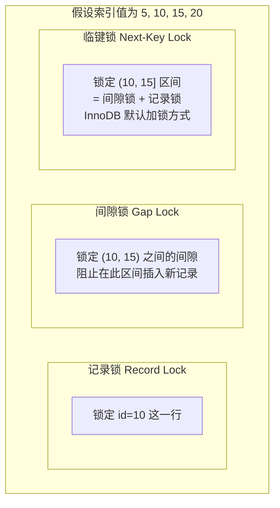
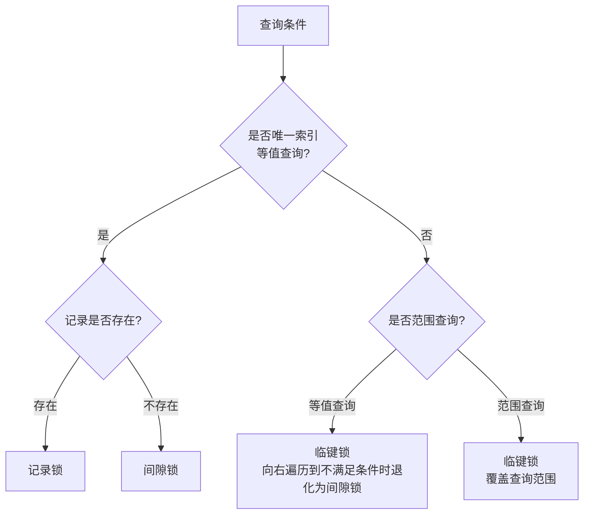
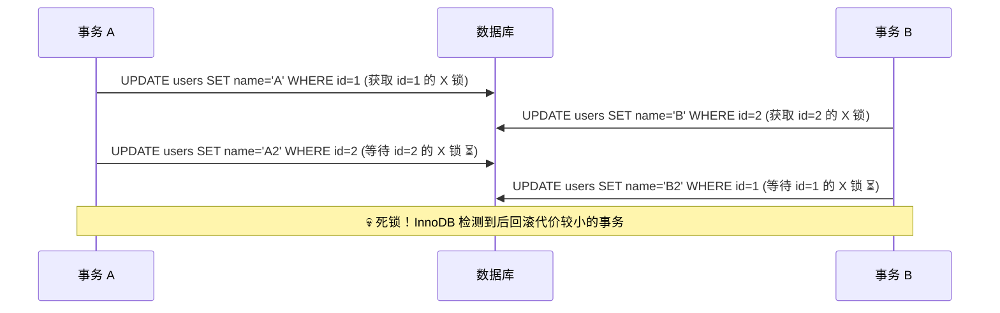

# MySQL 锁机制

## 概念说明

MySQL InnoDB 引擎通过锁机制控制并发访问，保证数据一致性。锁是事务隔离性的重要实现手段，与 MVCC 配合使用。理解锁的类型和加锁规则是排查死锁问题和优化并发性能的关键。

锁的分类维度：
- **按粒度**：表锁、行锁
- **按模式**：共享锁（S 锁）、排他锁（X 锁）
- **按范围**：记录锁、间隙锁、临键锁
- **按意图**：意向共享锁（IS）、意向排他锁（IX）

## 核心原理

### 锁类型总览



### 共享锁与排他锁

| 锁类型 | 简称 | 加锁方式 | 兼容性 |
|--------|------|---------|--------|
| 共享锁 | S 锁 | `SELECT ... LOCK IN SHARE MODE` | S 与 S 兼容 |
| 排他锁 | X 锁 | `SELECT ... FOR UPDATE` | X 与任何锁互斥 |

```
兼容矩阵：
        S 锁    X 锁
S 锁    ✅      ❌
X 锁    ❌      ❌
```

### 行锁的三种形态



#### 记录锁（Record Lock）

锁定索引中的一条记录，阻止其他事务修改或删除该行。

```sql
-- 精确匹配唯一索引时，退化为记录锁
SELECT * FROM users WHERE id = 10 FOR UPDATE;
-- 锁定 id=10 这一行
```

#### 间隙锁（Gap Lock）

锁定索引记录之间的间隙，阻止其他事务在间隙中插入新记录。间隙锁之间不互斥。

```sql
-- 假设 id 有值 10, 20
SELECT * FROM users WHERE id > 10 AND id < 20 FOR UPDATE;
-- 锁定 (10, 20) 之间的间隙
```

#### 临键锁（Next-Key Lock）

间隙锁 + 记录锁的组合，锁定一个左开右闭的区间。InnoDB 在 RR 隔离级别下默认使用临键锁。

```sql
-- 假设 id 有值 10, 20
SELECT * FROM users WHERE id >= 10 AND id < 20 FOR UPDATE;
-- 加锁范围：[10, 20)
-- 即 id=10 的记录锁 + (10, 20) 的间隙锁
```

### 加锁规则（RR 隔离级别）



### 死锁



## 标准库方案

```go
// Go 中使用行锁
tx, _ := db.Begin()

// 排他锁（FOR UPDATE）
var balance float64
tx.QueryRow("SELECT balance FROM accounts WHERE id = ? FOR UPDATE", 1).Scan(&balance)

// 共享锁（LOCK IN SHARE MODE）
tx.QueryRow("SELECT balance FROM accounts WHERE id = ? LOCK IN SHARE MODE", 1).Scan(&balance)

tx.Commit()
```

## 代码示例

> 💻 完整可运行代码：[code-examples/02-web-data/database/database-sql/](https://github.com/skyhe58/guide-go/tree/main/code-examples/02-web-data/database/database-sql/)
> 🏷️ Demo 模式：Part A（内存模拟锁机制概念）

## 常见面试题

### Q1: InnoDB 的行锁是怎么实现的？

**难度**：⭐⭐⭐⭐ | **频率**：🔥🔥🔥

**标准答案**：

InnoDB 的行锁是通过锁定索引记录实现的，而不是锁定行数据本身。如果查询没有命中索引，会退化为表锁（锁定聚簇索引的所有记录）。这就是为什么 WHERE 条件必须走索引才能实现行级锁。

### Q2: 什么是间隙锁？它解决了什么问题？

**难度**：⭐⭐⭐⭐ | **频率**：🔥🔥🔥

**标准答案**：

间隙锁锁定索引记录之间的间隙，阻止其他事务在间隙中插入新记录。它主要用于 RR 隔离级别下防止幻读。间隙锁之间不互斥（两个事务可以同时持有同一间隙的间隙锁），但间隙锁会阻塞插入操作。

### Q3: 如何排查和解决死锁？

**难度**：⭐⭐⭐⭐ | **频率**：🔥🔥🔥

**标准答案**：

排查方法：
1. `SHOW ENGINE INNODB STATUS` 查看最近的死锁信息
2. 开启 `innodb_print_all_deadlocks` 记录所有死锁到错误日志
3. 分析死锁日志中的事务和锁信息

解决方法：
1. 按固定顺序访问表和行，避免交叉加锁
2. 缩短事务执行时间，减少锁持有时间
3. 使用较低的隔离级别（RC 没有间隙锁）
4. 为查询添加合适的索引，避免行锁升级为表锁

## 常见陷阱

1. **无索引导致表锁**：WHERE 条件没有走索引时，InnoDB 会锁定所有记录（等同于表锁）
2. **间隙锁导致插入阻塞**：RR 级别下间隙锁可能阻塞大量插入操作，影响并发性能
3. **SELECT ... FOR UPDATE 忘记提交**：长时间持有排他锁会阻塞其他事务

## 参考资料

- [MySQL 官方文档 - InnoDB 锁](https://dev.mysql.com/doc/refman/8.0/en/innodb-locking.html)
- [MySQL 官方文档 - 死锁](https://dev.mysql.com/doc/refman/8.0/en/innodb-deadlocks.html)
