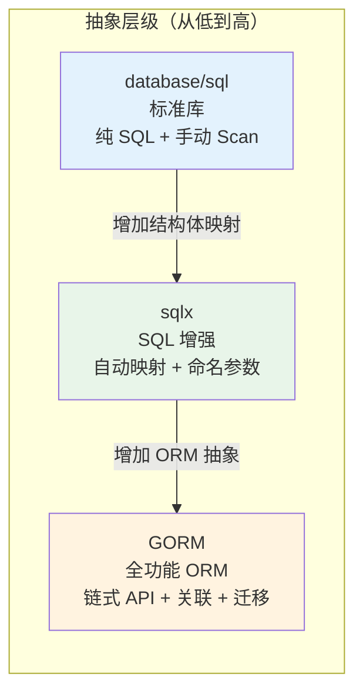
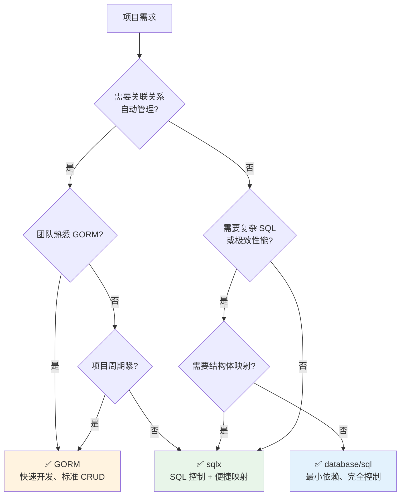

# ORM 选型对比

## 概念说明

Go 生态中数据库操作有三种主流方案：标准库 `database/sql`、轻量级扩展 `sqlx`、全功能 ORM `GORM`。选择合适的方案取决于项目规模、团队经验、性能要求和业务复杂度。没有"最好"的方案，只有"最合适"的方案。

## 核心原理

### 三种方案定位



### 全面对比

| 维度 | database/sql | sqlx | GORM |
|------|-------------|------|------|
| **定位** | 标准库抽象层 | SQL 增强工具 | 全功能 ORM |
| **SQL 控制** | 完全手写 | 完全手写 | 链式 API 生成 |
| **结构体映射** | 手动 Scan | 自动映射（db tag） | 自动映射（gorm tag） |
| **关联关系** | 手动 JOIN | 手动 JOIN | Preload/Joins |
| **事务** | `db.Begin()` | `db.Beginx()` | `db.Transaction()` |
| **迁移** | 无 | 无 | AutoMigrate |
| **Hook** | 无 | 无 | BeforeCreate 等 |
| **软删除** | 手动实现 | 手动实现 | 内置支持 |
| **批量操作** | 手动拼接 | NamedExec | CreateInBatches |
| **性能** | ⭐⭐⭐⭐⭐ | ⭐⭐⭐⭐⭐ | ⭐⭐⭐⭐ |
| **学习曲线** | 低 | 低 | 中 |
| **代码量** | 多 | 中 | 少 |
| **调试难度** | 低（SQL 可见） | 低（SQL 可见） | 中（需开启日志） |
| **社区活跃度** | 标准库 | ⭐⭐⭐ | ⭐⭐⭐⭐⭐ |
| **GitHub Stars** | — | ~16k | ~37k |

### 代码对比

#### 查询单行

```go
// database/sql
var user User
err := db.QueryRow("SELECT id, name, email FROM users WHERE id = $1", 1).
    Scan(&user.ID, &user.Name, &user.Email)

// sqlx
var user User
err := db.Get(&user, "SELECT id, name, email FROM users WHERE id = $1", 1)

// GORM
var user User
err := db.First(&user, 1).Error
```

#### 条件查询

```go
// database/sql
rows, err := db.Query("SELECT id, name FROM users WHERE age > $1 AND status = $2 ORDER BY name LIMIT $3", 18, "active", 10)
defer rows.Close()
var users []User
for rows.Next() {
    var u User
    rows.Scan(&u.ID, &u.Name)
    users = append(users, u)
}

// sqlx
var users []User
err := db.Select(&users, "SELECT id, name FROM users WHERE age > $1 AND status = $2 ORDER BY name LIMIT $3", 18, "active", 10)

// GORM
var users []User
err := db.Where("age > ? AND status = ?", 18, "active").Order("name").Limit(10).Find(&users).Error
```

#### 插入

```go
// database/sql
result, err := db.Exec("INSERT INTO users (name, email) VALUES ($1, $2)", "张三", "zhangsan@example.com")

// sqlx
result, err := db.NamedExec("INSERT INTO users (name, email) VALUES (:name, :email)",
    User{Name: "张三", Email: "zhangsan@example.com"})

// GORM
err := db.Create(&User{Name: "张三", Email: "zhangsan@example.com"}).Error
```

### 选型决策树



### 推荐方案

| 场景 | 推荐方案 | 理由 |
|------|---------|------|
| 快速原型/CRUD 为主 | GORM | 开发效率高，内置迁移和关联 |
| 复杂查询/报表系统 | sqlx | SQL 完全可控，性能好 |
| 微服务/性能敏感 | sqlx 或 database/sql | 最小开销，SQL 可预测 |
| 大型项目混合使用 | GORM + sqlx | GORM 处理 CRUD，sqlx 处理复杂查询 |
| 学习/理解原理 | database/sql | 理解底层机制 |

### 性能对比

```
基准测试（查询 1000 行，映射到结构体）：
database/sql + 手动 Scan:  ~1.2ms
sqlx + Select:             ~1.3ms  (+8%)
GORM + Find:               ~1.8ms  (+50%)

说明：
- GORM 的额外开销主要来自反射、Hook 检查、关联处理
- 对于大多数 Web 应用，这个差异可以忽略（网络延迟远大于 ORM 开销）
- 性能敏感的热点路径可以用 sqlx 或 database/sql 优化
```

## 代码示例

> 💻 完整可运行代码：[code-examples/02-web-data/database/](https://github.com/skyhe58/guide-go/tree/main/code-examples/02-web-data/database/)
> 🏷️ 三种方案的完整示例分别在 `database-sql/`、`gorm-examples/`、`sqlx-examples/` 目录

## 常见面试题

### Q1: GORM 和 sqlx 怎么选？

**难度**：⭐⭐⭐ | **频率**：🔥🔥🔥

**标准答案**：

GORM 适合快速开发和标准 CRUD 场景，提供关联管理、自动迁移、Hook 等功能。sqlx 适合需要精确控制 SQL 的场景，如复杂查询、报表、性能敏感的服务。大型项目中可以混合使用：GORM 处理常规 CRUD，sqlx 处理复杂查询。

### Q2: 为什么有些团队不用 ORM？

**难度**：⭐⭐⭐ | **频率**：🔥🔥

**标准答案**：

不用 ORM 的理由：
1. **SQL 可控性**：ORM 生成的 SQL 不可预测，可能产生低效查询
2. **性能开销**：ORM 的反射和抽象层有额外开销
3. **学习成本**：ORM 本身的 API 和行为需要学习
4. **Go 哲学**：Go 社区推崇简洁和显式，ORM 的"魔法"与此相悖

Go 社区的主流观点是：简单项目用 GORM，复杂项目用 sqlx，核心链路用 database/sql。

## 常见陷阱

1. **盲目选择 GORM**：不是所有项目都需要 ORM，简单的微服务用 sqlx 可能更合适
2. **混合使用时事务不一致**：GORM 和 sqlx 混合使用时，确保在同一个事务中操作
3. **忽略 SQL 审查**：无论用哪种方案，都应该审查生成的 SQL，避免 N+1 查询等问题

## 参考资料

- [GORM 官方文档](https://gorm.io/zh_CN/docs/)
- [sqlx GitHub](https://github.com/jmoiron/sqlx)
- [Go database/sql 教程](http://go-database-sql.org/)
