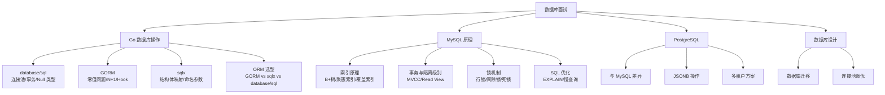

# 数据库与 ORM 面试指南

## 面试知识图谱

## 高频面试题汇总

### 一、Go 数据库操作

#### Q1: database/sql 的连接池是如何工作的？

**难度**：⭐⭐⭐ | **频率**：🔥🔥🔥

**答题思路**：

1. `sql.DB` 不是单个连接，而是连接池
2. 关键配置参数
3. 连接的生命周期管理

**标准答案**：

`sql.DB` 内部维护一个连接池，调用 `Query`/`Exec` 时从池中获取空闲连接，使用完毕后归还。关键配置：
- `SetMaxOpenConns`：最大打开连接数（默认无限制）
- `SetMaxIdleConns`：最大空闲连接数（默认 2）
- `SetConnMaxLifetime`：连接最大生命周期
- `SetConnMaxIdleTime`：空闲连接最大存活时间

连接池是并发安全的，内部使用 mutex 保护。建议根据数据库服务器能力设置合理的连接数上限。

**深入追问**：
- 连接泄漏的常见原因？（忘记 Close rows、长事务不提交）
- 如何监控连接池状态？（`db.Stats()` 返回连接池统计信息）

---

#### Q2: GORM 的零值问题是什么？如何解决？

**难度**：⭐⭐⭐ | **频率**：🔥🔥🔥

**标准答案**：

GORM 使用结构体进行 `Updates` 时，Go 的零值（`0`、`""`、`false`）会被忽略，不会更新到数据库。

解决方案：
1. 使用 `map[string]interface{}` 代替结构体
2. 使用指针类型（`*int`、`*string`）
3. 使用 `db.Select("field").Updates(...)` 指定更新字段
4. 使用 `db.Model(&user).Update("age", 0)` 单字段更新

---

#### Q3: GORM 和 sqlx 怎么选？

**难度**：⭐⭐⭐ | **频率**：🔥🔥🔥

**标准答案**：

- **GORM**：适合快速开发、标准 CRUD、需要关联管理和自动迁移的场景
- **sqlx**：适合复杂查询、性能敏感、需要精确控制 SQL 的场景
- **混合使用**：大型项目中 GORM 处理常规 CRUD，sqlx 处理复杂查询
- **database/sql**：极简场景或需要最小依赖时使用

---

### 二、MySQL 索引

#### Q4: 为什么 MySQL 使用 B+ 树而不是 B 树？

**难度**：⭐⭐⭐⭐ | **频率**：🔥🔥🔥

**标准答案**：

1. B+ 树非叶子节点只存键不存数据，单个节点可存更多键，树更矮，磁盘 I/O 更少
2. B+ 树所有数据在叶子节点，查询路径长度一致，性能稳定
3. B+ 树叶子节点通过链表连接，支持高效的范围查询和排序
4. B 树的数据分散在各层节点，范围查询需要中序遍历整棵树

---

#### Q5: 什么是聚簇索引和覆盖索引？

**难度**：⭐⭐⭐ | **频率**：🔥🔥🔥

**标准答案**：

**聚簇索引**：数据按主键顺序物理存储在 B+ 树的叶子节点中。InnoDB 每张表只有一个聚簇索引（主键索引）。如果没有定义主键，InnoDB 会选择唯一非空索引，或自动生成隐藏的 ROW_ID。

**覆盖索引**：查询的所有字段都包含在索引中，无需回表到聚簇索引获取数据。通过 `EXPLAIN` 中 `Extra` 列显示 `Using index` 来确认。

---

#### Q6: 索引失效的常见场景有哪些？

**难度**：⭐⭐⭐⭐ | **频率**：🔥🔥🔥

**标准答案**：

1. 对索引列使用函数：`WHERE YEAR(created_at) = 2024`
2. 隐式类型转换：`WHERE phone = 13800138000`（phone 是 varchar）
3. LIKE 左模糊：`WHERE name LIKE '%三'`
4. 联合索引不满足最左前缀原则
5. OR 条件中有一个字段无索引
6. 使用 `!=` 或 `NOT IN`（优化器可能放弃索引）
7. `IS NOT NULL`（大部分数据非 NULL 时）

---

### 三、MySQL 事务与锁

#### Q7: MySQL 的四种隔离级别分别解决了什么问题？

**难度**：⭐⭐⭐⭐ | **频率**：🔥🔥🔥

**标准答案**：

| 隔离级别 | 脏读 | 不可重复读 | 幻读 |
|---------|------|-----------|------|
| READ UNCOMMITTED | ❌ | ❌ | ❌ |
| READ COMMITTED | ✅ | ❌ | ❌ |
| REPEATABLE READ（MySQL 默认） | ✅ | ✅ | 大部分解决 |
| SERIALIZABLE | ✅ | ✅ | ✅ |

MySQL 的 RR 级别通过 MVCC 解决快照读的幻读，通过间隙锁解决当前读的幻读。

---

#### Q8: MVCC 的实现原理？

**难度**：⭐⭐⭐⭐ | **频率**：🔥🔥🔥

**标准答案**：

InnoDB 为每行数据维护两个隐藏列：
- `trx_id`：最后修改该行的事务 ID
- `roll_pointer`：指向 undo log 中的上一个版本

通过 `roll_pointer` 形成版本链。读取时创建 Read View（包含当前活跃事务列表），沿版本链查找第一个可见版本。

RC 级别每次 SELECT 创建新 Read View，RR 级别整个事务复用第一次的 Read View。

---

#### Q9: 什么是间隙锁？它和临键锁的区别？

**难度**：⭐⭐⭐⭐ | **频率**：🔥🔥🔥

**标准答案**：

- **间隙锁（Gap Lock）**：锁定索引记录之间的间隙，阻止插入。锁定范围是开区间 `(a, b)`
- **临键锁（Next-Key Lock）**：间隙锁 + 记录锁，锁定左开右闭区间 `(a, b]`
- InnoDB 在 RR 级别下默认使用临键锁
- 唯一索引等值查询命中记录时，退化为记录锁
- 唯一索引等值查询未命中时，退化为间隙锁

---

#### Q10: 如何排查死锁？

**难度**：⭐⭐⭐⭐ | **频率**：🔥🔥🔥

**标准答案**：

1. `SHOW ENGINE INNODB STATUS` 查看最近死锁信息
2. 开启 `innodb_print_all_deadlocks` 记录所有死锁
3. 分析死锁日志中的事务持有和等待的锁
4. 解决方案：按固定顺序访问资源、缩短事务、添加索引避免表锁

---

### 四、SQL 优化

#### Q11: EXPLAIN 中最重要的字段是什么？

**难度**：⭐⭐⭐ | **频率**：🔥🔥🔥

**标准答案**：

- `type`：访问类型，从好到差：system > const > eq_ref > ref > range > index > ALL
- `key`：实际使用的索引，NULL 表示全表扫描
- `rows`：预估扫描行数
- `Extra`：`Using index`（覆盖索引，好）、`Using filesort`（文件排序，需优化）、`Using temporary`（临时表，需优化）

优化目标：type 至少达到 range 级别。

---

#### Q12: 如何优化深分页？

**难度**：⭐⭐⭐⭐ | **频率**：🔥🔥🔥

**标准答案**：

1. **游标分页**：`WHERE id > last_id LIMIT 10`，适合连续翻页
2. **延迟关联**：先查主键再 JOIN 回表
3. **业务限制**：限制最大翻页深度
4. **搜索引擎**：大数据量用 Elasticsearch

---

### 五、PostgreSQL

#### Q13: PostgreSQL 和 MySQL 的主要区别？

**难度**：⭐⭐⭐ | **频率**：🔥🔥

**标准答案**：

| 维度 | PostgreSQL | MySQL |
|------|-----------|-------|
| MVCC | 多版本在表中，需 VACUUM | undo log 版本链 |
| 默认隔离级别 | RC | RR |
| JSON | JSONB（可索引） | JSON（文本存储） |
| 数组类型 | 原生支持 | 不支持 |
| CTE/窗口函数 | 完整支持 | 8.0+ 支持 |
| 扩展性 | Extension 机制 | 较弱 |

---

## 面试准备建议

### 按公司类型准备

| 公司类型 | 重点准备 |
|---------|---------|
| 互联网大厂 | 索引原理、MVCC、锁机制、SQL 优化、分库分表 |
| 中型公司 | GORM/sqlx 使用、事务隔离、基本优化 |
| 创业公司 | ORM 选型、快速开发、基本 CRUD |

### 答题技巧

1. **索引题**：先说 B+ 树结构，再说聚簇/二级索引区别，最后说优化建议
2. **事务题**：先说 ACID，再说隔离级别，最后说 MVCC 实现
3. **锁题**：先说锁类型分类，再说加锁规则，最后说死锁排查
4. **优化题**：先说 EXPLAIN 分析，再说具体优化手段，最后说监控方案

## 参考资料

- [MySQL 官方文档](https://dev.mysql.com/doc/refman/8.0/en/)
- [PostgreSQL 官方文档](https://www.postgresql.org/docs/)
- [GORM 官方文档](https://gorm.io/zh_CN/docs/)
- [高性能 MySQL（第四版）](https://www.oreilly.com/library/view/high-performance-mysql/9781492080503/)
