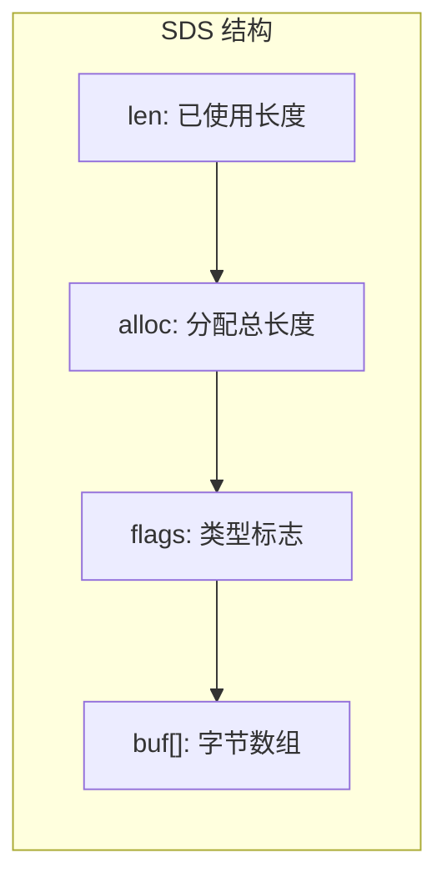
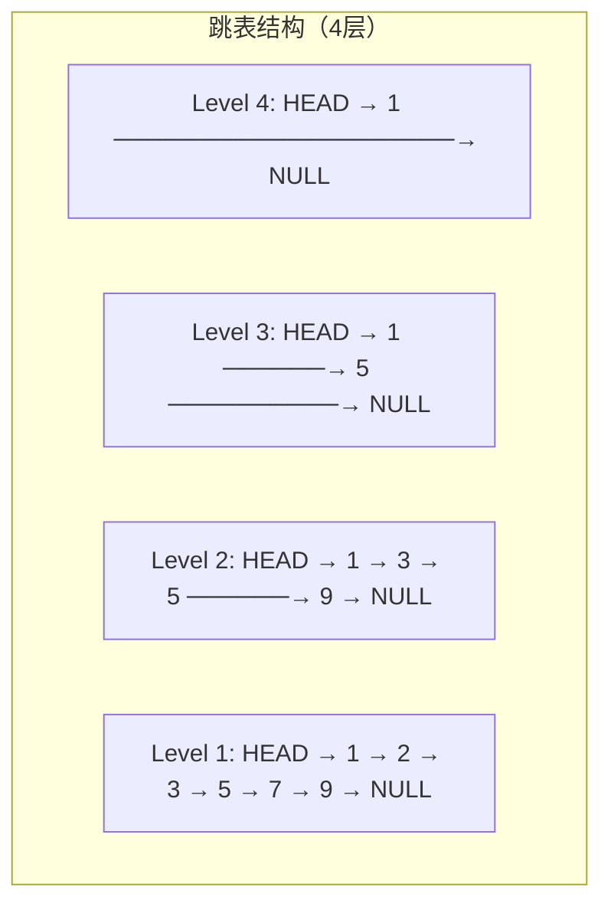

# Redis 数据结构与底层实现

## 概念说明

Redis 不仅仅是一个简单的 Key-Value 存储，它提供了丰富的数据结构：String、List、Hash、Set、Sorted Set（ZSet）、Stream 等。每种数据结构在底层都有精心设计的编码方式，Redis 会根据数据量和元素大小自动选择最优编码，在内存效率和访问速度之间取得平衡。

理解 Redis 数据结构的底层实现，是面试中的高频考点，也是正确使用 Redis 的基础。

## 核心原理

### 数据结构与底层编码对照表

| 数据结构 | 底层编码 | 切换条件 |
|---------|---------|---------|
| String | int / embstr / raw | 整数用 int；≤44 字节用 embstr；否则 raw |
| List | listpack / quicklist | Redis 7.0+ 统一使用 listpack + quicklist |
| Hash | listpack / hashtable | 元素数 ≤ 128 且值 ≤ 64 字节用 listpack |
| Set | intset / listpack / hashtable | 全整数且 ≤ 512 用 intset；否则 hashtable |
| Sorted Set | listpack / skiplist + hashtable | 元素数 ≤ 128 且值 ≤ 64 字节用 listpack |
| Stream | listpack + rax tree | 消息流专用结构 |

### SDS（Simple Dynamic String）

Redis 没有直接使用 C 语言的字符串，而是自己实现了 SDS：



SDS 相比 C 字符串的优势：
- **O(1) 获取长度**：直接读取 len 字段，C 字符串需要遍历
- **二进制安全**：可以存储任意二进制数据，不以 `\0` 作为结束标志
- **杜绝缓冲区溢出**：修改前检查空间是否足够
- **空间预分配**：减少内存重分配次数（< 1MB 翻倍，≥ 1MB 多分配 1MB）
- **惰性空间释放**：缩短字符串时不立即回收内存

### 跳表（Skip List）

Sorted Set 在数据量大时使用跳表 + 哈希表的组合：



跳表特点：
- 平均 O(log N) 的查找、插入、删除
- 实现比红黑树简单，范围查询更高效
- Redis 跳表最高 32 层，晋升概率 1/4

### 为什么 ZSet 用跳表而不用红黑树？

这是面试高频题。Redis 作者 antirez 的回答：
1. **实现简单**：跳表代码量远少于红黑树
2. **范围查询高效**：跳表天然支持范围操作（ZRANGEBYSCORE）
3. **内存友好**：跳表节点大小可变，红黑树每个节点固定开销更大
4. **并发友好**：跳表更容易实现无锁并发（虽然 Redis 是单线程）

## 标准库方案

Redis 是独立的外部服务，Go 标准库不包含 Redis 客户端。但可以用 Go 的 map、slice 等数据结构模拟 Redis 的核心概念来理解原理。

```go
// 用 Go map 模拟 Redis Hash
type RedisHash map[string]map[string]string

func (h RedisHash) HSet(key, field, value string) {
    if h[key] == nil {
        h[key] = make(map[string]string)
    }
    h[key][field] = value
}

func (h RedisHash) HGet(key, field string) (string, bool) {
    if fields, ok := h[key]; ok {
        val, exists := fields[field]
        return val, exists
    }
    return "", false
}
```

## 第三方库方案

Go 生态中操作 Redis 的主流客户端：

| 库 | 特点 | Star 数 |
|----|------|---------|
| `github.com/redis/go-redis/v9` | 功能最全、类型安全、支持 Cluster/Sentinel | 20k+ |
| `github.com/gomodule/redigo` | 轻量级、连接池管理、命令式 API | 10k+ |

推荐使用 **go-redis**，它是目前 Go 社区最活跃的 Redis 客户端，支持所有 Redis 数据结构和高级特性。

## 代码示例

> 💻 完整可运行代码：[code-examples/02-web-data/cache-search/redis/](https://github.com/skyhe58/guide-go/tree/main/code-examples/02-web-data/cache-search/redis/)
> 🏷️ Demo 模式：Part A（内存模拟数据结构）/ Part B（go-redis 操作真实 Redis）

## 常见面试题

### Q1: Redis 有哪些数据结构？分别适用什么场景？

**难度**：⭐⭐⭐ | **频率**：🔥🔥🔥

**答题思路**：

1. 列举五种基本数据结构 + Stream
2. 每种结构给出典型使用场景
3. 提及底层编码优化

**标准答案**：

- **String**：缓存、计数器、分布式锁、Session 存储
- **List**：消息队列、最新消息列表、时间线
- **Hash**：对象存储（用户信息）、购物车
- **Set**：标签系统、共同好友、去重
- **Sorted Set**：排行榜、延迟队列、带权重的队列
- **Stream**：消息队列（支持消费组、ACK、持久化）

**深入追问**：
- String 的三种编码分别在什么情况下使用？
- 为什么 Sorted Set 底层用跳表而不用红黑树？

### Q2: Redis 的 SDS 相比 C 字符串有什么优势？

**难度**：⭐⭐⭐ | **频率**：🔥🔥🔥

**答题思路**：

1. C 字符串的缺陷
2. SDS 的结构设计
3. 五大优势逐一说明

**标准答案**：

SDS 五大优势：O(1) 获取长度、二进制安全、杜绝缓冲区溢出、空间预分配减少内存重分配、惰性空间释放。核心思想是用少量额外内存换取更高的安全性和性能。

**深入追问**：
- SDS 的空间预分配策略是什么？（< 1MB 翻倍，≥ 1MB 多分配 1MB）
- embstr 和 raw 编码的区别？（embstr 一次内存分配，raw 两次）

## 常见陷阱

1. **大 Key 问题**：单个 Key 的 Value 过大（如百万元素的 Hash），会导致慢查询、内存不均、主从同步延迟。建议拆分为多个小 Key
2. **热 Key 问题**：某个 Key 被高频访问，导致单节点压力过大。可通过本地缓存、Key 分片等方式缓解
3. **过期策略误解**：Redis 使用惰性删除 + 定期删除策略，不是 Key 一过期就立即删除

## 参考资料

- [Redis 官方文档 - Data types](https://redis.io/docs/data-types/)
- [Redis 设计与实现](http://redisbook.com/)
- [Redis 源码分析 - SDS](https://github.com/redis/redis/blob/unstable/src/sds.h)
