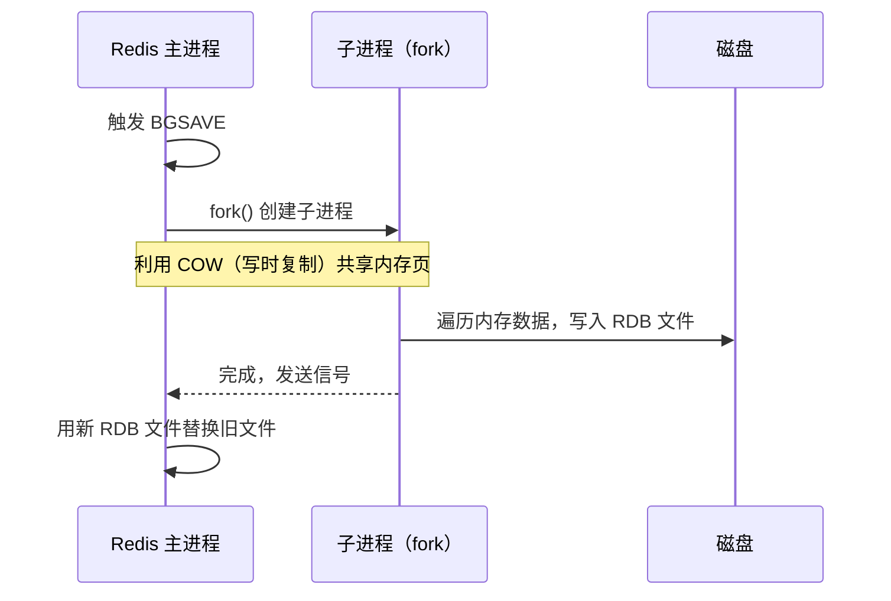
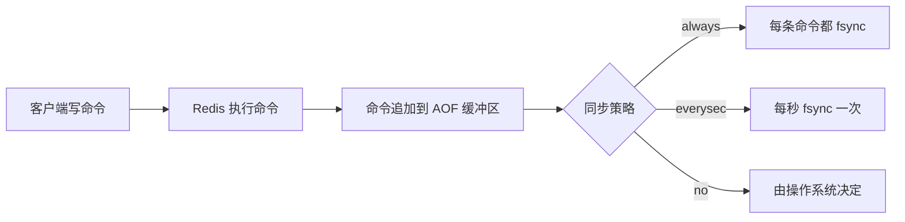
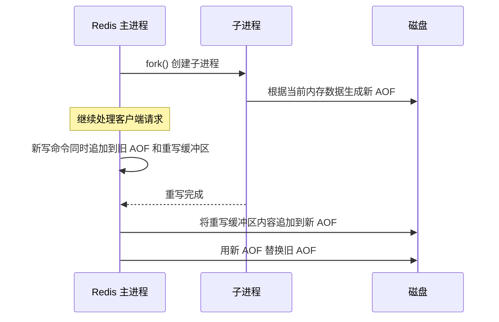

# Redis 持久化（RDB/AOF）

## 概念说明

Redis 是内存数据库，数据存储在内存中。为了防止服务器宕机导致数据丢失，Redis 提供了两种持久化机制：RDB（Redis Database）快照和 AOF（Append Only File）日志。Redis 4.0+ 还支持混合持久化模式，结合两者优势。

## 核心原理

### RDB 快照

RDB 将某一时刻的内存数据以二进制格式写入磁盘文件（dump.rdb）。

**触发方式**：
- `SAVE`：阻塞主进程，生产环境禁用
- `BGSAVE`：fork 子进程后台执行，推荐方式
- 配置自动触发：`save 900 1`（900 秒内至少 1 次修改）

**优点**：文件紧凑、恢复速度快、适合备份和灾难恢复
**缺点**：可能丢失最后一次快照后的数据、fork 大内存实例时可能阻塞

### AOF 日志

AOF 以追加方式记录每条写命令到日志文件。

**同步策略对比**：

| 策略 | 数据安全性 | 性能影响 | 推荐场景 |
|------|-----------|---------|---------|
| `always` | 最高，最多丢 1 条命令 | 最慢 | 金融等强一致场景 |
| `everysec` | 较高，最多丢 1 秒数据 | 适中 | **生产环境推荐** |
| `no` | 最低，取决于 OS | 最快 | 对数据安全要求不高 |

### AOF 重写

AOF 文件会不断增长，Redis 通过 AOF 重写压缩文件大小：

### 混合持久化（Redis 4.0+）

开启 `aof-use-rdb-preamble yes` 后，AOF 重写时前半部分用 RDB 格式，后半部分用 AOF 格式。兼顾了 RDB 的快速加载和 AOF 的数据安全。

## 标准库方案

Go 标准库不涉及 Redis 持久化配置，这是 Redis 服务端的配置项。但理解持久化原理对于正确配置 Redis 和排查问题至关重要。

## 代码示例

> 💻 完整可运行代码：[code-examples/02-web-data/cache-search/redis/](https://github.com/your-repo/code-examples/02-web-data/cache-search/redis/)
> 🏷️ Demo 模式：Part A（模拟持久化概念）/ Part B（go-redis 查看持久化信息）

## 常见面试题

### Q1: RDB 和 AOF 的区别？生产环境如何选择？

**难度**：⭐⭐⭐ | **频率**：🔥🔥🔥

**答题思路**：

1. 分别说明 RDB 和 AOF 的原理
2. 对比优缺点
3. 给出生产环境建议

**标准答案**：

| 维度 | RDB | AOF |
|------|-----|-----|
| 持久化方式 | 定时快照 | 追加写命令 |
| 数据安全 | 可能丢失最后一次快照后的数据 | 最多丢 1 秒数据（everysec） |
| 文件大小 | 紧凑 | 较大（重写后可压缩） |
| 恢复速度 | 快 | 慢（需重放命令） |
| 对性能影响 | fork 时可能阻塞 | 持续写入，影响较小 |

**生产建议**：同时开启 RDB + AOF，使用混合持久化模式。RDB 用于备份和快速恢复，AOF 保证数据安全。

**深入追问**：
- BGSAVE 的 fork 操作为什么可能阻塞？（大内存实例复制页表耗时）
- AOF 重写期间如果有新写入怎么办？（重写缓冲区）

## 常见陷阱

1. **fork 阻塞**：大内存 Redis 实例执行 BGSAVE 时，fork 复制页表可能耗时数百毫秒，导致主进程阻塞
2. **AOF 文件过大**：未配置自动重写，AOF 文件持续增长，恢复时间过长
3. **混合持久化未开启**：Redis 4.0+ 默认开启，但升级时需确认配置

## 参考资料

- [Redis 官方文档 - Persistence](https://redis.io/docs/management/persistence/)
- [Redis 设计与实现 - 持久化](http://redisbook.com/)
