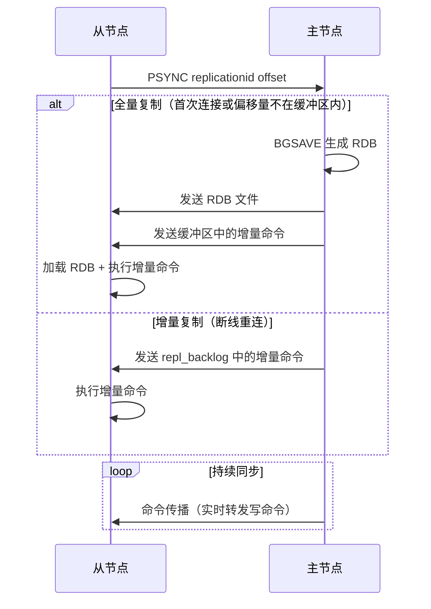
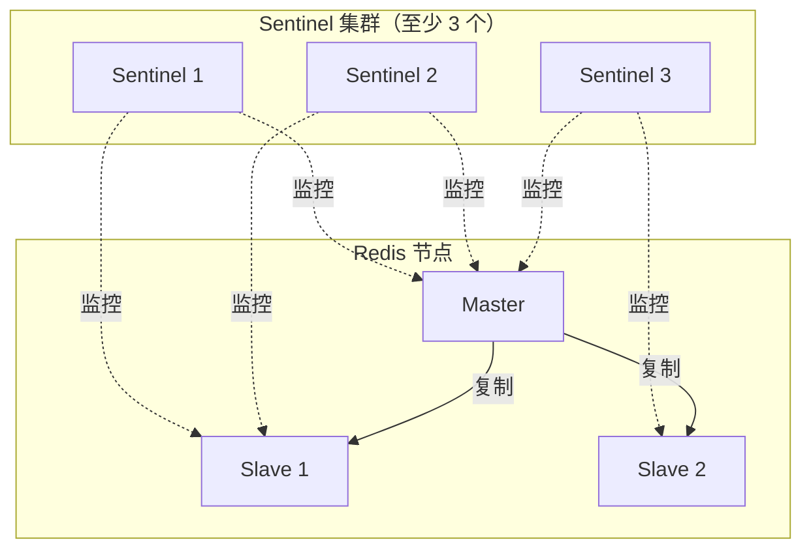
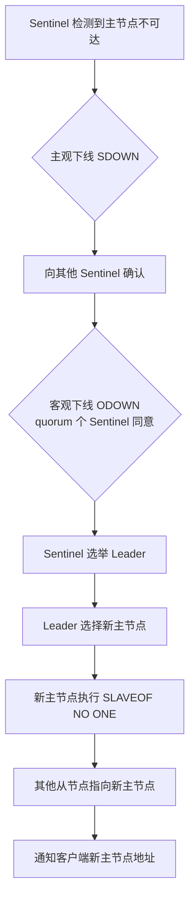

# Redis 主从与哨兵

## 概念说明

单节点 Redis 存在单点故障风险。Redis 通过主从复制（Replication）实现数据冗余，通过哨兵（Sentinel）实现自动故障转移，共同构成 Redis 的高可用方案。

- **主从复制**：一主多从，主节点负责写，从节点负责读，实现读写分离
- **哨兵模式**：监控主从节点状态，主节点故障时自动选举新主节点

## 核心原理

### 主从复制流程



**关键概念**：
- **replication id**：主节点的唯一标识，主从切换后会变化
- **offset**：复制偏移量，标记从节点同步到的位置
- **repl_backlog**：环形缓冲区，存储最近的写命令，支持增量复制

### 哨兵架构



### 故障转移流程



**新主节点选择优先级**：
1. 优先级最高（`replica-priority` 最小）
2. 复制偏移量最大（数据最新）
3. Run ID 最小（字典序）

## 标准库方案

Go 标准库不包含 Redis 客户端。使用 go-redis 连接哨兵模式：

```go
rdb := redis.NewFailoverClient(&redis.FailoverOptions{
    MasterName:    "mymaster",
    SentinelAddrs: []string{":26379", ":26380", ":26381"},
})
```

## 代码示例

> 💻 完整可运行代码：[code-examples/02-web-data/cache-search/redis/](https://github.com/your-repo/code-examples/02-web-data/cache-search/redis/)
> 🏷️ Demo 模式：Part A（模拟主从复制概念）

## 常见面试题

### Q1: Redis 主从复制的原理？全量复制和增量复制的区别？

**难度**：⭐⭐⭐ | **频率**：🔥🔥🔥

**答题思路**：

1. PSYNC 命令触发
2. 全量复制：首次连接，发送 RDB + 缓冲区命令
3. 增量复制：断线重连，通过 repl_backlog 发送增量
4. 持续同步：命令传播

**标准答案**：

从节点发送 PSYNC 命令，主节点根据 replication id 和 offset 判断：如果是首次连接或偏移量不在 repl_backlog 中，执行全量复制（BGSAVE + 发送 RDB + 缓冲区命令）；否则执行增量复制（发送 repl_backlog 中的增量命令）。之后通过命令传播保持持续同步。

**深入追问**：
- repl_backlog 满了会怎样？（触发全量复制，建议调大 `repl-backlog-size`）
- 主从延迟如何监控？（`INFO replication` 查看 offset 差值）

### Q2: 哨兵模式如何实现自动故障转移？

**难度**：⭐⭐⭐ | **频率**：🔥🔥🔥

**答题思路**：

1. 主观下线 → 客观下线
2. Sentinel Leader 选举（Raft）
3. 新主节点选择策略
4. 故障转移执行

**标准答案**：

Sentinel 通过心跳检测主节点状态。当一个 Sentinel 认为主节点不可达时标记为主观下线（SDOWN），然后询问其他 Sentinel。当 quorum 个 Sentinel 同意时标记为客观下线（ODOWN）。之后 Sentinel 之间通过 Raft 算法选举 Leader，由 Leader 执行故障转移：选择新主节点、通知从节点切换、通知客户端。

**深入追问**：
- 为什么 Sentinel 至少需要 3 个？（避免脑裂，保证多数派选举）
- 哨兵模式的局限性？（不支持数据分片，单主节点写入瓶颈）

## 常见陷阱

1. **主从延迟**：从节点异步复制，读从节点可能读到旧数据。对一致性要求高的读操作应读主节点
2. **脑裂问题**：网络分区时可能出现两个主节点。配置 `min-replicas-to-write` 和 `min-replicas-max-lag` 缓解
3. **Sentinel 数量不足**：至少部署 3 个 Sentinel 节点，且分布在不同机器上

## 参考资料

- [Redis 官方文档 - Replication](https://redis.io/docs/management/replication/)
- [Redis 官方文档 - Sentinel](https://redis.io/docs/management/sentinel/)
