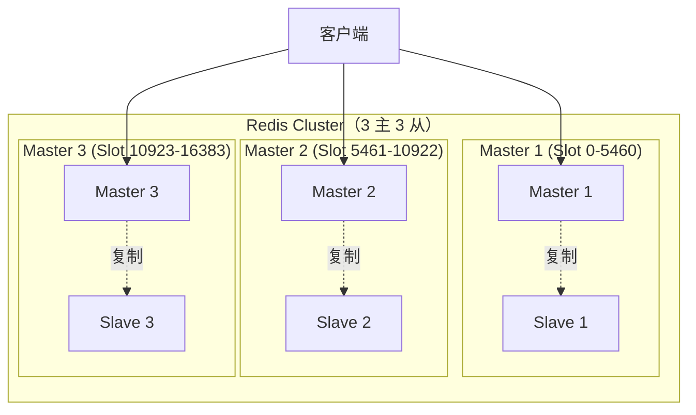
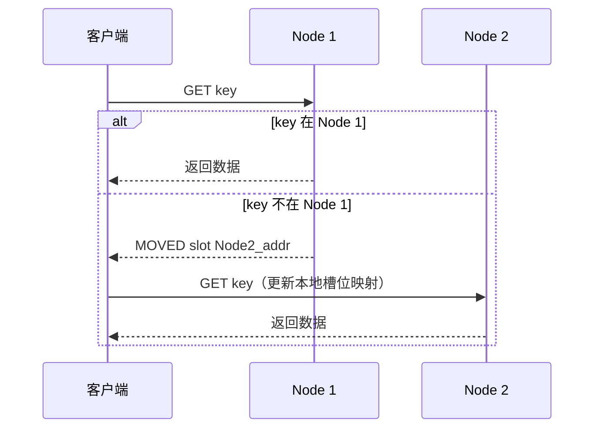

# Redis Cluster 集群

## 概念说明

Redis Cluster 是 Redis 官方提供的分布式方案，通过数据分片（Sharding）将数据分散到多个节点，突破单节点的内存和性能瓶颈。它同时提供了自动故障转移能力，无需额外的哨兵组件。

核心特性：
- **数据分片**：16384 个哈希槽（Hash Slot）分布在多个主节点上
- **高可用**：每个主节点配备从节点，主节点故障时自动切换
- **去中心化**：节点间通过 Gossip 协议通信，无中心节点

## 核心原理

### 哈希槽分配



**槽位计算**：`slot = CRC16(key) % 16384`

### MOVED 与 ASK 重定向



- **MOVED**：永久重定向，客户端应更新本地槽位映射表
- **ASK**：临时重定向（槽位迁移中），仅本次请求重定向

### Gossip 协议

节点间通过 Gossip 协议交换集群状态信息：
- **PING/PONG**：心跳检测和信息交换
- **MEET**：新节点加入集群
- **FAIL**：标记节点故障

## 标准库方案

Go 标准库不包含 Redis 客户端。使用 go-redis 连接 Cluster：

```go
rdb := redis.NewClusterClient(&redis.ClusterOptions{
    Addrs: []string{":7000", ":7001", ":7002"},
})
```

## 代码示例

> 💻 完整可运行代码：[code-examples/02-web-data/cache-search/redis/](https://github.com/skyhe58/guide-go/tree/main/code-examples/02-web-data/cache-search/redis/)
> 🏷️ Demo 模式：Part A（模拟哈希槽分配）

## 常见面试题

### Q1: Redis Cluster 的数据分片原理？

**难度**：⭐⭐⭐ | **频率**：🔥🔥🔥

**答题思路**：

1. 16384 个哈希槽
2. CRC16 计算槽位
3. MOVED/ASK 重定向
4. 客户端缓存槽位映射

**标准答案**：

Redis Cluster 将数据空间划分为 16384 个哈希槽，每个主节点负责一部分槽位。客户端通过 `CRC16(key) % 16384` 计算 Key 所属的槽位，然后路由到对应节点。如果请求到了错误的节点，会收到 MOVED 重定向响应，客户端更新本地映射后重新请求。

**深入追问**：
- 为什么是 16384 个槽？（Gossip 消息中用 bitmap 表示槽位，16384 bit = 2KB，合理大小）
- 如何实现在线扩容？（槽位迁移 + ASK 重定向）

### Q2: Redis Cluster 不支持哪些操作？

**难度**：⭐⭐⭐ | **频率**：🔥🔥

**标准答案**：

- **跨槽位的多 Key 操作**：MGET/MSET 涉及的 Key 必须在同一个槽位（可用 Hash Tag `{tag}` 强制路由）
- **跨节点事务**：MULTI/EXEC 只能在单节点内执行
- **大批量操作**：Pipeline 中的命令可能分散到不同节点
- **数据库选择**：Cluster 模式只支持 db0

**深入追问**：
- Hash Tag 是什么？（`{user}:1001` 和 `{user}:1002` 会路由到同一个槽位）

## 常见陷阱

1. **跨槽位操作失败**：多 Key 操作未使用 Hash Tag，导致 CROSSSLOT 错误
2. **集群规模过大**：Gossip 消息量与节点数成正比，建议不超过 1000 个节点
3. **热点 Key**：某个槽位的 Key 被高频访问，导致单节点过载

## 参考资料

- [Redis 官方文档 - Cluster](https://redis.io/docs/management/scaling/)
- [Redis Cluster 规范](https://redis.io/docs/reference/cluster-spec/)
