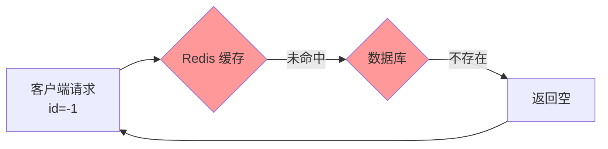
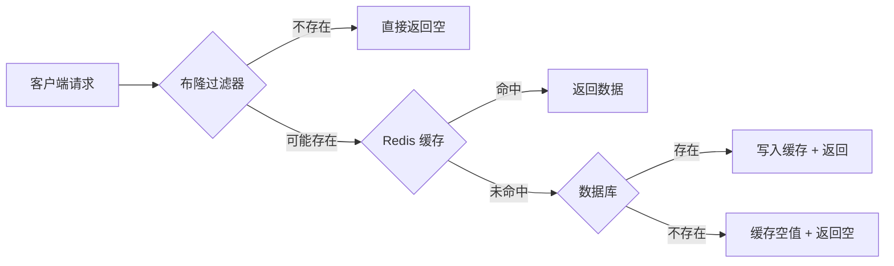
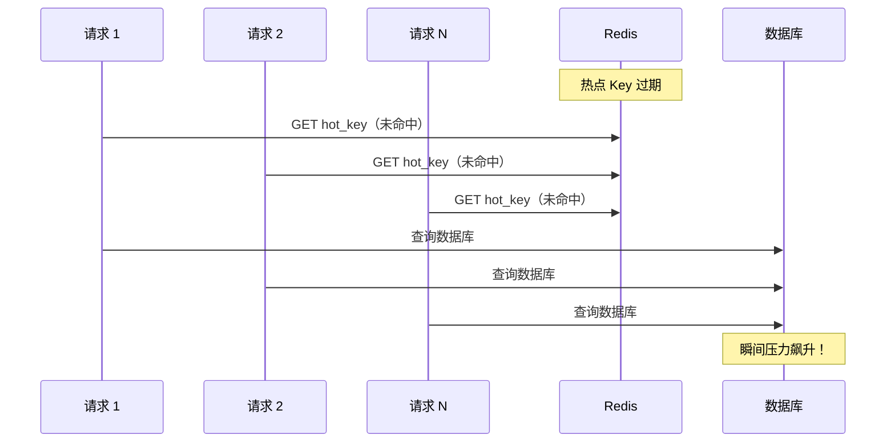

# 缓存穿透/击穿/雪崩方案

## 概念说明

在使用 Redis 作为缓存时，有三个经典问题需要防范：

| 问题 | 定义 | 危害 |
|------|------|------|
| **缓存穿透** | 查询不存在的数据，缓存和数据库都没有 | 大量请求直达数据库 |
| **缓存击穿** | 热点 Key 过期瞬间，大量并发请求打到数据库 | 数据库瞬间压力飙升 |
| **缓存雪崩** | 大量 Key 同时过期，或 Redis 宕机 | 数据库被压垮 |

这三个问题是面试中的超高频考点，也是生产环境中必须解决的实际问题。

## 核心原理

### 缓存穿透



**解决方案**：

1. **缓存空值**：查询数据库为空时，缓存一个空值（设置较短 TTL）
2. **布隆过滤器**：在缓存前加一层布隆过滤器，快速判断数据是否存在
3. **参数校验**：在入口层拦截非法参数



### 缓存击穿



**解决方案**：

1. **互斥锁（singleflight）**：只允许一个请求查询数据库，其他请求等待
2. **逻辑过期**：不设置 TTL，在 Value 中存储逻辑过期时间，过期后异步更新
3. **热点 Key 永不过期**：对确定的热点 Key 不设置过期时间

### 缓存雪崩

**解决方案**：

1. **过期时间加随机值**：避免大量 Key 同时过期
2. **多级缓存**：本地缓存（如 Go 的 sync.Map）+ Redis + 数据库
3. **Redis 高可用**：Sentinel 或 Cluster 模式，避免单点故障
4. **限流降级**：使用限流器保护数据库

## 标准库方案

Go 标准库的 `sync` 包和 `golang.org/x/sync/singleflight` 可以用于解决缓存击穿：

```go
import "golang.org/x/sync/singleflight"

var g singleflight.Group

func getFromCache(key string) (interface{}, error) {
    // 多个并发请求只会执行一次数据库查询
    v, err, _ := g.Do(key, func() (interface{}, error) {
        // 查询数据库
        return queryDB(key)
    })
    return v, err
}
```

## 代码示例

> 💻 完整可运行代码：[code-examples/02-web-data/cache-search/redis/](https://github.com/your-repo/code-examples/02-web-data/cache-search/redis/)
> 🏷️ Demo 模式：Part A（模拟缓存穿透/击穿/雪崩场景及解决方案）

## 常见面试题

### Q1: 缓存穿透、击穿、雪崩的区别和解决方案？

**难度**：⭐⭐⭐ | **频率**：🔥🔥🔥

**答题思路**：

1. 先区分三者的定义
2. 分别给出解决方案
3. 结合实际场景说明

**标准答案**：

- **穿透**：查不存在的数据 → 布隆过滤器 + 缓存空值
- **击穿**：热点 Key 过期 → 互斥锁（singleflight）+ 逻辑过期
- **雪崩**：大量 Key 同时过期 → 过期时间加随机值 + 多级缓存 + 高可用

**深入追问**：
- 布隆过滤器的原理？有什么缺点？（有误判率，不支持删除）
- singleflight 的原理？（相同 Key 的并发请求只执行一次，其他等待结果）

### Q2: 如何设计一个多级缓存方案？

**难度**：⭐⭐⭐ | **频率**：🔥🔥

**标准答案**：

三级缓存架构：本地缓存（进程内，如 sync.Map 或 bigcache）→ Redis（分布式缓存）→ 数据库。本地缓存 TTL 最短（秒级），Redis TTL 适中（分钟级），数据库作为最终数据源。更新时先更新数据库，再删除 Redis 缓存，本地缓存通过 TTL 自动失效。

**深入追问**：
- 本地缓存和 Redis 缓存的一致性如何保证？
- 本地缓存用什么数据结构？（LRU/LFU 淘汰策略）

## 常见陷阱

1. **缓存空值未设 TTL**：缓存空值时必须设置较短的过期时间，否则数据新增后仍然返回空
2. **布隆过滤器容量不足**：布隆过滤器需要预估数据量，容量不足会导致误判率升高
3. **singleflight 超时**：数据库查询慢时，所有等待的请求都会超时，需要设置合理的超时时间

## 参考资料

- [Redis 官方文档 - Caching](https://redis.io/docs/manual/client-side-caching/)
- [golang.org/x/sync/singleflight](https://pkg.go.dev/golang.org/x/sync/singleflight)
