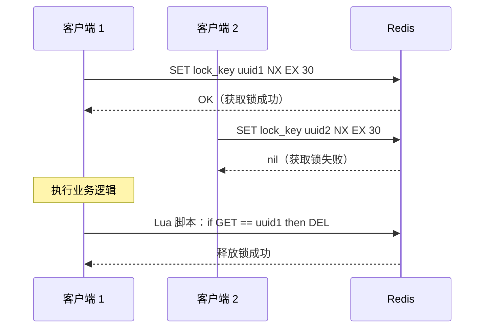
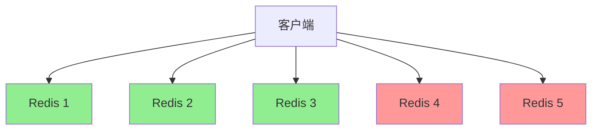
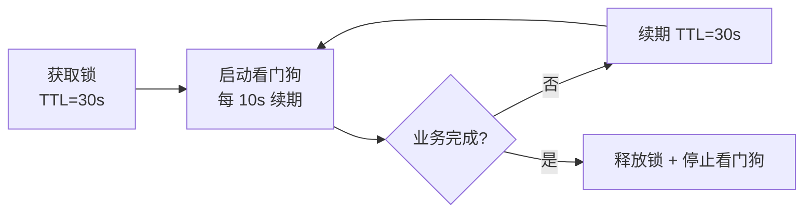

# 分布式锁（Redlock/单节点锁）

## 概念说明

在分布式系统中，多个进程/服务需要互斥访问共享资源时，需要分布式锁。Redis 凭借其高性能和原子操作特性，是实现分布式锁的常用方案。

两种主要方案：
- **单节点锁**：基于单个 Redis 实例的 `SET NX EX` 命令，简单高效
- **Redlock**：基于多个独立 Redis 实例的分布式锁算法，更高可靠性

## 核心原理

### 单节点锁



**关键要素**：
1. **原子加锁**：`SET key value NX EX timeout`（NX 保证互斥，EX 防止死锁）
2. **唯一标识**：Value 使用 UUID，防止误删其他客户端的锁
3. **Lua 脚本释放**：判断和删除必须原子执行

```lua
-- 释放锁的 Lua 脚本
if redis.call("GET", KEYS[1]) == ARGV[1] then
    return redis.call("DEL", KEYS[1])
else
    return 0
end
```

### Redlock 算法



Redlock 步骤：
1. 获取当前时间戳 T1
2. 依次向 N 个独立 Redis 实例请求加锁（设置较短超时）
3. 计算加锁总耗时 = 当前时间 - T1
4. 如果在 **多数节点**（N/2 + 1）上加锁成功，且总耗时 < 锁过期时间，则认为加锁成功
5. 锁的有效时间 = 过期时间 - 加锁耗时
6. 加锁失败时，向所有节点发送释放锁请求

### 锁续期（看门狗机制）

业务执行时间可能超过锁的过期时间，需要自动续期：



## 标准库方案

Go 标准库的 `sync.Mutex` 只能用于单进程内的互斥，分布式场景需要借助 Redis。

## 第三方库方案

| 库 | 特点 |
|----|------|
| `github.com/bsm/redislock` | 基于 go-redis 的分布式锁，支持自动续期 |
| `github.com/go-redsync/redsync` | Redlock 算法的 Go 实现 |

## 代码示例

> 💻 完整可运行代码：[code-examples/02-web-data/cache-search/redis/](https://github.com/skyhe58/guide-go/tree/main/code-examples/02-web-data/cache-search/redis/)
> 🏷️ Demo 模式：Part A（模拟分布式锁逻辑）/ Part B（go-redis 实现真实分布式锁）

## 常见面试题

### Q1: 如何用 Redis 实现分布式锁？需要注意什么？

**难度**：⭐⭐⭐ | **频率**：🔥🔥🔥

**答题思路**：

1. SET NX EX 原子加锁
2. UUID 唯一标识
3. Lua 脚本原子释放
4. 锁续期机制

**标准答案**：

使用 `SET key uuid NX EX timeout` 原子加锁，Value 用 UUID 标识持有者。释放锁时用 Lua 脚本保证判断和删除的原子性。为防止业务超时导致锁过期，需要实现看门狗自动续期机制。

**深入追问**：
- 为什么不能用 SETNX + EXPIRE 两条命令？（非原子操作，SETNX 后宕机会死锁）
- Redlock 算法的争议是什么？（Martin Kleppmann 指出时钟跳跃问题）

### Q2: Redlock 和单节点锁的区别？什么时候用 Redlock？

**难度**：⭐⭐⭐ | **频率**：🔥🔥

**标准答案**：

单节点锁依赖单个 Redis 实例，如果该实例宕机，锁会丢失。Redlock 基于多个独立 Redis 实例，在多数节点上加锁成功才算成功，容忍少数节点故障。但 Redlock 实现复杂、性能较低。大多数场景单节点锁 + Redis 高可用（Sentinel）已经足够，只有对锁可靠性要求极高的场景才需要 Redlock。

**深入追问**：
- Martin Kleppmann 对 Redlock 的批评是什么？
- 如果用 etcd 实现分布式锁，和 Redis 方案有什么区别？

## 常见陷阱

1. **锁过期但业务未完成**：未实现续期机制，导致锁被其他客户端获取，出现并发问题
2. **误删其他客户端的锁**：释放锁时未校验 UUID，直接 DEL
3. **非原子释放**：先 GET 再 DEL，中间可能被其他客户端抢占

## 参考资料

- [Redis 官方文档 - Distributed Locks](https://redis.io/docs/manual/patterns/distributed-locks/)
- [Martin Kleppmann - How to do distributed locking](https://martin.kleppmann.com/2016/02/08/how-to-do-distributed-locking.html)
