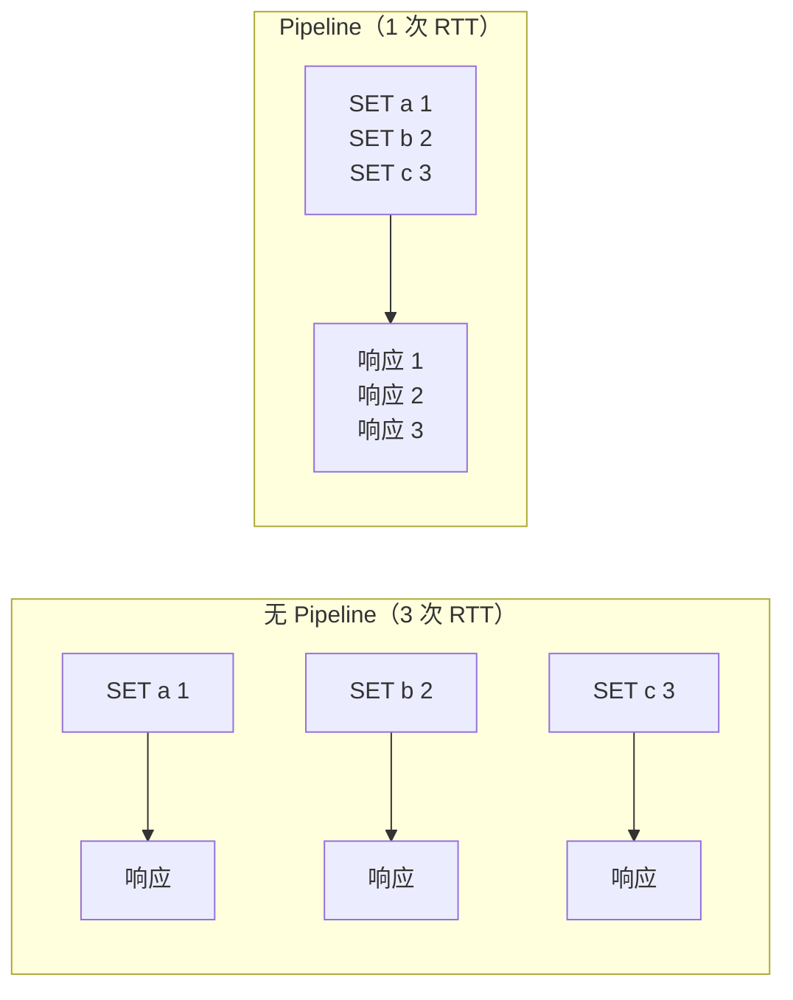
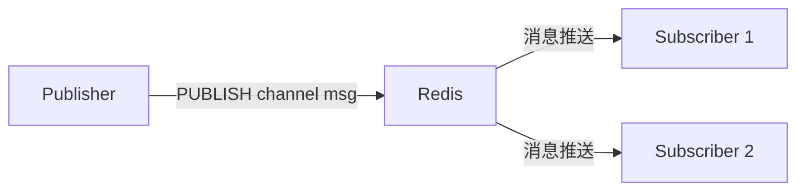
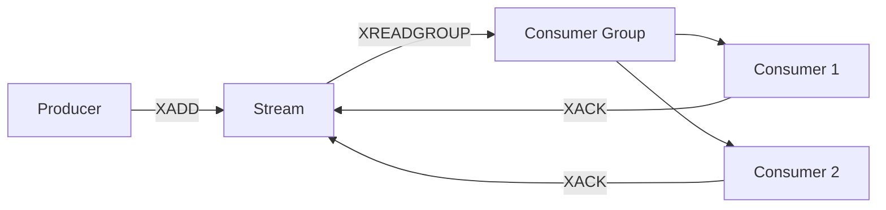

# go-redis 客户端

## 概念说明

`github.com/redis/go-redis/v9` 是 Go 生态中最流行的 Redis 客户端库，提供类型安全的 API、连接池管理、Pipeline、事务、Pub/Sub、Stream 等完整功能，支持单节点、Sentinel、Cluster 三种模式。

## 核心原理

### 连接池

go-redis 内置连接池，自动管理连接的创建、复用和回收：

```go
rdb := redis.NewClient(&redis.Options{
    Addr:         "localhost:6379",
    Password:     "",
    DB:           0,
    PoolSize:     10,              // 连接池大小
    MinIdleConns: 5,               // 最小空闲连接数
    DialTimeout:  5 * time.Second, // 连接超时
    ReadTimeout:  3 * time.Second, // 读超时
    WriteTimeout: 3 * time.Second, // 写超时
})
```

### Pipeline

Pipeline 将多个命令打包发送，减少网络往返次数（RTT）：



### 事务（MULTI/EXEC）

go-redis 通过 `TxPipeline` 实现事务：

```go
pipe := rdb.TxPipeline()
pipe.Set(ctx, "key1", "value1", 0)
pipe.Set(ctx, "key2", "value2", 0)
cmds, err := pipe.Exec(ctx)
```

注意：Redis 事务不支持回滚，EXEC 执行时如果某条命令失败，其他命令仍会执行。

### Pub/Sub

发布/订阅模式，适用于实时消息推送：



### Stream

Redis 5.0+ 引入的消息队列数据结构，支持消费组、ACK、持久化：



## 标准库方案

Go 标准库不包含 Redis 客户端，go-redis 是社区标准选择。

## 第三方库方案

| 库 | 特点 | 推荐度 |
|----|------|--------|
| `github.com/redis/go-redis/v9` | 功能最全、类型安全、活跃维护 | ⭐⭐⭐⭐⭐ |
| `github.com/gomodule/redigo` | 轻量级、命令式 API | ⭐⭐⭐⭐ |

## 代码示例

> 💻 完整可运行代码：[code-examples/02-web-data/cache-search/redis/](https://github.com/skyhe58/guide-go/tree/main/code-examples/02-web-data/cache-search/redis/)
> 🏷️ Demo 模式：Part A（模拟 Pipeline/事务概念）/ Part B（go-redis 完整操作）

## 常见面试题

### Q1: go-redis 的 Pipeline 和事务有什么区别？

**难度**：⭐⭐ | **频率**：🔥🔥🔥

**答题思路**：

1. Pipeline 只是批量发送，不保证原子性
2. 事务（MULTI/EXEC）保证命令的原子执行
3. 两者都减少 RTT

**标准答案**：

Pipeline 将多个命令打包发送以减少网络往返，但不保证原子性——中间可能插入其他客户端的命令。事务（TxPipeline）使用 MULTI/EXEC 包裹命令，保证这批命令的原子执行（要么全执行，要么全不执行），但不支持回滚。

**深入追问**：
- Redis 事务为什么不支持回滚？（Redis 作者认为命令错误是编程错误，不应在运行时处理）
- WATCH 命令的作用？（乐观锁，监控 Key 变化，变化则事务失败）

### Q2: Redis Pub/Sub 和 Stream 的区别？

**难度**：⭐⭐⭐ | **频率**：🔥🔥

**标准答案**：

Pub/Sub 是即时消息推送，消息不持久化，离线订阅者会丢失消息。Stream 是持久化消息队列，支持消费组、消息确认（ACK）、消息回溯，类似 Kafka 的消费模型。需要可靠消息传递时用 Stream，实时通知场景用 Pub/Sub。

## 常见陷阱

1. **连接泄漏**：Pub/Sub 的 `Subscribe` 返回的 `PubSub` 对象必须 `Close()`
2. **Pipeline 错误处理**：Pipeline 中单条命令失败不影响其他命令，需要逐个检查结果
3. **Context 超时**：go-redis v9 所有操作都需要 context，注意设置合理的超时

## 参考资料

- [go-redis 官方文档](https://redis.uptrace.dev/)
- [go-redis GitHub](https://github.com/redis/go-redis)
