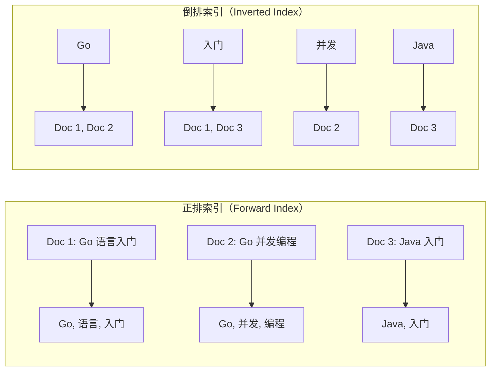
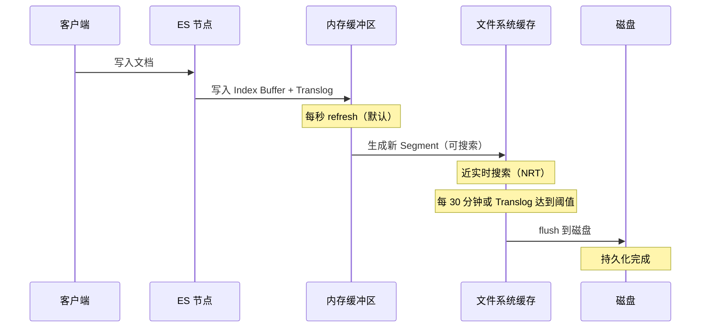

# Elasticsearch 倒排索引原理

## 概念说明

Elasticsearch（ES）是基于 Apache Lucene 构建的分布式搜索和分析引擎。其核心数据结构是**倒排索引**（Inverted Index），这是全文搜索的基础。

传统数据库使用正排索引（文档 → 关键词），而倒排索引反过来（关键词 → 文档列表），使得关键词搜索的时间复杂度从 O(N) 降低到 O(1)。

## 核心原理

### 正排索引 vs 倒排索引



### 倒排索引结构

倒排索引由两部分组成：

1. **词项字典（Term Dictionary）**：所有不重复的词项，通常用 B+ 树或 FST（有限状态转换器）存储
2. **倒排列表（Posting List）**：每个词项对应的文档列表，包含文档 ID、词频（TF）、位置信息等

| 词项（Term） | 文档频率（DF） | 倒排列表（Posting List） |
|-------------|---------------|------------------------|
| Go | 2 | [Doc1(pos:1), Doc2(pos:1)] |
| 入门 | 2 | [Doc1(pos:3), Doc3(pos:2)] |
| 并发 | 1 | [Doc2(pos:2)] |
| 编程 | 1 | [Doc2(pos:3)] |

### 索引写入流程



**关键概念**：
- **Segment**：Lucene 的最小索引单元，不可变
- **Refresh**：将内存缓冲区写入文件系统缓存，默认 1 秒，这就是 ES "近实时" 的原因
- **Flush**：将文件系统缓存持久化到磁盘
- **Merge**：合并小 Segment 为大 Segment，回收已删除文档的空间

### 分词过程

文本写入前需要经过分析器（Analyzer）处理：


## 标准库方案

Go 标准库不包含搜索引擎功能。可以用 Go 的 map 模拟倒排索引的核心概念：

```go
// 简单的倒排索引实现
type InvertedIndex map[string][]int // term -> docIDs

func buildIndex(docs map[int]string) InvertedIndex {
    index := make(InvertedIndex)
    for docID, content := range docs {
        words := strings.Fields(content)
        for _, word := range words {
            word = strings.ToLower(word)
            index[word] = append(index[word], docID)
        }
    }
    return index
}
```

## 代码示例

> 💻 完整可运行代码：[code-examples/02-web-data/cache-search/elasticsearch/](https://github.com/skyhe58/guide-go/tree/main/code-examples/02-web-data/cache-search/elasticsearch/)
> 🏷️ Demo 模式：Part A（内存模拟倒排索引）/ Part B（go-elasticsearch 操作真实 ES）

## 常见面试题

### Q1: Elasticsearch 的倒排索引原理？

**难度**：⭐⭐⭐ | **频率**：🔥🔥🔥

**答题思路**：

1. 正排索引 vs 倒排索引
2. 词项字典 + 倒排列表
3. 写入流程（Buffer → Segment → Merge）
4. 近实时搜索的原因

**标准答案**：

ES 使用倒排索引实现全文搜索。文档写入时经过分析器分词，生成词项列表。每个词项对应一个倒排列表，记录包含该词项的文档 ID、词频和位置信息。查询时通过词项字典快速定位倒排列表，获取匹配的文档。写入先到内存缓冲区，每秒 refresh 生成新 Segment（近实时），定期 flush 到磁盘持久化。

**深入追问**：
- 为什么 ES 是近实时而不是实时？（refresh 间隔默认 1 秒）
- Segment 合并的作用？（回收空间、减少文件数、提升查询性能）

## 常见陷阱

1. **写入后立即查询**：ES 默认 1 秒 refresh，写入后可能查不到。可以手动 refresh 或设置 `refresh=wait_for`
2. **中文分词**：默认分析器不支持中文分词，需要安装 IK 分词器
3. **深度分页**：`from + size` 超过 10000 会报错，大数据量分页应使用 `search_after`

## 参考资料

- [Elasticsearch 官方文档 - Inverted Index](https://www.elastic.co/guide/en/elasticsearch/reference/current/documents-indices.html)
- [Lucene 倒排索引原理](https://lucene.apache.org/)
