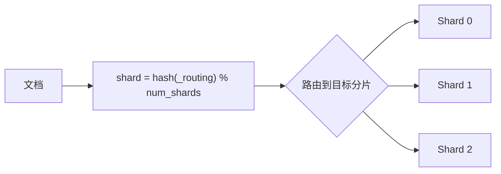

# ES CRUD 操作

## 概念说明

Elasticsearch 通过 RESTful API 提供所有操作接口。CRUD（Create、Read、Update、Delete）是最基础的操作，对应 HTTP 的 PUT/POST、GET、POST/PUT、DELETE 方法。

ES 中的核心概念与关系型数据库的对照：

| ES 概念 | 关系型数据库 | 说明 |
|---------|------------|------|
| Index | Database/Table | 索引（ES 7.x+ 一个索引对应一种文档类型） |
| Document | Row | 文档（JSON 格式） |
| Field | Column | 字段 |
| Mapping | Schema | 映射（字段类型定义） |

## 核心原理

### 索引管理

```bash
# 创建索引（带映射）
PUT /articles
{
  "settings": { "number_of_shards": 3, "number_of_replicas": 1 },
  "mappings": {
    "properties": {
      "title": { "type": "text" },
      "content": { "type": "text" },
      "author": { "type": "keyword" },
      "created_at": { "type": "date" }
    }
  }
}

# 删除索引
DELETE /articles

# 查看索引信息
GET /articles
```

### 文档 CRUD

```bash
# Create：创建文档（指定 ID）
PUT /articles/_doc/1
{ "title": "Go 入门", "content": "Go 语言基础教程", "author": "张三" }

# Create：创建文档（自动生成 ID）
POST /articles/_doc
{ "title": "Redis 入门", "content": "Redis 缓存教程", "author": "李四" }

# Read：获取文档
GET /articles/_doc/1

# Update：部分更新
POST /articles/_update/1
{ "doc": { "title": "Go 入门（修订版）" } }

# Delete：删除文档
DELETE /articles/_doc/1
```

### 批量操作（Bulk API）

```bash
POST /_bulk
{ "index": { "_index": "articles", "_id": "1" } }
{ "title": "Go 入门", "author": "张三" }
{ "index": { "_index": "articles", "_id": "2" } }
{ "title": "Redis 入门", "author": "李四" }
{ "delete": { "_index": "articles", "_id": "3" } }
```

Bulk API 将多个操作打包发送，显著提升写入性能。

### 文档路由



默认 `_routing` 为文档 ID，确保同一文档始终路由到同一分片。

## 代码示例

> 💻 完整可运行代码：[code-examples/02-web-data/cache-search/elasticsearch/](https://github.com/skyhe58/guide-go/tree/main/code-examples/02-web-data/cache-search/elasticsearch/)
> 🏷️ Demo 模式：Part A（模拟 CRUD 概念）/ Part B（go-elasticsearch CRUD 操作）

## 常见面试题

### Q1: ES 的写入流程是怎样的？

**难度**：⭐⭐⭐ | **频率**：🔥🔥

**答题思路**：

1. 客户端发送请求到协调节点
2. 路由到目标主分片
3. 主分片写入后同步到副本分片
4. 内存缓冲区 → Segment → 磁盘

**标准答案**：

客户端请求到达协调节点，通过路由公式确定目标主分片。主分片先写入 Translog（保证持久性），再写入内存缓冲区。每秒 refresh 将缓冲区数据生成新 Segment（可搜索）。主分片写入成功后，并行同步到副本分片。所有副本确认后返回客户端成功。

**深入追问**：
- 如何提升写入性能？（增大 refresh_interval、使用 Bulk API、减少副本数）

## 常见陷阱

1. **频繁单条写入**：应使用 Bulk API 批量写入，单条写入性能差
2. **更新即重建**：ES 的更新实际上是删除旧文档 + 创建新文档（Segment 不可变）
3. **主分片数不可修改**：索引创建后主分片数不可更改，需要提前规划

## 参考资料

- [Elasticsearch 官方文档 - Document APIs](https://www.elastic.co/guide/en/elasticsearch/reference/current/docs.html)
- [Elasticsearch 官方文档 - Bulk API](https://www.elastic.co/guide/en/elasticsearch/reference/current/docs-bulk.html)
