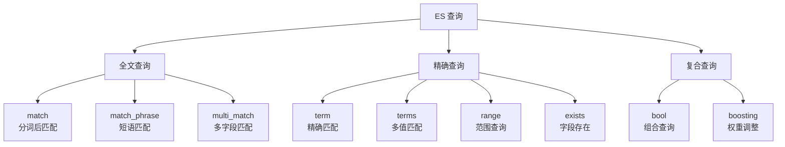

# ES DSL 查询

## 概念说明

DSL（Domain Specific Language）是 Elasticsearch 的查询语言，基于 JSON 格式。ES 的查询分为两大类：

- **查询上下文（Query Context）**：计算相关性评分（_score），回答"这个文档有多匹配"
- **过滤上下文（Filter Context）**：不计算评分，只判断是否匹配，性能更好且可缓存

## 核心原理

### 查询分类



### 全文查询

```json
// match：分词后匹配（OR 逻辑）
{ "query": { "match": { "title": "Go 入门" } } }

// match_phrase：短语匹配（词项顺序和位置必须一致）
{ "query": { "match_phrase": { "title": "Go 入门" } } }

// multi_match：多字段匹配
{ "query": { "multi_match": { "query": "Go", "fields": ["title^2", "content"] } } }
```

### 精确查询

```json
// term：精确匹配（不分词）
{ "query": { "term": { "status": "published" } } }

// range：范围查询
{ "query": { "range": { "created_at": { "gte": "2024-01-01", "lt": "2025-01-01" } } } }
```

### Bool 复合查询

Bool 查询是最常用的复合查询，通过 must/should/must_not/filter 组合多个条件：

```json
{
  "query": {
    "bool": {
      "must": [
        { "match": { "title": "Go" } }
      ],
      "filter": [
        { "term": { "status": "published" } },
        { "range": { "created_at": { "gte": "2024-01-01" } } }
      ],
      "should": [
        { "match": { "tags": "入门" } }
      ],
      "must_not": [
        { "term": { "author": "test" } }
      ]
    }
  }
}
```

| 子句 | 作用 | 计算评分 | 缓存 |
|------|------|---------|------|
| `must` | 必须匹配 | ✅ | ❌ |
| `filter` | 必须匹配 | ❌ | ✅ |
| `should` | 可选匹配（提升评分） | ✅ | ❌ |
| `must_not` | 必须不匹配 | ❌ | ✅ |

### 分页与排序

```json
{
  "query": { "match_all": {} },
  "from": 0,
  "size": 10,
  "sort": [
    { "created_at": "desc" },
    "_score"
  ],
  "_source": ["title", "author", "created_at"]
}
```

**深度分页问题**：`from + size` 超过 10000 会报错。解决方案：
- `search_after`：基于上一页最后一条记录的排序值
- `scroll`：适用于大批量数据导出（不适合实时搜索）

### 高亮

```json
{
  "query": { "match": { "content": "Go 语言" } },
  "highlight": {
    "fields": { "content": {} },
    "pre_tags": ["<em>"],
    "post_tags": ["</em>"]
  }
}
```

## 代码示例

> 💻 完整可运行代码：[code-examples/02-web-data/cache-search/elasticsearch/](https://github.com/your-repo/code-examples/02-web-data/cache-search/elasticsearch/)
> 🏷️ Demo 模式：Part A（模拟 DSL 查询概念）/ Part B（go-elasticsearch DSL 查询）

## 常见面试题

### Q1: match 和 term 查询的区别？

**难度**：⭐⭐ | **频率**：🔥🔥🔥

**答题思路**：

1. match 会分词，term 不分词
2. 各自适用的字段类型
3. 常见误用场景

**标准答案**：

`match` 查询会对查询文本进行分词处理，然后匹配倒排索引中的词项，适用于 `text` 类型字段的全文搜索。`term` 查询不分词，将查询文本作为整体精确匹配，适用于 `keyword` 类型字段。常见错误：对 `text` 字段使用 `term` 查询，由于 `text` 字段存储的是分词后的词项，精确匹配往往失败。

**深入追问**：
- Bool 查询中 must 和 filter 的区别？（must 计算评分，filter 不计算且可缓存）
- 如何解决深度分页问题？（search_after）

## 常见陷阱

1. **对 text 字段用 term 查询**：text 字段存储的是分词后的小写词项，term 精确匹配会失败
2. **深度分页性能差**：`from=10000, size=10` 需要在每个分片上取 10010 条再合并排序
3. **filter 未利用缓存**：频繁使用的过滤条件应放在 filter 中而非 must 中

## 参考资料

- [Elasticsearch 官方文档 - Query DSL](https://www.elastic.co/guide/en/elasticsearch/reference/current/query-dsl.html)
- [Elasticsearch 官方文档 - Bool Query](https://www.elastic.co/guide/en/elasticsearch/reference/current/query-dsl-bool-query.html)
