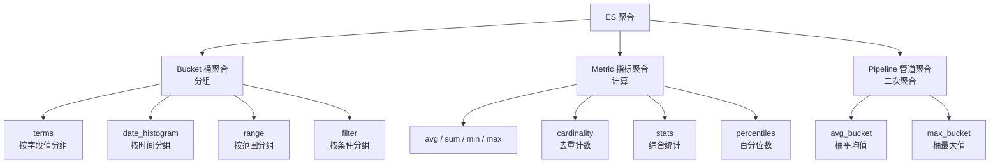

# ES 聚合分析

## 概念说明

聚合（Aggregation）是 Elasticsearch 的强大分析功能，类似于 SQL 中的 GROUP BY + 聚合函数。ES 聚合可以在搜索结果上进行实时统计分析，支持嵌套聚合，是日志分析、数据可视化的核心能力。

## 核心原理

### 聚合分类



### Bucket 桶聚合

```json
// terms 聚合：按作者分组统计文章数
{
  "size": 0,
  "aggs": {
    "by_author": {
      "terms": { "field": "author", "size": 10 }
    }
  }
}

// date_histogram：按月统计文章数
{
  "size": 0,
  "aggs": {
    "by_month": {
      "date_histogram": {
        "field": "created_at",
        "calendar_interval": "month"
      }
    }
  }
}
```

### Metric 指标聚合

```json
// 综合统计
{
  "size": 0,
  "aggs": {
    "view_stats": {
      "stats": { "field": "view_count" }
    }
  }
}
// 返回：count, min, max, avg, sum
```

### 嵌套聚合

```json
// 按作者分组，每组计算平均阅读量
{
  "size": 0,
  "aggs": {
    "by_author": {
      "terms": { "field": "author" },
      "aggs": {
        "avg_views": {
          "avg": { "field": "view_count" }
        }
      }
    }
  }
}
```

### 聚合 + 查询

聚合可以在查询结果上执行，先过滤再聚合：

```json
{
  "query": {
    "range": { "created_at": { "gte": "2024-01-01" } }
  },
  "size": 0,
  "aggs": {
    "popular_tags": {
      "terms": { "field": "tags", "size": 20 }
    }
  }
}
```

## 代码示例

> 💻 完整可运行代码：[code-examples/02-web-data/cache-search/elasticsearch/](https://github.com/skyhe58/guide-go/tree/main/code-examples/02-web-data/cache-search/elasticsearch/)
> 🏷️ Demo 模式：Part A（模拟聚合概念）/ Part B（go-elasticsearch 聚合查询）

## 常见面试题

### Q1: ES 聚合有哪些类型？各自的作用？

**难度**：⭐⭐⭐ | **频率**：🔥🔥

**答题思路**：

1. 三大类：Bucket、Metric、Pipeline
2. 各类的典型用法
3. 嵌套聚合的概念

**标准答案**：

ES 聚合分三类：Bucket 桶聚合（类似 GROUP BY，按条件分组）、Metric 指标聚合（类似聚合函数，计算 avg/sum/min/max 等）、Pipeline 管道聚合（在其他聚合结果上二次计算）。桶聚合和指标聚合可以嵌套使用，实现"先分组再统计"的效果。

**深入追问**：
- terms 聚合的精确度问题？（分布式环境下每个分片返回 top N，合并后可能不精确）
- 如何提升聚合性能？（使用 filter 缩小范围、设置合理的 size）

## 常见陷阱

1. **对 text 字段聚合**：text 字段默认不支持聚合，需要使用 `keyword` 子字段
2. **聚合结果不精确**：terms 聚合在分布式环境下可能不精确，可设置 `shard_size` 提升精度
3. **聚合内存消耗大**：大数据量的 cardinality 聚合使用 HyperLogLog 近似算法，有误差

## 参考资料

- [Elasticsearch 官方文档 - Aggregations](https://www.elastic.co/guide/en/elasticsearch/reference/current/search-aggregations.html)
