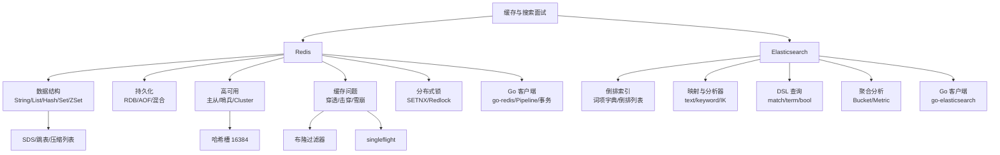

# 缓存与搜索面试指南

## 面试知识图谱

## 高频面试题汇总

### 一、Redis 数据结构与原理

#### Q1: Redis 有哪些数据结构？底层实现分别是什么？

**难度**：⭐⭐⭐ | **频率**：🔥🔥🔥

**答题思路**：

1. 五种基本数据结构 + Stream
2. 每种结构的底层编码
3. 编码切换条件

**标准答案**：

Redis 五种基本数据结构：String（int/embstr/raw）、List（listpack/quicklist）、Hash（listpack/hashtable）、Set（intset/hashtable）、Sorted Set（listpack/skiplist+hashtable）。Redis 会根据数据量和元素大小自动选择最优编码。例如 Hash 在元素数 ≤ 128 且值 ≤ 64 字节时使用 listpack（内存紧凑），超过阈值切换为 hashtable（查询高效）。

**深入追问**：
- SDS 相比 C 字符串的优势？
- 为什么 ZSet 用跳表而不用红黑树？

---

#### Q2: Redis 为什么这么快？

**难度**：⭐⭐⭐ | **频率**：🔥🔥🔥

**标准答案**：

1. **纯内存操作**：数据存储在内存中，读写速度极快
2. **单线程模型**：避免了多线程的上下文切换和锁竞争开销
3. **IO 多路复用**：使用 epoll/kqueue 处理大量并发连接
4. **高效数据结构**：SDS、跳表、压缩列表等针对性能优化的数据结构
5. **简单协议**：RESP 协议简单高效，解析速度快

**深入追问**：
- Redis 6.0 引入的多线程是什么？（IO 线程，命令执行仍然是单线程）
- 单线程为什么还能处理高并发？（IO 多路复用 + 事件驱动）

---

### 二、Redis 持久化与高可用

#### Q3: RDB 和 AOF 的区别？生产环境如何选择？

**难度**：⭐⭐⭐ | **频率**：🔥🔥🔥

**标准答案**：

RDB 定时快照，文件紧凑恢复快，但可能丢失最后一次快照后的数据。AOF 追加写命令，数据安全性高（everysec 最多丢 1 秒），但文件较大恢复较慢。生产环境建议同时开启 RDB + AOF，使用混合持久化模式（Redis 4.0+），兼顾恢复速度和数据安全。

---

#### Q4: Redis Cluster 的数据分片原理？

**难度**：⭐⭐⭐ | **频率**：🔥🔥🔥

**标准答案**：

Redis Cluster 将数据空间划分为 16384 个哈希槽，通过 `CRC16(key) % 16384` 计算 Key 所属槽位，路由到对应主节点。每个主节点负责一部分槽位，配备从节点实现高可用。客户端缓存槽位映射表，请求到错误节点时收到 MOVED 重定向。

---

### 三、缓存经典问题

#### Q5: 缓存穿透、击穿、雪崩的区别和解决方案？

**难度**：⭐⭐⭐ | **频率**：🔥🔥🔥

**标准答案**：

| 问题 | 定义 | 解决方案 |
|------|------|---------|
| 穿透 | 查不存在的数据 | 布隆过滤器 + 缓存空值 |
| 击穿 | 热点 Key 过期 | 互斥锁（singleflight）+ 逻辑过期 |
| 雪崩 | 大量 Key 同时过期 | 过期时间加随机值 + 多级缓存 + 高可用 |

---

#### Q6: 如何用 Redis 实现分布式锁？

**难度**：⭐⭐⭐ | **频率**：🔥🔥🔥

**标准答案**：

使用 `SET key uuid NX EX timeout` 原子加锁，Value 用 UUID 标识持有者。释放锁时用 Lua 脚本保证判断和删除的原子性。为防止业务超时导致锁过期，需要实现看门狗自动续期机制。多节点场景可使用 Redlock 算法，在多数节点上加锁成功才算成功。

**深入追问**：
- Redlock 的争议？（Martin Kleppmann 的批评：时钟跳跃问题）
- Redis 分布式锁 vs etcd 分布式锁？（Redis 基于 TTL，etcd 基于 Lease + Watch）

---

### 四、Elasticsearch

#### Q7: ES 的倒排索引原理？

**难度**：⭐⭐⭐ | **频率**：🔥🔥🔥

**标准答案**：

ES 使用倒排索引实现全文搜索。文档写入时经过分析器分词，生成词项列表。每个词项对应一个倒排列表，记录包含该词项的文档 ID、词频和位置信息。查询时通过词项字典（FST 结构）快速定位倒排列表，获取匹配的文档。

---

#### Q8: match 和 term 查询的区别？

**难度**：⭐⭐ | **频率**：🔥🔥🔥

**标准答案**：

`match` 查询会对查询文本进行分词处理，然后匹配倒排索引中的词项，适用于 `text` 类型字段。`term` 查询不分词，将查询文本作为整体精确匹配，适用于 `keyword` 类型字段。常见错误：对 `text` 字段使用 `term` 查询导致搜索不到结果。

---

#### Q9: ES 如何解决深度分页问题？

**难度**：⭐⭐⭐ | **频率**：🔥🔥

**标准答案**：

`from + size` 方式在深度分页时性能极差（每个分片需要返回 from + size 条数据再合并排序），且超过 10000 会报错。解决方案：
1. **search_after**：基于上一页最后一条记录的排序值，适用于实时翻页
2. **scroll**：创建快照遍历全量数据，适用于数据导出（不适合实时搜索）
3. **PIT（Point in Time）**：ES 7.10+ 推荐，结合 search_after 使用

---

### 五、综合场景题

#### Q10: 设计一个商品搜索系统，如何选择 Redis 和 ES？

**难度**：⭐⭐⭐ | **频率**：🔥🔥

**标准答案**：

Redis 和 ES 各司其职：
- **ES**：负责全文搜索（商品名称、描述的模糊搜索）、多条件筛选（价格范围、品牌、分类）、聚合统计（按品牌统计数量、价格分布）
- **Redis**：负责热门搜索词缓存（ZSet 排行榜）、搜索结果缓存（减少 ES 压力）、商品详情缓存（Hash 存储）

数据流：用户搜索 → 查 Redis 缓存 → 未命中则查 ES → 结果写入 Redis 缓存。商品更新时先更新数据库，再异步更新 ES 索引和 Redis 缓存。

## 面试准备建议

### 按公司类型

| 公司类型 | 重点 |
|---------|------|
| 大厂 | Redis 底层原理（SDS/跳表）、Cluster 分片、缓存三大问题、分布式锁 |
| 中厂 | Redis 数据结构使用场景、持久化配置、ES 基本使用 |
| 创业公司 | go-redis 实际使用、缓存方案设计、ES 搜索集成 |

### 复习优先级

1. 🔥🔥🔥 Redis 数据结构与底层实现
2. 🔥🔥🔥 缓存穿透/击穿/雪崩
3. 🔥🔥🔥 分布式锁
4. 🔥🔥🔥 Redis 持久化
5. 🔥🔥🔥 ES 倒排索引原理
6. 🔥🔥 Redis Cluster
7. 🔥🔥 ES DSL 查询
