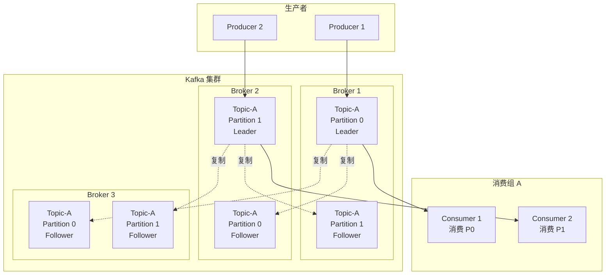
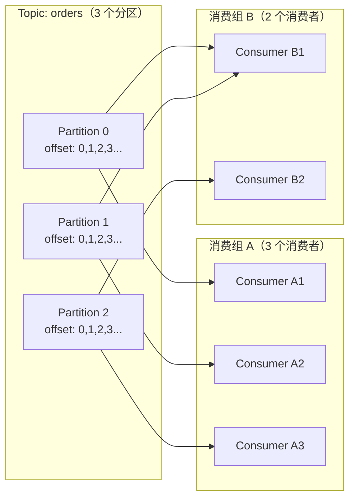

# Kafka 架构原理与 Go 客户端

## 概念说明

Apache Kafka 是一个**分布式流处理平台**，最初由 LinkedIn 开发，后捐赠给 Apache 基金会。Kafka 以高吞吐量、低延迟、持久化存储和水平扩展能力著称，广泛用于日志采集、事件溯源、实时数据管道和流处理场景。

Kafka 的核心设计理念：
- **分布式提交日志（Distributed Commit Log）**：消息以追加写入的方式持久化到磁盘，天然有序
- **消费组（Consumer Group）**：多个消费者协作消费同一 Topic，实现负载均衡
- **分区（Partition）**：Topic 分为多个分区，实现并行处理和水平扩展

## 核心原理

### Kafka 架构总览



### 核心概念

| 概念 | 说明 |
|------|------|
| **Broker** | Kafka 服务节点，一个集群由多个 Broker 组成 |
| **Topic** | 消息的逻辑分类，类似数据库中的表 |
| **Partition** | Topic 的物理分片，每个 Partition 是一个有序的消息队列 |
| **Offset** | 消息在 Partition 中的唯一序号，消费者通过 Offset 追踪消费进度 |
| **Consumer Group** | 消费组，组内消费者协作消费 Topic 的所有 Partition |
| **Replication** | 副本机制，每个 Partition 有 Leader 和 Follower，保证高可用 |

### 分区与消费组

分区是 Kafka 实现并行处理的核心机制：



**关键规则：**
- 一个 Partition 在同一消费组内只能被一个消费者消费
- 消费者数量 > 分区数量时，多余的消费者空闲
- 不同消费组之间互不影响，各自维护 Offset

### 消息可靠性保证

Kafka 通过 `acks` 参数控制消息可靠性：

| acks 值 | 含义 | 可靠性 | 性能 |
|---------|------|--------|------|
| `0` | 不等待确认 | 最低（可能丢消息） | 最高 |
| `1` | Leader 写入即确认 | 中等（Leader 宕机可能丢） | 中等 |
| `-1`/`all` | 所有 ISR 副本写入确认 | 最高 | 最低 |

### 幂等性

Kafka 0.11+ 支持幂等生产者（Idempotent Producer），通过 `ProducerID + SequenceNumber` 实现单分区内的精确一次语义（Exactly Once）：

1. 每个 Producer 分配唯一的 ProducerID
2. 每条消息携带递增的 SequenceNumber
3. Broker 检测重复的 SequenceNumber 并去重

## 第三方库方案

### sarama 客户端

Go 生态中最成熟的 Kafka 客户端是 `github.com/IBM/sarama`（原 Shopify/sarama），支持：

- 同步/异步生产者
- 消费组（ConsumerGroup）
- 分区消费者（PartitionConsumer）
- 管理操作（创建 Topic、查看 Offset 等）

```go
// 同步生产者示例
import "github.com/IBM/sarama"

config := sarama.NewConfig()
config.Producer.RequiredAcks = sarama.WaitForAll  // acks=-1
config.Producer.Retry.Max = 3
config.Producer.Return.Successes = true

producer, err := sarama.NewSyncProducer([]string{"localhost:9092"}, config)
if err != nil {
    log.Fatal(err)
}
defer producer.Close()

msg := &sarama.ProducerMessage{
    Topic: "orders",
    Key:   sarama.StringEncoder("order-1001"),
    Value: sarama.StringEncoder(`{"id":"1001","amount":99.9}`),
}
partition, offset, err := producer.SendMessage(msg)
```

```go
// 消费组示例
type ConsumerHandler struct{}

func (h *ConsumerHandler) Setup(_ sarama.ConsumerGroupSession) error   { return nil }
func (h *ConsumerHandler) Cleanup(_ sarama.ConsumerGroupSession) error { return nil }
func (h *ConsumerHandler) ConsumeClaim(session sarama.ConsumerGroupSession, claim sarama.ConsumerGroupClaim) error {
    for msg := range claim.Messages() {
        fmt.Printf("收到消息: topic=%s partition=%d offset=%d value=%s\n",
            msg.Topic, msg.Partition, msg.Offset, string(msg.Value))
        session.MarkMessage(msg, "") // 提交 Offset
    }
    return nil
}
```

## 代码示例

> 💻 完整可运行代码：[code-examples/02-web-data/message-queue/kafka/](https://github.com/your-repo/code-examples/02-web-data/message-queue/kafka/)
> 🏷️ Demo 模式：Part A（内存模拟 Kafka 分区/消费组概念）/ Part B（连接真实 Kafka）

## 常见面试题

### Q1: Kafka 如何保证消息不丢失？

**难度**：⭐⭐⭐ | **频率**：🔥🔥🔥

**答题思路**：

1. 生产者端：设置 `acks=all`，开启重试
2. Broker 端：设置 `min.insync.replicas >= 2`，确保多副本写入
3. 消费者端：手动提交 Offset，处理完消息后再提交

**标准答案**：

Kafka 消息不丢失需要三端配合：
- **生产者**：`acks=all` + `retries > 0` + `enable.idempotence=true`
- **Broker**：`replication.factor >= 3` + `min.insync.replicas >= 2` + `unclean.leader.election.enable=false`
- **消费者**：关闭自动提交（`enable.auto.commit=false`），业务处理成功后手动提交 Offset

**深入追问**：

- Kafka 的 ISR（In-Sync Replicas）机制是什么？
- 消费者 Rebalance 过程中可能出现什么问题？

### Q2: Kafka 分区数量如何选择？

**难度**：⭐⭐⭐ | **频率**：🔥🔥

**答题思路**：

1. 分区数 = max(生产者吞吐量 / 单分区写入速度, 消费者吞吐量 / 单消费者处理速度)
2. 分区数不宜过多（增加 Broker 内存开销、Rebalance 时间）
3. 一般建议：分区数 = 消费者数量的整数倍

**标准答案**：

分区数量需要根据业务吞吐量需求和消费者数量综合考虑。经验法则：单个分区的写入吞吐约 10MB/s，读取约 30MB/s。如果目标吞吐量为 100MB/s，至少需要 10 个分区。同时分区数应为消费者数量的整数倍，避免消费者空闲。

**深入追问**：

- 分区数能否动态增加？增加后对已有消息有什么影响？
- 为什么分区数过多会影响性能？

## 常见陷阱

1. **消费者数量超过分区数**：多余的消费者会空闲，无法消费任何消息
2. **忘记手动提交 Offset**：关闭自动提交后不手动提交，重启后会重复消费
3. **消息顺序性误解**：Kafka 只保证单分区内有序，跨分区无序
4. **Rebalance 风暴**：消费者频繁加入/退出导致反复 Rebalance，影响消费延迟

## 参考资料

- [Apache Kafka 官方文档](https://kafka.apache.org/documentation/)
- [IBM/sarama GitHub](https://github.com/IBM/sarama)
- [Kafka: The Definitive Guide](https://www.confluent.io/resources/kafka-the-definitive-guide/)
