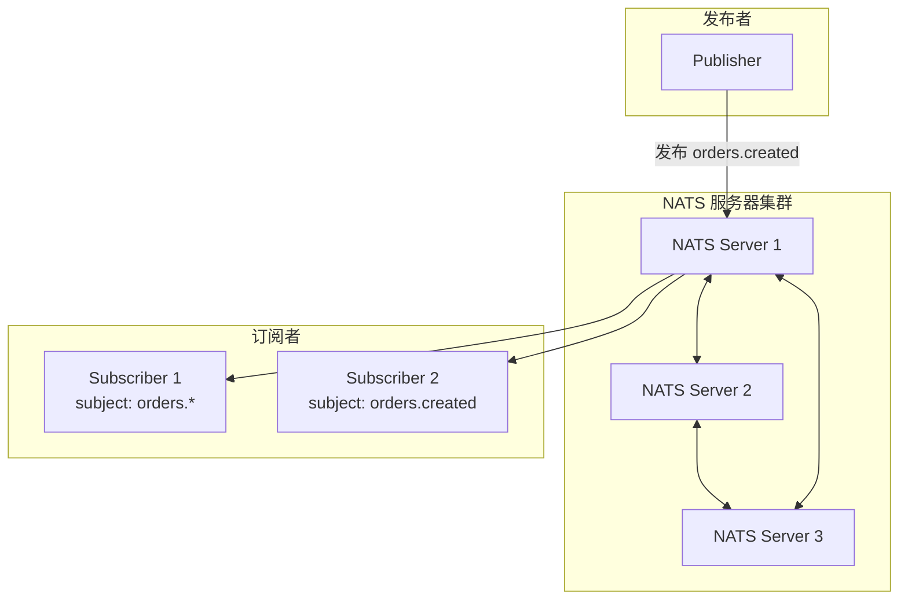
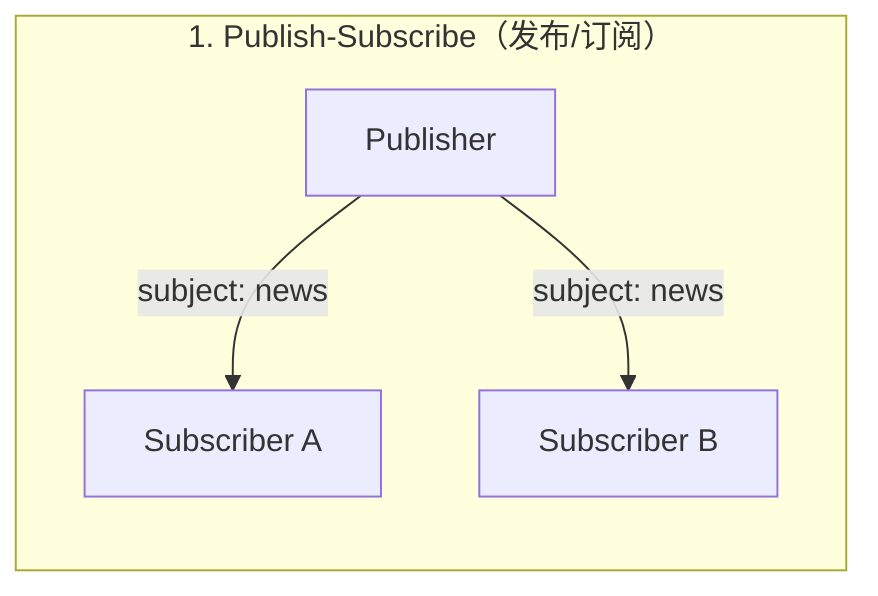
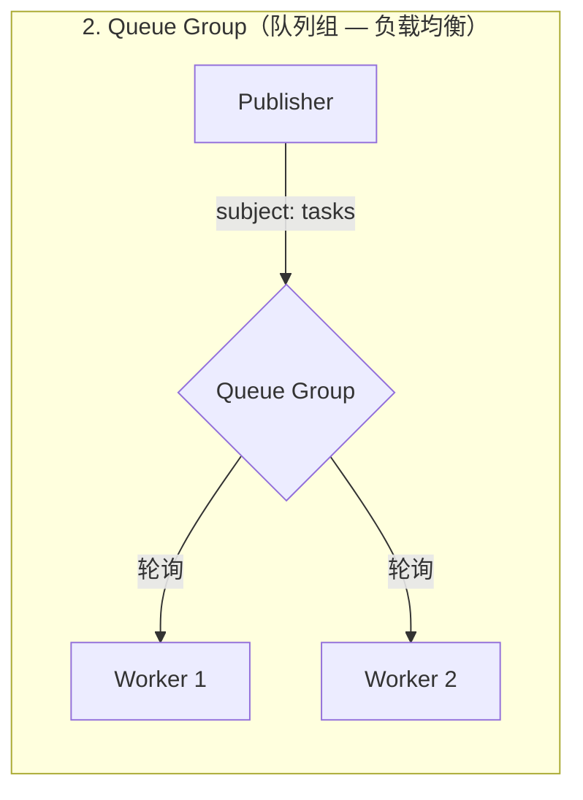
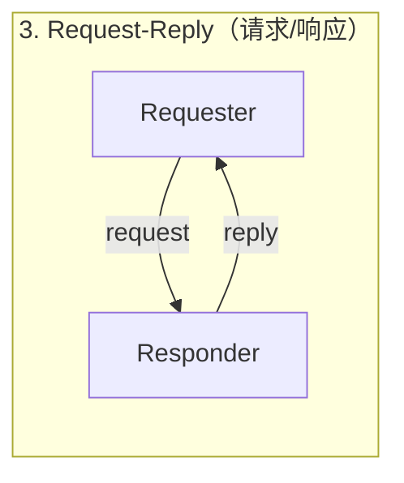

# NATS 轻量级消息系统

## 概念说明

NATS 是一个用 Go 编写的**轻量级、高性能消息系统**，由 Synadia 公司维护，是 CNCF（云原生计算基金会）孵化项目。NATS 以极简设计著称——单一二进制文件、零配置启动、超低延迟，天然适合云原生和微服务场景。

NATS 的核心设计理念：
- **简单至上**：核心协议极简，客户端实现轻量
- **At-Most-Once 语义**：Core NATS 默认不持久化，追求极致性能
- **JetStream 持久化**：NATS 2.0+ 内置持久化层，支持 At-Least-Once 和 Exactly-Once
- **Go 原生**：服务端和官方客户端均用 Go 编写，与 Go 生态天然契合

## 核心原理

### NATS 架构



### Core NATS vs JetStream

| 特性 | Core NATS | JetStream |
|------|-----------|-----------|
| 消息持久化 | ❌ 不持久化 | ✅ 持久化到磁盘 |
| 消息语义 | At-Most-Once | At-Least-Once / Exactly-Once |
| 消息回放 | ❌ | ✅ 支持从任意位置回放 |
| 消费者组 | Queue Group | Durable Consumer |
| 适用场景 | 实时通知、服务发现 | 事件溯源、任务队列 |
| 性能 | 极高（百万级 msg/s） | 高（受磁盘 IO 影响） |

### 消息模式

NATS 支持三种核心消息模式：







### Subject 通配符

NATS 使用点分隔的 Subject 命名，支持通配符：

| 通配符 | 含义 | 示例 |
|--------|------|------|
| `*` | 匹配单个 token | `orders.*` 匹配 `orders.created`，不匹配 `orders.us.created` |
| `>` | 匹配一个或多个 token | `orders.>` 匹配 `orders.created` 和 `orders.us.created` |

## 第三方库方案

### nats.go 客户端

Go 官方客户端 `github.com/nats-io/nats.go`：

```go
import "github.com/nats-io/nats.go"

// 连接 NATS
nc, err := nats.Connect("nats://localhost:4222")
if err != nil {
    log.Fatal(err)
}
defer nc.Close()

// 发布消息
nc.Publish("orders.created", []byte(`{"id":"1001"}`))

// 订阅消息
nc.Subscribe("orders.*", func(msg *nats.Msg) {
    fmt.Printf("收到: subject=%s data=%s\n", msg.Subject, string(msg.Data))
})

// Request-Reply
reply, err := nc.Request("api.user.get", []byte("1001"), 2*time.Second)
```

### JetStream 持久化

```go
// 创建 JetStream 上下文
js, err := nc.JetStream()

// 创建 Stream
js.AddStream(&nats.StreamConfig{
    Name:     "ORDERS",
    Subjects: []string{"orders.>"},
    Storage:  nats.FileStorage,
    MaxAge:   24 * time.Hour,
})

// 发布持久化消息
js.Publish("orders.created", []byte(`{"id":"1001"}`))

// 创建持久化消费者
sub, _ := js.PullSubscribe("orders.>", "order-processor")
msgs, _ := sub.Fetch(10, nats.MaxWait(5*time.Second))
```

## 代码示例

> 💻 完整可运行代码：[code-examples/02-web-data/message-queue/nats/](https://github.com/skyhe58/guide-go/tree/main/code-examples/02-web-data/message-queue/nats/)
> 🏷️ Demo 模式：Part A（内存模拟 Pub/Sub 和 Request-Reply）/ Part B（连接真实 NATS）

## 常见面试题

### Q1: NATS 和 Kafka 的核心区别是什么？

**难度**：⭐⭐⭐ | **频率**：🔥🔥

**答题思路**：

1. 设计理念不同：NATS 追求简单轻量，Kafka 追求高吞吐持久化
2. 消息语义不同：Core NATS 是 At-Most-Once，Kafka 是 At-Least-Once
3. 适用场景不同：NATS 适合微服务通信，Kafka 适合数据管道

**标准答案**：

NATS 和 Kafka 定位不同。NATS 是轻量级消息系统，核心优势是低延迟和简单部署，适合微服务间的实时通信和服务发现；Kafka 是分布式流处理平台，核心优势是高吞吐和持久化，适合日志采集和事件溯源。NATS JetStream 补齐了持久化能力，但在大规模数据管道场景仍不如 Kafka 成熟。

**深入追问**：

- NATS JetStream 和 Kafka 在持久化机制上有什么区别？
- 什么场景下你会选择 NATS 而不是 Kafka？

### Q2: NATS 的 Queue Group 是如何实现负载均衡的？

**难度**：⭐⭐ | **频率**：🔥🔥

**答题思路**：

1. 同一 Queue Group 内的订阅者共享消息
2. NATS 服务器随机选择一个订阅者投递
3. 类似 Kafka 的消费组，但更轻量

**标准答案**：

NATS Queue Group 是一种内置的负载均衡机制。多个订阅者使用相同的 Queue Group 名称订阅同一 Subject 时，每条消息只会被组内的一个订阅者接收。NATS 服务器使用随机选择策略分发消息，无需额外配置。这比 Kafka 的消费组更轻量——不需要分区概念，任意数量的消费者都能参与负载均衡。

**深入追问**：

- Queue Group 和普通订阅可以同时存在吗？
- 如果 Queue Group 中的消费者处理失败，消息会重新投递吗？

## 常见陷阱

1. **Core NATS 消息丢失**：Core NATS 不持久化，订阅者离线期间的消息会丢失，需要持久化请用 JetStream
2. **Subject 命名不规范**：Subject 应使用点分隔的层级命名（如 `orders.created`），避免使用空格或特殊字符
3. **忽略连接断开处理**：生产环境需要设置重连回调和错误处理
4. **JetStream 消费者不确认**：Pull 模式下忘记 Ack 会导致消息重复投递

## 参考资料

- [NATS 官方文档](https://docs.nats.io/)
- [nats.go GitHub](https://github.com/nats-io/nats.go)
- [NATS by Example](https://natsbyexample.com/)
