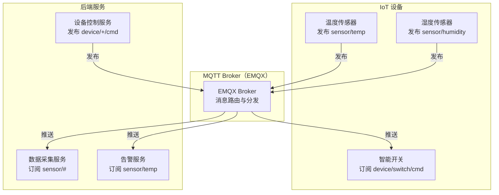
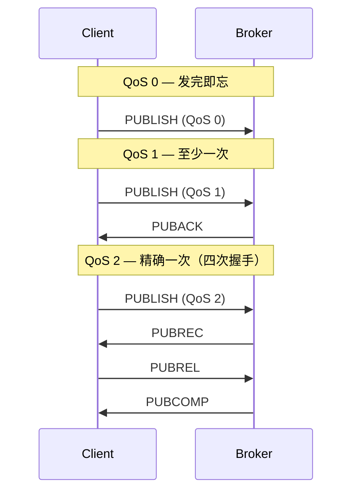

# MQTT 物联网消息协议

## 概念说明

MQTT（Message Queuing Telemetry Transport）是一个**轻量级的发布/订阅消息传输协议**，专为低带宽、高延迟、不稳定网络环境设计。MQTT 是物联网（IoT）领域的事实标准协议，广泛用于设备通信、传感器数据采集、智能家居、车联网等场景。

MQTT 的核心设计理念：
- **极简协议**：最小报文仅 2 字节，适合资源受限的嵌入式设备
- **发布/订阅模式**：设备之间通过 Broker 解耦，无需直接连接
- **三级 QoS**：提供三种服务质量等级，平衡可靠性和性能
- **会话保持**：支持持久会话、遗嘱消息、保留消息等特性

## 核心原理

### MQTT 架构



### QoS 级别

MQTT 定义了三种服务质量（Quality of Service）等级：

| QoS | 名称 | 含义 | 消息传递 | 适用场景 |
|-----|------|------|----------|----------|
| **0** | At Most Once | 最多一次 | 可能丢失 | 传感器周期上报（丢一条无所谓） |
| **1** | At Least Once | 至少一次 | 可能重复 | 设备状态上报（重复可接受） |
| **2** | Exactly Once | 精确一次 | 不丢不重 | 计费、支付指令（不能丢也不能重） |



### 遗嘱消息（Last Will and Testament）

遗嘱消息是客户端在连接时预设的消息，当客户端**异常断开**（非正常 Disconnect）时，Broker 自动发布该消息。常用于设备离线通知：

```
连接时设置遗嘱：
  Will Topic: device/sensor-001/status
  Will Payload: {"status": "offline"}
  Will QoS: 1
  Will Retain: true

设备异常断开 → Broker 自动发布遗嘱消息 → 订阅者收到离线通知
```

### 保留消息（Retained Message）

保留消息是 Broker 为每个 Topic 保存的最后一条消息。新订阅者订阅该 Topic 时，会立即收到保留消息，无需等待下一次发布。适合设备状态同步：

```
设备发布保留消息：
  Topic: device/sensor-001/status
  Payload: {"status": "online", "temp": 25.6}
  Retain: true

新订阅者订阅 device/sensor-001/status → 立即收到最新状态
```

### 共享订阅（Shared Subscription）

MQTT 5.0 引入共享订阅，实现消费者负载均衡（类似 Kafka 消费组）：

```
共享订阅格式：$share/{group}/{topic}

示例：
  订阅者 A: $share/workers/sensor/temp
  订阅者 B: $share/workers/sensor/temp
  
  → 每条消息只投递给 A 或 B 中的一个（轮询）
```

### Topic 通配符

| 通配符 | 含义 | 示例 |
|--------|------|------|
| `+` | 匹配单层 | `sensor/+/temp` 匹配 `sensor/room1/temp` |
| `#` | 匹配多层（只能在末尾） | `sensor/#` 匹配 `sensor/room1/temp` 和 `sensor/room1/humidity` |

## 第三方库方案

### paho.mqtt.golang 客户端

Eclipse Paho 是 MQTT 客户端的参考实现，`github.com/eclipse/paho.mqtt.golang` 是 Go 版本：

```go
import mqtt "github.com/eclipse/paho.mqtt.golang"

opts := mqtt.NewClientOptions().
    AddBroker("tcp://localhost:1883").
    SetClientID("go-sensor-001").
    SetWill("device/sensor-001/status", `{"status":"offline"}`, 1, true)

client := mqtt.NewClient(opts)
if token := client.Connect(); token.Wait() && token.Error() != nil {
    log.Fatal(token.Error())
}

// 发布消息
client.Publish("sensor/temp", 1, false, `{"temp":25.6}`)

// 订阅消息
client.Subscribe("sensor/#", 1, func(c mqtt.Client, msg mqtt.Message) {
    fmt.Printf("收到: topic=%s payload=%s\n", msg.Topic(), msg.Payload())
})
```

### EMQX Broker

EMQX 是全球最具扩展性的开源 MQTT Broker，支持：
- 单集群百万级并发连接
- MQTT 3.1.1 / 5.0 协议
- 规则引擎（数据桥接到 Kafka/数据库）
- Dashboard 可视化管理

### 与 AWS IoT Core 集成

AWS IoT Core 是 AWS 的托管 MQTT 服务，支持：
- X.509 证书认证
- 设备影子（Device Shadow）
- 规则引擎（转发到 Lambda/S3/DynamoDB）

```go
// AWS IoT Core 连接（需要 TLS 证书）
import mqtt "github.com/eclipse/paho.mqtt.golang"

tlsConfig := &tls.Config{
    Certificates: []tls.Certificate{cert},
    RootCAs:      caCertPool,
}

opts := mqtt.NewClientOptions().
    AddBroker("tls://xxx.iot.region.amazonaws.com:8883").
    SetClientID("device-001").
    SetTLSConfig(tlsConfig)
```

## 代码示例

> 💻 完整可运行代码：[code-examples/02-web-data/message-queue/mqtt/](https://github.com/your-repo/code-examples/02-web-data/message-queue/mqtt/)
> 🏷️ Demo 模式：Part A（内存模拟 MQTT QoS/遗嘱消息/保留消息概念）/ Part B（连接真实 EMQX）

## 常见面试题

### Q1: MQTT 的三种 QoS 级别有什么区别？

**难度**：⭐⭐⭐ | **频率**：🔥🔥🔥

**答题思路**：

1. 分别说明 QoS 0/1/2 的语义
2. 说明各自的消息传递流程
3. 给出适用场景

**标准答案**：

MQTT 定义三种 QoS：QoS 0（At Most Once）发完即忘，不保证送达，适合传感器周期上报；QoS 1（At Least Once）通过 PUBACK 确认，保证至少送达一次但可能重复，适合设备状态上报；QoS 2（Exactly Once）通过四次握手（PUBLISH→PUBREC→PUBREL→PUBCOMP）保证精确一次，适合计费和支付指令。QoS 越高，网络开销越大，需要根据业务场景权衡。

**深入追问**：

- QoS 2 的四次握手具体流程是什么？
- 发布者和订阅者的 QoS 可以不同吗？最终 QoS 如何确定？

### Q2: MQTT 的遗嘱消息和保留消息有什么区别？

**难度**：⭐⭐ | **频率**：🔥🔥

**答题思路**：

1. 遗嘱消息：异常断开时自动发布
2. 保留消息：Broker 保存的最后一条消息
3. 两者可以结合使用

**标准答案**：

遗嘱消息（Will Message）是客户端连接时预设的消息，当客户端异常断开时 Broker 自动发布，用于离线通知。保留消息（Retained Message）是 Broker 为每个 Topic 保存的最后一条消息，新订阅者订阅时立即收到，用于状态同步。两者可以结合：设备上线时发布保留消息 `{"status":"online"}`，同时设置遗嘱消息 `{"status":"offline"}`，实现完整的在线状态管理。

**深入追问**：

- 如何清除一个 Topic 的保留消息？
- 遗嘱消息在什么情况下不会被发布？

## 常见陷阱

1. **QoS 降级**：最终 QoS = min(发布者 QoS, 订阅者 QoS)，订阅者设置 QoS 2 但发布者用 QoS 0，实际是 QoS 0
2. **ClientID 冲突**：两个客户端使用相同 ClientID 连接同一 Broker，后连接的会踢掉先连接的
3. **忽略 Clean Session**：`CleanSession=false` 时 Broker 会保存离线消息，但可能导致消息堆积
4. **Topic 层级过深**：过深的 Topic 层级增加 Broker 路由开销，建议控制在 5 层以内

## 参考资料

- [MQTT 协议规范 5.0](https://docs.oasis-open.org/mqtt/mqtt/v5.0/mqtt-v5.0.html)
- [Eclipse Paho Go Client](https://github.com/eclipse/paho.mqtt.golang)
- [EMQX 官方文档](https://www.emqx.io/docs/zh/latest/)
- [AWS IoT Core 开发者指南](https://docs.aws.amazon.com/iot/latest/developerguide/)
