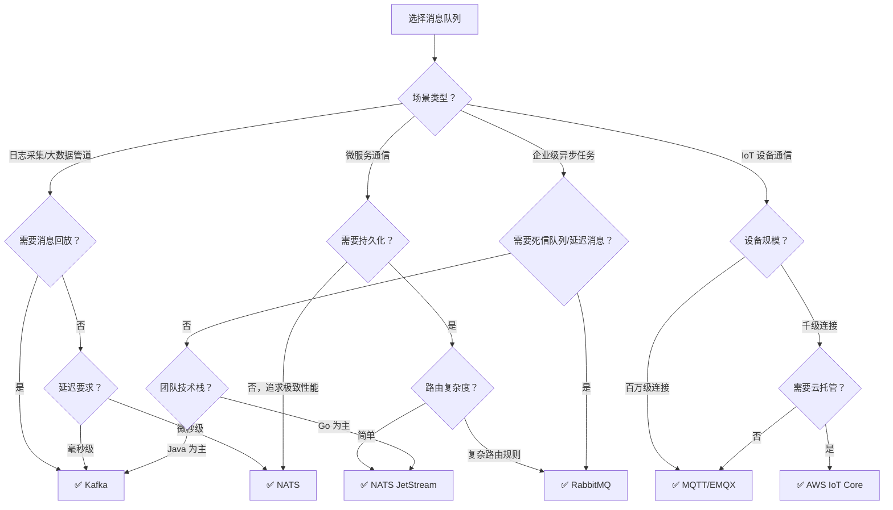

# 消息队列选型对比

## 概念说明

消息队列选型是后端架构设计中的关键决策。不同消息队列在吞吐量、延迟、可靠性、功能丰富度、运维复杂度等维度各有优劣，没有"银弹"方案。本文从多个维度对比 Kafka、NATS、RabbitMQ 和 MQTT，帮助开发者根据业务场景做出合理选型。

## 核心原理

### 全维度对比

| 维度 | Kafka | NATS | RabbitMQ | MQTT (EMQX) |
|------|-------|------|----------|-------------|
| **定位** | 分布式流处理平台 | 轻量级消息系统 | 企业级消息队列 | IoT 消息协议 |
| **协议** | 自定义二进制协议 | 自定义文本协议 | AMQP 0-9-1 | MQTT 3.1.1/5.0 |
| **开发语言** | Java/Scala | Go | Erlang | Erlang |
| **吞吐量** | 极高（百万级/s） | 极高（千万级/s） | 中等（万级/s） | 高（百万连接） |
| **延迟** | 毫秒级 | 微秒级 | 毫秒级 | 毫秒级 |
| **消息持久化** | ✅ 默认持久化 | ✅ JetStream | ✅ 可选持久化 | ✅ 可选持久化 |
| **消息顺序** | 分区内有序 | 不保证 | 队列内有序 | 不保证 |
| **消息回放** | ✅ 按 Offset 回放 | ✅ JetStream | ❌ | ❌ |
| **消费模式** | Pull（拉取） | Push/Pull | Push（推送） | Push（推送） |
| **路由能力** | Topic + Partition | Subject 通配符 | Exchange 灵活路由 | Topic 通配符 |
| **运维复杂度** | 高 | 低 | 中 | 中 |
| **Go 客户端** | IBM/sarama | nats-io/nats.go | rabbitmq/amqp091-go | eclipse/paho.mqtt.golang |

### 消息语义对比

| 语义 | Kafka | NATS Core | NATS JetStream | RabbitMQ | MQTT |
|------|-------|-----------|----------------|----------|------|
| At-Most-Once | ✅ | ✅（默认） | ✅ | ✅ | ✅（QoS 0） |
| At-Least-Once | ✅（默认） | ❌ | ✅（默认） | ✅（默认） | ✅（QoS 1） |
| Exactly-Once | ✅（事务） | ❌ | ✅ | ❌ | ✅（QoS 2） |

### 场景选型决策树

### 按场景推荐

| 业务场景 | 推荐方案 | 理由 |
|----------|----------|------|
| **日志采集与分析** | Kafka | 高吞吐、持久化、支持回放，与 ELK/Flink 生态集成 |
| **事件溯源** | Kafka | 天然的分布式提交日志，支持按 Offset 回放 |
| **微服务间通信** | NATS | 轻量、低延迟、Go 原生，Queue Group 天然负载均衡 |
| **实时通知推送** | NATS | 微秒级延迟，Pub/Sub 模式天然适合 |
| **异步任务处理** | RabbitMQ | 消息确认机制完善，死信队列处理失败任务 |
| **订单超时取消** | RabbitMQ | TTL + 死信队列实现延迟消息 |
| **IoT 设备通信** | MQTT/EMQX | 专为 IoT 设计，百万级连接，QoS 保证 |
| **车联网/智能家居** | MQTT/EMQX | 低带宽、遗嘱消息、保留消息 |
| **云端 IoT 平台** | AWS IoT Core | 托管服务、证书认证、规则引擎、设备影子 |

### IoT 场景专项对比

在 IoT 场景中，MQTT 是首选，但其他消息队列也有各自的角色：

| 维度 | MQTT/EMQX | Kafka | NATS |
|------|-----------|-------|------|
| **设备端协议** | ✅ 原生支持 | ❌ 不适合 | ⚠️ 可用但非主流 |
| **百万级连接** | ✅ 单集群支持 | ❌ 不适合 | ✅ 支持 |
| **低带宽网络** | ✅ 最小 2 字节报文 | ❌ 报文较大 | ⚠️ 报文较小 |
| **QoS 保证** | ✅ 三级 QoS | ✅ acks 机制 | ⚠️ JetStream |
| **设备状态管理** | ✅ 遗嘱+保留消息 | ❌ 需自实现 | ❌ 需自实现 |
| **数据管道** | ⚠️ 需桥接 | ✅ 原生支持 | ✅ 支持 |

**典型 IoT 架构**：设备端使用 MQTT 协议连接 EMQX，EMQX 通过规则引擎将数据桥接到 Kafka 进行流处理和持久化。

## 代码示例

> 💻 完整可运行代码：[code-examples/02-web-data/message-queue/](https://github.com/skyhe58/guide-go/tree/main/code-examples/02-web-data/message-queue/)
> 🏷️ 四种消息队列的 Go 客户端示例均在此目录下

## 常见面试题

### Q1: 如何选择 Kafka、RabbitMQ 和 NATS？

**难度**：⭐⭐⭐ | **频率**：🔥🔥🔥

**答题思路**：

1. 先明确业务场景和核心需求
2. 从吞吐量、延迟、可靠性、运维复杂度等维度对比
3. 给出具体推荐

**标准答案**：

选型取决于业务场景：需要高吞吐量和消息回放（日志采集、事件溯源）选 Kafka；需要复杂路由和可靠投递（企业级异步任务、延迟消息）选 RabbitMQ；需要轻量级低延迟（微服务通信、实时通知）选 NATS。如果团队以 Go 为主且不需要复杂路由，NATS 是最佳选择——Go 原生、零配置、部署简单。如果涉及 IoT 设备通信，MQTT 是唯一合理选择。

**深入追问**：

- 如果同时需要 IoT 设备通信和后端数据管道，架构怎么设计？
- Kafka 和 NATS JetStream 在持久化场景下如何选择？

### Q2: 消息队列如何保证消息不丢失？

**难度**：⭐⭐⭐ | **频率**：🔥🔥🔥

**答题思路**：

1. 通用原则：生产者确认 + Broker 持久化 + 消费者确认
2. 分别说明各消息队列的具体实现

**标准答案**：

消息不丢失的通用原则是"三端保证"：生产者确认消息已被 Broker 接收、Broker 将消息持久化到磁盘、消费者处理完成后确认。具体实现：Kafka 通过 `acks=all` + 副本机制 + 手动提交 Offset；RabbitMQ 通过 Publisher Confirm + 队列持久化 + 手动 Ack；NATS JetStream 通过 Publish Ack + 文件存储 + Consumer Ack；MQTT 通过 QoS 1/2 + 持久会话。

**深入追问**：

- 消息不丢失和消息不重复能同时保证吗？
- 如何处理消费者处理成功但 Ack 失败的情况？

## 常见陷阱

1. **盲目选择 Kafka**：小规模微服务场景使用 Kafka 是"杀鸡用牛刀"，运维成本高
2. **忽略 IoT 场景的特殊性**：IoT 设备资源受限，不能使用 Kafka/RabbitMQ 的重客户端
3. **混淆消息队列和流处理**：Kafka 是流处理平台（支持回放），RabbitMQ 是传统消息队列（消费即删）
4. **忽略运维成本**：Kafka 集群运维复杂度远高于 NATS，选型时需考虑团队运维能力

## 参考资料

- [Apache Kafka 官方文档](https://kafka.apache.org/documentation/)
- [NATS 官方文档](https://docs.nats.io/)
- [RabbitMQ 官方文档](https://www.rabbitmq.com/documentation.html)
- [EMQX 官方文档](https://www.emqx.io/docs/zh/latest/)
