# 消息队列面试指南

## 面试知识图谱

```mermaid
graph TB
    MQ[消息队列面试] --> Basic[基础概念]
    MQ --> Kafka[Kafka 专题]
    MQ --> RabbitMQ[RabbitMQ 专题]
    MQ --> Design[架构设计]
    MQ --> IoT[IoT 专题]

    Basic --> B1[为什么需要消息队列？]
    Basic --> B2[消息队列的三大作用]
    Basic --> B3[消息不丢失方案]
    Basic --> B4[消息重复消费与幂等性]
    Basic --> B5[消息顺序性保证]

    Kafka --> K1[Kafka 架构原理]
    Kafka --> K2[分区与消费组]
    Kafka --> K3[消息可靠性配置]
    Kafka --> K4[Rebalance 机制]

    RabbitMQ --> R1[Exchange 类型]
    RabbitMQ --> R2[死信队列]
    RabbitMQ --> R3[延迟消息实现]
    RabbitMQ --> R4[消息确认机制]

    Design --> D1[消息队列选型]
    Design --> D2[消息积压处理]
    Design --> D3[分布式事务]

    IoT --> I1[MQTT QoS 级别]
    IoT --> I2[遗嘱消息与保留消息]
    IoT --> I3[IoT 架构设计]
```



## 高频面试题

### Q1: 为什么需要消息队列？消息队列的三大作用是什么？

**难度**：⭐⭐ | **频率**：🔥🔥🔥

**答题思路**：

1. 从实际业务场景出发
2. 说明三大核心作用
3. 举例说明

**标准答案**：

消息队列的三大核心作用：

1. **异步处理**：将耗时操作异步化，提升响应速度。例如用户注册后，发送欢迎邮件和短信通知可以异步处理，注册接口立即返回
2. **系统解耦**：生产者和消费者通过消息队列解耦，互不依赖。例如订单系统发布"订单创建"事件，库存、物流、通知等系统各自订阅处理
3. **流量削峰**：高并发场景下，消息队列作为缓冲层，平滑处理突发流量。例如秒杀场景，请求先写入消息队列，后端按处理能力消费

**深入追问**：

- 引入消息队列会带来什么问题？（系统复杂度增加、消息丢失风险、消息重复、顺序性问题）
- 如何保证消息队列的高可用？

### Q2: 如何保证消息不丢失？

**难度**：⭐⭐⭐ | **频率**：🔥🔥🔥

**答题思路**：

1. 分析消息丢失的三个环节
2. 每个环节的解决方案
3. 以 Kafka 和 RabbitMQ 为例

**标准答案**：

消息可能在三个环节丢失：

**1. 生产者 → Broker**
- Kafka：`acks=all` + `retries > 0` + `enable.idempotence=true`
- RabbitMQ：开启 Publisher Confirm 模式

**2. Broker 存储**
- Kafka：`replication.factor >= 3` + `min.insync.replicas >= 2`
- RabbitMQ：队列 `durable=true` + 消息 `deliveryMode=2`

**3. Broker → 消费者**
- Kafka：关闭自动提交，业务处理成功后手动提交 Offset
- RabbitMQ：关闭自动 Ack，业务处理成功后手动 Ack

**深入追问**：

- 消息不丢失和消息不重复能同时保证吗？（CAP 理论视角）
- Kafka 的 ISR 机制是什么？

### Q3: 如何处理消息重复消费？

**难度**：⭐⭐⭐ | **频率**：🔥🔥🔥

**答题思路**：

1. 为什么会重复消费
2. 幂等性设计方案
3. 具体实现方式

**标准答案**：

消息重复消费的原因：消费者处理成功但 Ack 失败（网络抖动、消费者重启），Broker 认为消息未被消费，重新投递。

解决方案是**幂等性设计**——同一消息处理多次，结果与处理一次相同：

1. **唯一 ID + 去重表**：每条消息携带唯一 ID，消费前查询去重表，已处理则跳过
2. **数据库唯一约束**：利用数据库唯一索引防止重复插入
3. **Redis SETNX**：用消息 ID 作为 Key，SETNX 成功才处理
4. **乐观锁/版本号**：更新操作带版本号，版本不匹配则跳过

```go
// Go 幂等消费示例
func handleMessage(msg Message) error {
    // 1. 检查是否已处理
    exists, _ := redis.SetNX(ctx, "msg:"+msg.ID, "1", 24*time.Hour).Result()
    if !exists {
        return nil // 已处理，跳过
    }
    // 2. 执行业务逻辑
    return processOrder(msg)
}
```

**深入追问**：

- 去重表和 Redis SETNX 方案各有什么优缺点？
- 如何处理"消费成功但去重标记失败"的情况？

### Q4: 如何保证消息的顺序性？

**难度**：⭐⭐⭐ | **频率**：🔥🔥🔥

**答题思路**：

1. 全局有序 vs 局部有序
2. Kafka 的分区有序方案
3. RabbitMQ 的单队列方案

**标准答案**：

大多数场景只需要**局部有序**（同一业务实体的消息有序），不需要全局有序：

- **Kafka**：同一 Key 的消息发送到同一 Partition，Partition 内有序。例如同一订单的消息用订单 ID 作为 Key
- **RabbitMQ**：单个 Queue 内有序，但多个消费者并行消费会打破顺序。解决方案：单消费者 + 单 Queue，或按业务 Key 路由到不同 Queue

全局有序的代价极高（单分区/单队列 + 单消费者），吞吐量严重下降，实际项目中很少需要。

**深入追问**：

- Kafka 消费者 Rebalance 会影响消息顺序吗？
- 如何在保证顺序的同时提高消费吞吐量？

### Q5: 消息积压了怎么办？

**难度**：⭐⭐⭐ | **频率**：🔥🔥🔥

**答题思路**：

1. 分析积压原因
2. 紧急处理方案
3. 长期优化方案

**标准答案**：

消息积压的常见原因：消费者处理速度跟不上生产速度、消费者异常停止、下游服务故障。

**紧急处理**：
1. 增加消费者数量（Kafka 需同时增加分区数）
2. 消费者跳过非关键消息，优先处理重要消息
3. 将积压消息转存到临时 Topic/Queue，用更多消费者并行处理

**长期优化**：
1. 消费者异步化处理，提高单个消费者吞吐量
2. 批量消费（Kafka Batch Fetch、RabbitMQ Prefetch）
3. 监控消费延迟，设置告警阈值
4. 合理设置分区数/队列数，匹配消费能力

**深入追问**：

- Kafka 消费者 Lag 如何监控？
- 消息积压导致磁盘满了怎么办？

### Q6: Kafka 的分区与消费组机制是什么？

**难度**：⭐⭐⭐ | **频率**：🔥🔥🔥

**答题思路**：

1. 分区的作用
2. 消费组的工作原理
3. Rebalance 机制

**标准答案**：

Kafka Topic 分为多个 Partition，每个 Partition 是一个有序的消息队列。消费组（Consumer Group）是一组消费者的逻辑集合，组内消费者协作消费 Topic 的所有 Partition。核心规则：一个 Partition 在同一消费组内只能被一个消费者消费，消费者数量超过分区数时多余的消费者空闲。

当消费组成员变化（加入/退出）时触发 Rebalance，重新分配 Partition 给消费者。Rebalance 期间所有消费者暂停消费，频繁 Rebalance 会影响消费延迟。

**深入追问**：

- 如何避免频繁 Rebalance？
- Kafka 的 Sticky Assignor 是什么？

### Q7: RabbitMQ 如何实现延迟消息？

**难度**：⭐⭐⭐ | **频率**：🔥🔥

**答题思路**：

1. TTL + 死信队列方案
2. 延迟消息插件方案
3. 两种方案的优缺点

**标准答案**：

RabbitMQ 实现延迟消息有两种方式：

**方案一：TTL + 死信队列**
- 创建一个设置了 TTL 的队列，消息过期后转入死信队列
- 消费者从死信队列消费，实现延迟效果
- 缺点：不同延迟时间需要不同的队列，且队列头部消息未过期会阻塞后续消息

**方案二：延迟消息插件**
- 安装 `rabbitmq_delayed_message_exchange` 插件
- 发送消息时设置 `x-delay` 头部指定延迟毫秒数
- 优点：灵活设置任意延迟时间，无需多个队列

实际项目推荐使用延迟消息插件，更灵活且无队列头部阻塞问题。

**深入追问**：

- TTL + 死信队列方案中，队列头部阻塞问题如何解决？
- 除了 RabbitMQ，还有哪些实现延迟消息的方案？（Redis ZSet、时间轮）

### Q8: MQTT 的 QoS 级别有什么区别？（IoT 方向）

**难度**：⭐⭐⭐ | **频率**：🔥🔥🔥（IoT 岗位）

**答题思路**：

1. 三种 QoS 的语义
2. 各自的消息传递流程
3. 适用场景

**标准答案**：

MQTT 定义三种 QoS：
- **QoS 0（At Most Once）**：发完即忘，不保证送达。适合传感器周期上报，丢一条数据影响不大
- **QoS 1（At Least Once）**：通过 PUBACK 确认，保证至少送达一次但可能重复。适合设备状态上报，重复可通过幂等处理
- **QoS 2（Exactly Once）**：四次握手（PUBLISH→PUBREC→PUBREL→PUBCOMP），保证精确一次。适合计费、支付等不能丢也不能重的场景

注意：最终 QoS = min(发布者 QoS, 订阅者 QoS)，两端 QoS 不同时取较低值。

**深入追问**：

- QoS 2 的四次握手为什么需要四步？能否简化？
- 在 IoT 场景中，如何选择合适的 QoS 级别？

## 面试重点速查

### 按公司类型

| 公司类型 | 重点考察 |
|----------|----------|
| **互联网大厂** | Kafka 架构原理、消息不丢失、消息积压处理、分布式事务 |
| **中小型公司** | 消息队列选型、RabbitMQ 使用、异步解耦设计 |
| **IoT/智能硬件** | MQTT QoS、遗嘱消息、设备通信架构、EMQX 部署 |
| **金融科技** | 消息顺序性、幂等性、Exactly-Once 语义 |

### 按难度级别

| 级别 | 考察内容 |
|------|----------|
| **初级** | 消息队列三大作用、基本使用、Exchange 类型 |
| **中级** | 消息不丢失、重复消费、顺序性、选型对比 |
| **高级** | Kafka 内部原理、Rebalance、消息积压、分布式事务、IoT 架构 |

## 参考资料

- [Apache Kafka 官方文档](https://kafka.apache.org/documentation/)
- [RabbitMQ 官方文档](https://www.rabbitmq.com/documentation.html)
- [NATS 官方文档](https://docs.nats.io/)
- [MQTT 协议规范](https://mqtt.org/mqtt-specification/)
