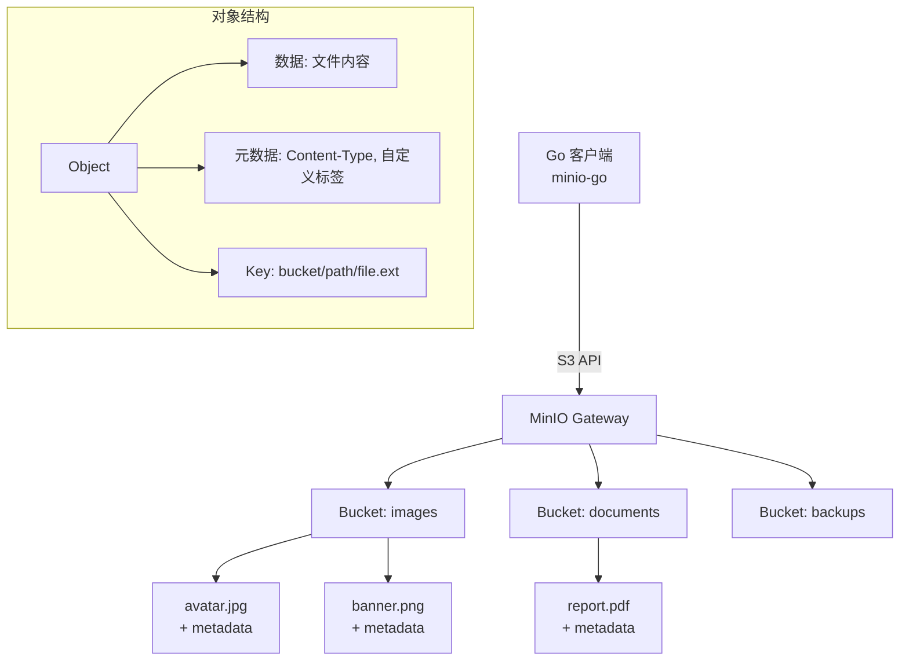
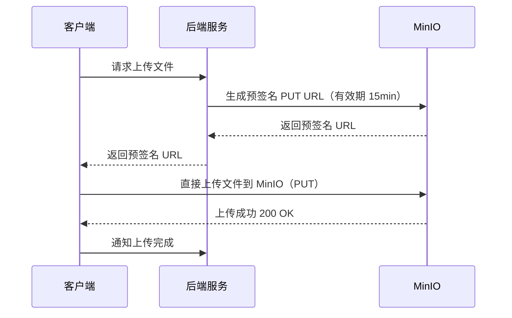
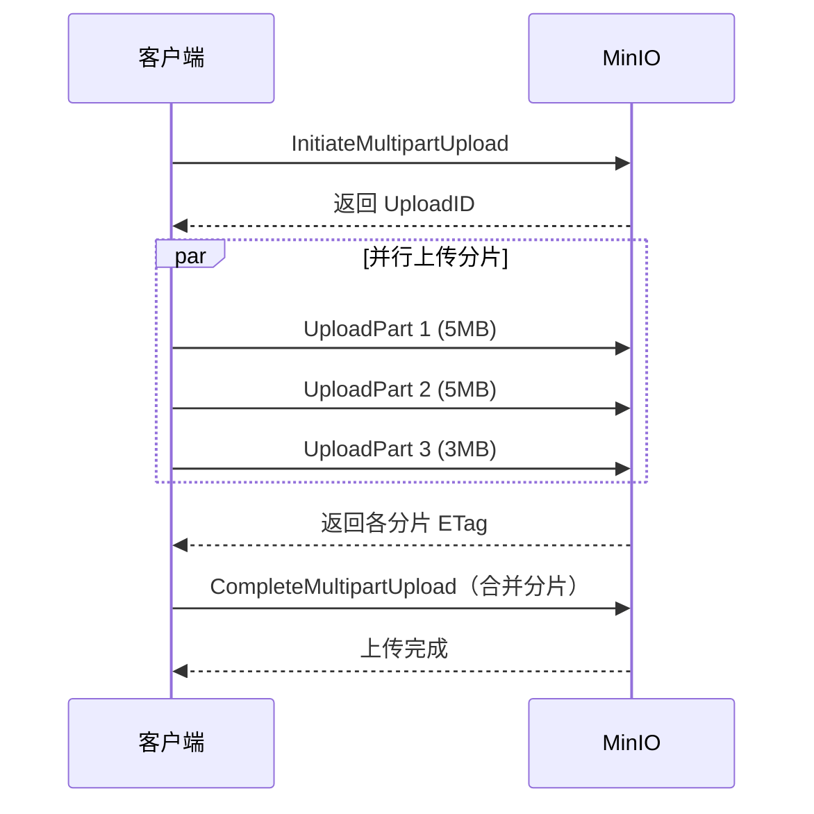

# MinIO 对象存储与 minio-go SDK

## 概念说明

**对象存储**（Object Storage）是一种将数据作为"对象"进行管理的存储架构。与文件系统的层级目录不同，对象存储采用扁平的命名空间，每个对象由三部分组成：

- **数据（Data）**：文件的实际内容（图片、视频、文档等）
- **元数据（Metadata）**：描述对象的键值对（Content-Type、自定义标签等）
- **唯一标识（Key）**：对象在 Bucket 中的唯一路径

**MinIO** 是一个高性能、兼容 S3 API 的开源对象存储系统。它可以私有化部署，也可以作为 AWS S3 的本地替代方案进行开发测试。MinIO 使用 Go 语言编写，天然适合 Go 项目集成。

### 核心概念

| 概念 | 说明 | 类比 |
|------|------|------|
| Bucket | 对象的容器，类似文件系统的根目录 | S3 Bucket |
| Object | 存储的数据单元（文件 + 元数据） | S3 Object |
| Key | 对象在 Bucket 中的唯一路径 | 文件路径 |
| Presigned URL | 临时授权的访问链接 | 带签名的下载链接 |
| Multipart Upload | 大文件分片上传 | 断点续传 |
| Bucket Policy | Bucket 级别的访问控制策略 | ACL |

## 核心原理

### 对象存储架构



### 预签名 URL 流程



### 分片上传流程



## 标准库方案

Go 标准库没有内置对象存储客户端，但可以通过 `net/http` 直接调用 S3 兼容的 REST API。不过在实际项目中，推荐使用 `minio-go` SDK，它封装了签名计算、分片上传、重试等复杂逻辑。

## 第三方库方案

### minio-go SDK

`github.com/minio/minio-go/v7` 是 MinIO 官方 Go SDK，完全兼容 AWS S3 API。

**核心 API：**

```go
// 创建客户端
client, err := minio.New("localhost:9000", &minio.Options{
    Creds:  credentials.NewStaticV4("minioadmin", "minioadmin", ""),
    Secure: false,
})

// Bucket 操作
client.MakeBucket(ctx, "my-bucket", minio.MakeBucketOptions{})
client.BucketExists(ctx, "my-bucket")
client.ListBuckets(ctx)
client.RemoveBucket(ctx, "my-bucket")

// 对象操作
client.PutObject(ctx, bucket, key, reader, size, minio.PutObjectOptions{})
client.GetObject(ctx, bucket, key, minio.GetObjectOptions{})
client.RemoveObject(ctx, bucket, key, minio.RemoveObjectOptions{})
client.StatObject(ctx, bucket, key, minio.StatObjectOptions{})

// 预签名 URL
client.PresignedPutObject(ctx, bucket, key, expiry)
client.PresignedGetObject(ctx, bucket, key, expiry, nil)

// 分片上传（PutObject 自动处理大文件分片）
client.PutObject(ctx, bucket, key, largeReader, -1, minio.PutObjectOptions{
    PartSize: 5 * 1024 * 1024, // 5MB 分片
})
```

**Bucket 策略示例：**

```go
// 设置 Bucket 为公开只读
policy := `{
    "Version": "2012-10-17",
    "Statement": [{
        "Effect": "Allow",
        "Principal": {"AWS": ["*"]},
        "Action": ["s3:GetObject"],
        "Resource": ["arn:aws:s3:::my-bucket/*"]
    }]
}`
client.SetBucketPolicy(ctx, "my-bucket", policy)
```

## 代码示例

> 💻 完整可运行代码：[code-examples/02-web-data/object-storage/minio/](https://github.com/your-repo/code-examples/02-web-data/object-storage/minio/)
> 🏷️ Demo 模式：Part A（内存模拟对象存储）/ Part B（连接真实 MinIO）

## 常见面试题

### Q1: 对象存储和文件系统有什么区别？什么场景用对象存储？

**难度**：⭐⭐ | **频率**：🔥🔥

**答题思路**：

1. 对比存储模型（扁平 vs 层级）
2. 对比访问方式（HTTP API vs 文件路径）
3. 说明对象存储的优势场景

**标准答案**：

对象存储采用扁平命名空间，通过 HTTP REST API 访问，天然支持水平扩展和 CDN 集成。文件系统采用层级目录结构，通过文件路径访问，受限于单机磁盘容量。

对象存储适用场景：图片/视频等静态资源托管、数据备份与归档、大数据分析的数据湖、日志存储。

**深入追问**：

- MinIO 和 AWS S3 的关系是什么？
- 预签名 URL 的安全性如何保证？

### Q2: 什么是预签名 URL？它解决了什么问题？

**难度**：⭐⭐⭐ | **频率**：🔥🔥

**答题思路**：

1. 解释预签名 URL 的概念
2. 说明解决的问题（客户端直传）
3. 安全性考虑

**标准答案**：

预签名 URL 是一个带有临时签名的 URL，允许未认证的客户端在有效期内直接访问对象存储。它解决了"客户端直传"的问题——文件不需要经过后端服务器中转，减少带宽压力和延迟。

安全性保证：URL 包含签名和过期时间，过期后自动失效；可以限制 HTTP 方法（只允许 GET 或 PUT）；签名基于 HMAC-SHA256，无法伪造。

**深入追问**：

- 预签名 URL 过期后会怎样？
- 如何防止预签名 URL 被滥用？

## 常见陷阱

1. **忘记设置 Content-Type**：上传文件时不设置 Content-Type，浏览器下载时可能无法正确识别文件类型。应在 PutObjectOptions 中指定 ContentType
2. **分片大小不合理**：分片太小导致请求数过多，分片太大导致单次上传时间过长。推荐 5MB-100MB，根据网络环境调整
3. **Bucket 命名不规范**：Bucket 名称必须全局唯一（S3）、小写字母、不能以点号结尾。MinIO 私有部署限制较少，但建议遵循 S3 规范
4. **预签名 URL 有效期过长**：设置过长的有效期会增加安全风险，建议上传 URL 15 分钟，下载 URL 根据业务需求设置

## 参考资料

- [MinIO 官方文档](https://min.io/docs/minio/linux/index.html)
- [minio-go SDK 文档](https://pkg.go.dev/github.com/minio/minio-go/v7)
- [AWS S3 API 参考](https://docs.aws.amazon.com/AmazonS3/latest/API/Welcome.html)
- [对象存储概念介绍](https://min.io/product/overview)
