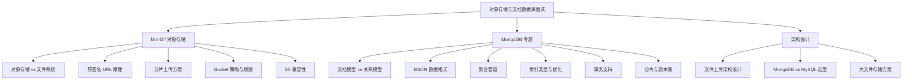

# 对象存储与文档数据库面试指南

## 面试知识图谱

## 高频面试题

### Q1: 对象存储和文件系统有什么区别？什么场景用对象存储？

**难度**：⭐⭐ | **频率**：🔥🔥

**答题思路**：

1. 对比存储模型
2. 对比访问方式和扩展性
3. 列举适用场景

**标准答案**：

| 维度 | 对象存储 | 文件系统 |
|------|---------|---------|
| 命名空间 | 扁平（Bucket + Key） | 层级目录树 |
| 访问方式 | HTTP REST API | 文件路径（POSIX） |
| 扩展性 | 水平扩展，PB 级 | 受限于单机/NFS |
| 元数据 | 自定义键值对 | 固定文件属性 |
| 一致性 | 最终一致性（S3）/ 强一致性（MinIO） | 强一致性 |

适用场景：静态资源托管（图片/视频/CSS/JS）、数据备份与归档、大数据分析的数据湖、日志存储、CDN 源站。

**深入追问**：

- MinIO 和 AWS S3 的关系？能否无缝迁移？
- 对象存储如何保证数据可靠性？

### Q2: 什么是预签名 URL？它解决了什么问题？

**难度**：⭐⭐⭐ | **频率**：🔥🔥

**答题思路**：

1. 概念解释
2. 解决的问题（客户端直传）
3. 安全性保证

**标准答案**：

预签名 URL（Presigned URL）是一个包含临时签名的 URL，允许未认证的客户端在有效期内直接对对象存储进行上传或下载操作。

解决的核心问题是**客户端直传**：文件不经过后端服务器中转，直接上传到对象存储，减少后端带宽压力和延迟。流程为：客户端请求后端 → 后端生成预签名 URL → 客户端直接上传到 MinIO/S3。

安全性保证：URL 包含 HMAC-SHA256 签名和过期时间；可限制 HTTP 方法（GET/PUT）；过期后自动失效；签名无法伪造。

**深入追问**：

- 预签名 URL 的有效期设置多长合适？
- 如何防止用户上传恶意文件？

### Q3: 大文件上传方案设计（分片上传 + 断点续传）

**难度**：⭐⭐⭐⭐ | **频率**：🔥🔥🔥

**答题思路**：

1. 分片上传的原理
2. 断点续传的实现
3. 并发上传优化
4. 错误处理

**标准答案**：

分片上传流程：

1. **初始化**：调用 InitiateMultipartUpload 获取 UploadID
2. **分片上传**：将文件切分为固定大小（如 5MB），并行上传各分片，每个分片返回 ETag
3. **完成合并**：调用 CompleteMultipartUpload，传入所有分片的 ETag，服务端合并文件

断点续传实现：客户端记录已上传的分片编号和 ETag；上传中断后，调用 ListParts 查询已上传分片；只上传缺失的分片，最后合并。

优化策略：并发上传多个分片（控制并发数 3-5）；分片大小根据网络环境调整（5MB-100MB）；失败分片自动重试（指数退避）。

**深入追问**：

- 分片大小如何选择？
- 如果 CompleteMultipartUpload 失败怎么办？
- 如何清理未完成的分片上传？

### Q4: MongoDB 和 MySQL 的区别？什么场景选 MongoDB？

**难度**：⭐⭐ | **频率**：🔥🔥🔥

**答题思路**：

1. 数据模型对比
2. 查询和事务对比
3. 扩展性对比
4. 场景选型

**标准答案**：

| 维度 | MongoDB | MySQL |
|------|---------|-------|
| 数据模型 | 灵活文档（BSON） | 固定表结构（Schema） |
| 查询语言 | MongoDB 查询语法 | SQL |
| 事务 | 4.0+ 多文档事务 | 完整 ACID |
| 扩展 | 原生 Sharding | 主从 + 分库分表 |
| JOIN | `$lookup`（性能一般） | 原生 JOIN（高效） |

选 MongoDB 的场景：内容管理系统（CMS）、用户画像/行为日志、IoT 设备数据、商品目录（属性不固定）、实时分析。

选 MySQL 的场景：金融交易、订单系统、需要复杂关联查询、强一致性要求高。

**深入追问**：

- MongoDB 的事务和 MySQL 事务有什么区别？
- MongoDB 如何实现水平扩展？

### Q5: MongoDB 聚合管道的常用阶段有哪些？

**难度**：⭐⭐⭐ | **频率**：🔥🔥

**答题思路**：

1. 解释管道概念
2. 列举常用阶段及 SQL 对照
3. 性能优化

**标准答案**：

聚合管道是 MongoDB 的数据处理框架，文档依次流经多个阶段，每个阶段进行转换或计算。

| 阶段 | 作用 | SQL 对照 |
|------|------|---------|
| `$match` | 过滤文档 | WHERE |
| `$group` | 分组聚合 | GROUP BY |
| `$sort` | 排序 | ORDER BY |
| `$project` | 字段投影 | SELECT |
| `$limit` / `$skip` | 分页 | LIMIT / OFFSET |
| `$lookup` | 关联查询 | LEFT JOIN |
| `$unwind` | 展开数组 | — |
| `$addFields` | 添加计算字段 | AS |

性能优化：`$match` 尽量放在管道前面（利用索引）；避免 `$lookup` 处理大数据集；使用 `$project` 减少传递的字段数量。

**深入追问**：

- `$lookup` 的性能瓶颈在哪里？
- 如何用聚合管道实现分页？

### Q6: MongoDB 的索引类型有哪些？如何优化查询？

**难度**：⭐⭐⭐ | **频率**：🔥🔥🔥

**答题思路**：

1. 列举索引类型
2. 索引选择原则
3. 优化技巧

**标准答案**：

索引类型：单字段索引、复合索引、唯一索引、文本索引、哈希索引、TTL 索引、地理空间索引（2dsphere）。

优化原则：

1. **ESR 原则**：复合索引字段顺序为 Equality → Sort → Range
2. **覆盖索引**：查询字段全部在索引中，避免回表
3. **使用 explain()**：分析查询计划，确认使用了索引（IXSCAN）而非全集合扫描（COLLSCAN）
4. **避免低选择性索引**：布尔字段等低基数字段不适合单独建索引
5. **TTL 索引**：自动清理过期数据（日志、会话等）

**深入追问**：

- MongoDB 的索引底层数据结构是什么？（B-Tree）
- 什么情况下索引会失效？

### Q7: MongoDB 的事务支持是怎样的？

**难度**：⭐⭐⭐ | **频率**：🔥🔥

**答题思路**：

1. 事务发展历程
2. 多文档事务的使用
3. 限制和注意事项

**标准答案**：

MongoDB 事务发展：3.x 只支持单文档原子性；4.0 支持副本集多文档事务；4.2 支持分片集群多文档事务。

使用方式：通过 Session 开启事务，在事务中执行多个操作，最后提交或回滚。mongo-go-driver 提供 `session.WithTransaction()` 方法，自动处理重试和回滚。

注意事项：事务有 60 秒超时限制；事务中的操作不能跨数据库；事务会增加 WiredTiger 存储引擎的压力；优先通过文档模型设计避免事务（嵌套文档替代关联表）。

**深入追问**：

- MongoDB 事务的隔离级别是什么？（Snapshot Isolation）
- 为什么说 MongoDB 应该优先通过文档设计避免事务？

## 面试技巧

### 对象存储相关

1. 提到 MinIO 时，强调它与 S3 API 的兼容性，说明可以无缝迁移到 AWS S3
2. 文件上传方案设计是高频架构题，重点讲预签名 URL + 分片上传
3. 对比对象存储和文件系统时，从扩展性、访问方式、元数据三个维度展开

### MongoDB 相关

1. MongoDB vs MySQL 是必考题，不要简单说"MongoDB 是 NoSQL"，要从数据模型、事务、扩展性等维度深入对比
2. 聚合管道是 MongoDB 的核心特性，能用 SQL 对照解释会加分
3. 索引优化是实战题，结合 explain() 分析查询计划来回答
4. 事务相关问题，强调"优先通过文档模型设计避免事务"的最佳实践
