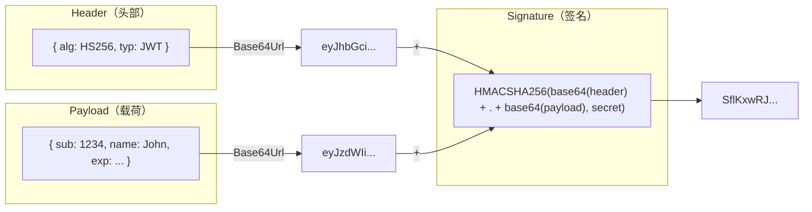
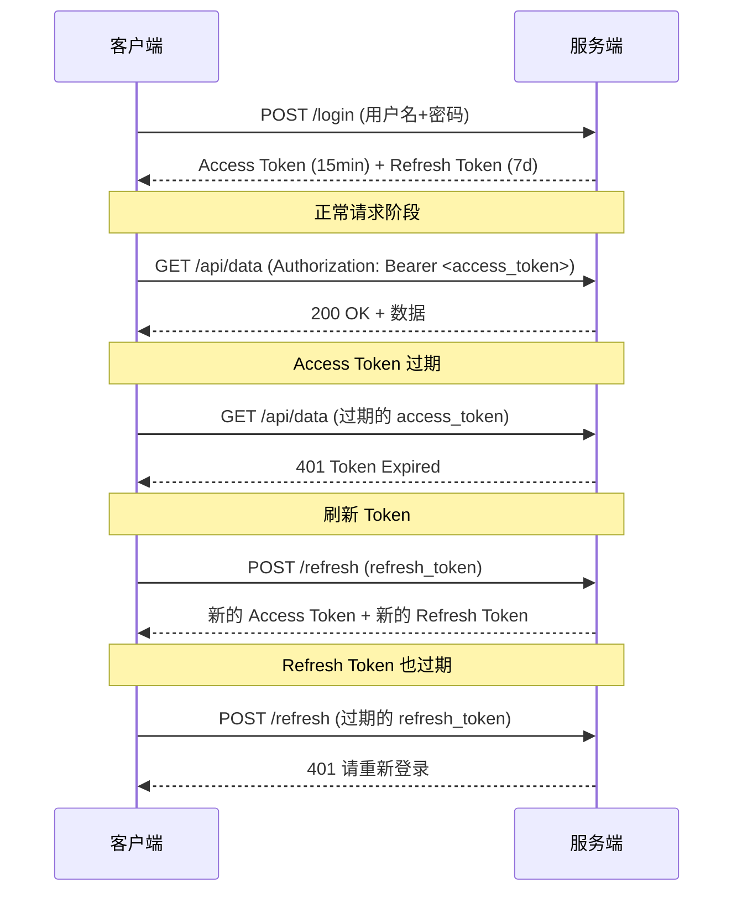

# JWT 认证

## 概念说明

JWT（JSON Web Token）是一种基于 JSON 的开放标准（RFC 7519），用于在各方之间安全传输信息。JWT 是**无状态**的认证方案——服务端不需要存储 Session，Token 本身携带了所有必要信息，非常适合分布式微服务架构。

**JWT vs Session 对比：**

| 维度 | JWT | Session |
|------|-----|---------|
| 存储位置 | 客户端（Header/Cookie） | 服务端（内存/Redis） |
| 扩展性 | 天然支持分布式 | 需要共享 Session（Redis） |
| 性能 | 每次请求需解析 Token | 每次请求需查询存储 |
| 注销 | 困难（需黑名单机制） | 简单（删除 Session） |
| 大小 | 较大（包含 Payload） | 较小（仅 Session ID） |
| 适用场景 | 微服务/移动端/第三方 API | 传统 Web 应用 |

## 核心原理

### JWT 结构

JWT 由三部分组成，用 `.` 分隔：`Header.Payload.Signature`

```
eyJhbGciOiJIUzI1NiIsInR5cCI6IkpXVCJ9.
eyJzdWIiOiIxMjM0NTY3ODkwIiwibmFtZSI6IkpvaG4gRG9lIiwiaWF0IjoxNTE2MjM5MDIyfQ.
SflKxwRJSMeKKF2QT4fwpMeJf36POk6yJV_adQssw5c
```



**三部分详解：**

1. **Header**：声明 Token 类型和签名算法（HS256/RS256）
2. **Payload**：携带声明（Claims），包括标准声明（iss/sub/exp/iat）和自定义声明（user_id/role）
3. **Signature**：对 Header 和 Payload 的签名，防止篡改

### Access Token + Refresh Token 双令牌机制



**为什么需要双令牌？**

- **Access Token** 有效期短（15min），即使泄露影响有限
- **Refresh Token** 有效期长（7d），仅用于刷新，不携带在每次请求中
- 兼顾安全性和用户体验

## 标准库方案

Go 标准库没有内置 JWT 支持，但可以用 `crypto/hmac` + `encoding/base64` 手动实现（仅用于理解原理，生产环境请使用 golang-jwt）。

## 第三方库方案

### golang-jwt/jwt/v5

`github.com/golang-jwt/jwt/v5` 是 Go 生态最主流的 JWT 库（原 dgrijalva/jwt-go 的官方继承者）。

**核心 API：**

```go
// 创建 Token
token := jwt.NewWithClaims(jwt.SigningMethodHS256, claims)
tokenString, err := token.SignedString([]byte(secret))

// 解析 Token
token, err := jwt.ParseWithClaims(tokenString, &CustomClaims{}, func(t *jwt.Token) (interface{}, error) {
    return []byte(secret), nil
})

// 提取 Claims
claims := token.Claims.(*CustomClaims)
```

## 代码示例

> 💻 完整可运行代码：[code-examples/02-web-data/auth/jwt/](https://github.com/skyhe58/guide-go/tree/main/code-examples/02-web-data/auth/jwt/)
> 🏷️ Demo 模式：纯 Go（直接运行，无需 Docker）

## 常见面试题

### Q1: JWT 和 Session 的区别？各自适用场景？

**难度**：⭐⭐ | **频率**：🔥🔥🔥

**答题思路**：

1. 从存储位置、扩展性、安全性三个维度对比
2. 说明各自适用场景
3. 提到 JWT 的注销难题

**标准答案**：

JWT 是无状态的，Token 存储在客户端，服务端不保存状态，天然支持分布式；Session 是有状态的，Session 数据存储在服务端，分布式环境需要共享 Session（通常用 Redis）。JWT 适合微服务、移动端、第三方 API 场景；Session 适合传统 Web 应用。JWT 的主要缺点是注销困难，需要额外的黑名单机制。

### Q2: JWT Token 泄露了怎么办？

**难度**：⭐⭐⭐ | **频率**：🔥🔥🔥

**答题思路**：

1. 缩短 Access Token 有效期
2. Token 黑名单机制（Redis 存储已注销 Token）
3. Token 绑定客户端指纹（IP/User-Agent）
4. 使用 HTTPS 防止传输层泄露

### Q3: 为什么需要 Access Token + Refresh Token 双令牌？

**难度**：⭐⭐⭐ | **频率**：🔥🔥🔥

**标准答案**：

Access Token 有效期短（通常 15 分钟），即使泄露影响有限；Refresh Token 有效期长（通常 7 天），仅用于获取新的 Access Token，不会在每次 API 请求中传输，降低泄露风险。这种设计兼顾了安全性和用户体验。

## 常见陷阱

1. **密钥硬编码**：JWT 签名密钥不应硬编码在代码中，应通过环境变量或配置中心管理
2. **算法混淆攻击**：解析 Token 时必须指定期望的签名算法，防止攻击者将 alg 改为 none
3. **Token 存储位置**：LocalStorage 容易受 XSS 攻击，HttpOnly Cookie 更安全但需处理 CSRF
4. **Payload 存敏感信息**：JWT Payload 仅 Base64 编码（非加密），不要存储密码等敏感信息
5. **忽略过期检查**：解析 Token 时必须验证 exp 声明，golang-jwt 默认会检查

## 参考资料

- [JWT 官方网站](https://jwt.io/)
- [RFC 7519 - JSON Web Token](https://datatracker.ietf.org/doc/html/rfc7519)
- [golang-jwt GitHub](https://github.com/golang-jwt/jwt)
