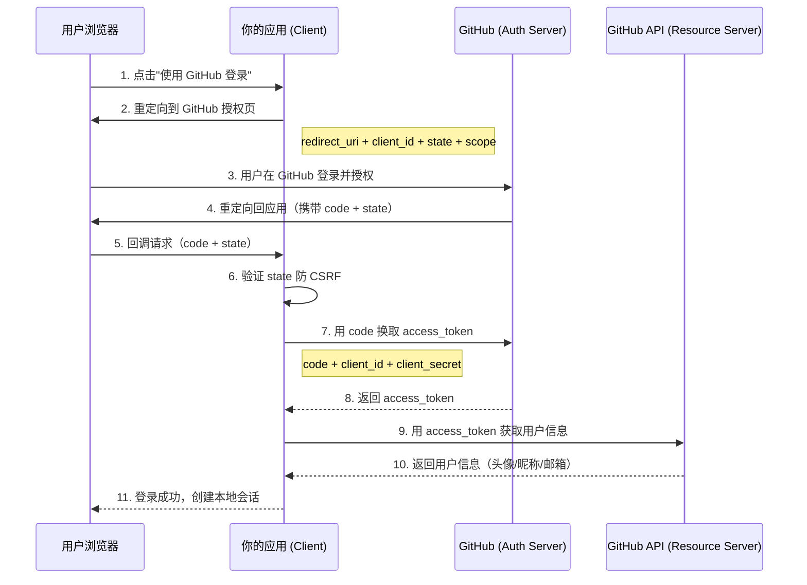

# OAuth2 授权

## 概念说明

OAuth2（Open Authorization 2.0）是一个授权框架（RFC 6749），允许第三方应用在用户授权的情况下访问用户在另一个服务上的资源，而无需暴露用户的密码。最常见的场景就是"使用 GitHub/Google/微信 登录"。

**核心角色：**

| 角色 | 说明 | 示例 |
|------|------|------|
| Resource Owner | 资源所有者（用户） | GitHub 用户 |
| Client | 第三方应用 | 你的 Go 应用 |
| Authorization Server | 授权服务器 | GitHub OAuth |
| Resource Server | 资源服务器 | GitHub API |

## 核心原理

### 四种授权模式

| 模式 | 适用场景 | 安全性 | 是否推荐 |
|------|---------|--------|---------|
| **授权码模式**（Authorization Code） | Web 应用后端 | ⭐⭐⭐⭐⭐ | ✅ 最推荐 |
| **隐式模式**（Implicit） | 纯前端 SPA | ⭐⭐ | ❌ 已废弃 |
| **密码模式**（Resource Owner Password） | 高度信任的第一方应用 | ⭐⭐⭐ | ⚠️ 谨慎使用 |
| **客户端凭证模式**（Client Credentials） | 服务间通信（M2M） | ⭐⭐⭐⭐ | ✅ 适合 M2M |

### 授权码模式流程（最常用）



### State 参数防 CSRF

State 是一个随机字符串，由客户端生成并在授权请求中发送，授权服务器会原样返回。客户端必须验证返回的 state 与发送的一致，防止 CSRF 攻击。

### OIDC（OpenID Connect）

OIDC 是建立在 OAuth2 之上的身份认证协议。OAuth2 只解决"授权"问题，OIDC 在此基础上增加了"认证"能力：

- OAuth2 返回 `access_token`（用于访问资源）
- OIDC 额外返回 `id_token`（JWT 格式，包含用户身份信息）

## 标准库方案

Go 官方扩展库 `golang.org/x/oauth2` 提供了 OAuth2 客户端实现：

```go
import "golang.org/x/oauth2"
import "golang.org/x/oauth2/github"

conf := &oauth2.Config{
    ClientID:     "your-client-id",
    ClientSecret: "your-client-secret",
    Scopes:       []string{"user:email"},
    Endpoint:     github.Endpoint,
}

// 生成授权 URL
url := conf.AuthCodeURL("random-state", oauth2.AccessTypeOnline)

// 用 code 换取 token
token, err := conf.Exchange(ctx, code)
```

## 代码示例

> 💻 完整可运行代码：[code-examples/02-web-data/auth/oauth2/](https://github.com/your-repo/code-examples/02-web-data/auth/oauth2/)
> 🏷️ Demo 模式：纯 Go（模拟 OAuth2 授权码流程，无需真实 GitHub 应用）

## 常见面试题

### Q1: OAuth2 授权码模式的完整流程？

**难度**：⭐⭐⭐ | **频率**：🔥🔥🔥

**答题思路**：

1. 用户点击第三方登录，应用重定向到授权服务器
2. 用户授权后，授权服务器回调应用并携带 code
3. 应用用 code + client_secret 换取 access_token
4. 应用用 access_token 获取用户信息

**深入追问**：

- 为什么不直接返回 access_token 而是先返回 code？（防止 Token 在浏览器 URL 中泄露）
- state 参数的作用？（防 CSRF 攻击）

### Q2: OAuth2 和 JWT 的关系？

**难度**：⭐⭐⭐ | **频率**：🔥🔥

**标准答案**：

OAuth2 是一个授权框架，定义了授权流程；JWT 是一种 Token 格式。两者可以结合使用——OAuth2 的 access_token 可以是 JWT 格式（也可以是不透明字符串）。OIDC 协议中的 id_token 必须是 JWT 格式。

## 常见陷阱

1. **不验证 state 参数**：必须验证 state 防止 CSRF 攻击
2. **client_secret 泄露**：client_secret 只能在后端使用，绝不能暴露给前端
3. **scope 过大**：只请求必要的权限范围，遵循最小权限原则
4. **Token 存储不当**：access_token 应安全存储，不要记录到日志中

## 参考资料

- [RFC 6749 - OAuth 2.0 Authorization Framework](https://datatracker.ietf.org/doc/html/rfc6749)
- [golang.org/x/oauth2](https://pkg.go.dev/golang.org/x/oauth2)
- [OpenID Connect 规范](https://openid.net/connect/)
