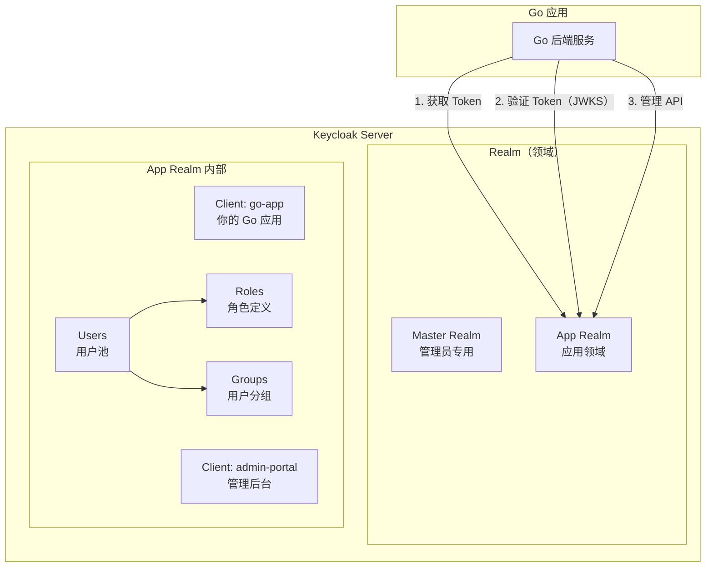
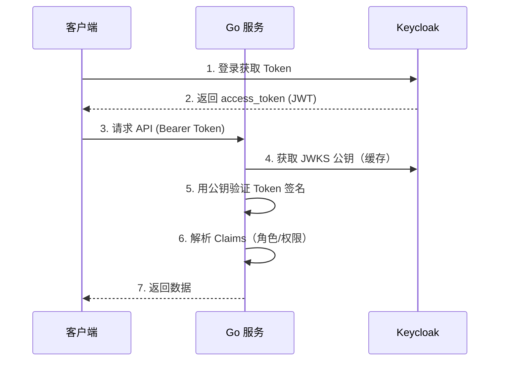

# Keycloak 身份管理

## 概念说明

Keycloak 是 Red Hat 开源的身份和访问管理（IAM）系统，提供开箱即用的 SSO（单点登录）、OAuth2、OpenID Connect、SAML 2.0 支持。在企业级项目中，Keycloak 可以替代自建的用户认证系统，统一管理用户、角色、权限。

**为什么用 Keycloak 而不是自建认证？**

| 维度 | 自建认证 | Keycloak |
|------|---------|----------|
| 开发成本 | 高（需实现注册/登录/密码重置/MFA 等） | 低（开箱即用） |
| 安全性 | 需自行处理密码加密/Token 管理/漏洞修复 | 经过大量安全审计 |
| SSO 支持 | 需自行实现 | 内置支持 |
| 第三方登录 | 需逐个对接 | 内置 GitHub/Google/微信等 |
| 适用场景 | 简单应用/学习 | 企业级多应用/多租户 |

## 核心原理

### Keycloak 架构



### 核心概念

| 概念 | 说明 |
|------|------|
| **Realm** | 领域，隔离的认证空间，类似"租户" |
| **Client** | 客户端应用，每个接入 Keycloak 的应用注册为一个 Client |
| **User** | 用户，存储在 Realm 中 |
| **Role** | 角色，分为 Realm Role 和 Client Role |
| **Group** | 用户分组，可批量分配角色 |
| **JWKS** | JSON Web Key Set，Keycloak 公开的公钥集合，用于验证 Token 签名 |

### Go 集成 Keycloak 流程



## Docker 部署

```bash
# 启动 Keycloak（开发模式，内置 H2 数据库）
docker compose -f docker/docker-compose.auth.yml up -d

# 访问管理控制台
# URL: http://localhost:8080
# 用户名: admin
# 密码: admin
```

## 代码示例

> 💻 完整可运行代码：[code-examples/02-web-data/auth/keycloak/](https://github.com/your-repo/code-examples/02-web-data/auth/keycloak/)
> 🏷️ Demo 模式：混合（Part A 模拟 OIDC 验证 / Part B 连接真实 Keycloak）

## 常见面试题

### Q1: Keycloak 的 Realm 和 Client 分别是什么？

**难度**：⭐⭐ | **频率**：🔥🔥

**标准答案**：

Realm 是 Keycloak 中的隔离空间，类似于"租户"概念，不同 Realm 的用户、角色、配置完全独立。Client 是注册在 Realm 中的应用，每个需要接入 Keycloak 认证的应用都需要注册为一个 Client，配置回调 URL、授权类型等。

### Q2: Go 服务如何验证 Keycloak 签发的 Token？

**难度**：⭐⭐⭐ | **频率**：🔥🔥

**标准答案**：

Go 服务通过 Keycloak 的 JWKS（JSON Web Key Set）端点获取公钥，然后用公钥验证 JWT Token 的 RS256 签名。JWKS 端点 URL 格式为 `http://keycloak:8080/realms/{realm}/protocol/openid-connect/certs`。公钥应该缓存并定期刷新。

## 常见陷阱

1. **生产环境用开发模式**：`start-dev` 仅用于开发，生产环境需要 `start` 并配置外部数据库
2. **不缓存 JWKS 公钥**：每次请求都去 Keycloak 获取公钥会造成性能瓶颈
3. **忽略 Token 的 audience 验证**：验证 Token 时应检查 aud 声明是否匹配你的 Client ID

## 参考资料

- [Keycloak 官方文档](https://www.keycloak.org/documentation)
- [Keycloak REST API](https://www.keycloak.org/docs-api/24.0/rest-api/)
- [Keycloak Docker Hub](https://quay.io/repository/keycloak/keycloak)
