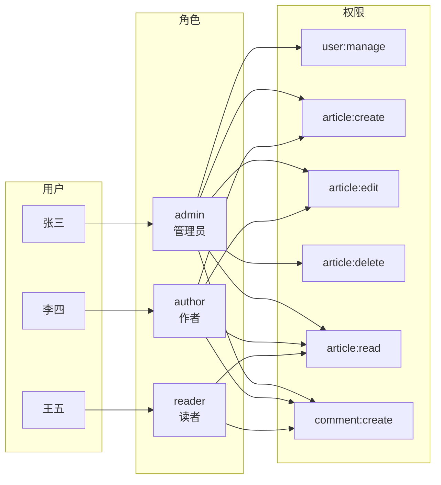
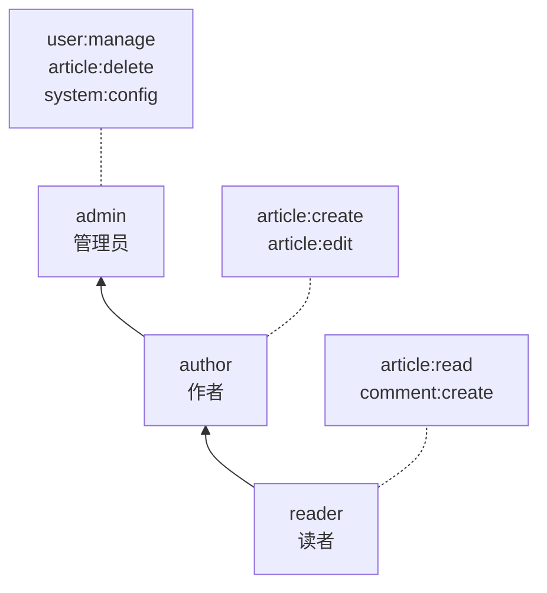

# RBAC 权限模型

## 概念说明

RBAC（Role-Based Access Control，基于角色的访问控制）是最常用的权限控制模型。核心思想是：**用户不直接关联权限，而是通过角色间接获得权限**。这样当权限变更时，只需修改角色的权限定义，而不需要逐个修改用户。

**三种主流权限模型对比：**

| 模型 | 说明 | 适用场景 |
|------|------|---------|
| **ACL** | 直接给用户分配权限 | 简单系统 |
| **RBAC** | 用户 → 角色 → 权限 | 大多数业务系统 |
| **ABAC** | 基于属性（用户/资源/环境）动态判断 | 复杂策略系统 |

## 核心原理

### 用户-角色-权限三层模型



### 角色继承（层级 RBAC）



admin 继承 author 的所有权限，author 继承 reader 的所有权限。

### Go 实现 RBAC

```go
// 权限定义
type Permission string

const (
    PermArticleRead   Permission = "article:read"
    PermArticleCreate Permission = "article:create"
    PermArticleEdit   Permission = "article:edit"
    PermArticleDelete Permission = "article:delete"
    PermUserManage    Permission = "user:manage"
)

// 角色-权限映射
var rolePermissions = map[string][]Permission{
    "admin":  {PermArticleRead, PermArticleCreate, PermArticleEdit, PermArticleDelete, PermUserManage},
    "author": {PermArticleRead, PermArticleCreate, PermArticleEdit},
    "reader": {PermArticleRead},
}

// 权限检查
func HasPermission(role string, perm Permission) bool {
    perms, ok := rolePermissions[role]
    if !ok {
        return false
    }
    for _, p := range perms {
        if p == perm {
            return true
        }
    }
    return false
}
```

## 代码示例

> 💻 完整可运行代码：[code-examples/02-web-data/auth/rbac-casbin/](https://github.com/skyhe58/guide-go/tree/main/code-examples/02-web-data/auth/rbac-casbin/)
> 🏷️ Demo 模式：纯 Go（直接运行，无需 Docker）

## 常见面试题

### Q1: RBAC 模型的核心思想？

**难度**：⭐⭐ | **频率**：🔥🔥🔥

**标准答案**：

RBAC 的核心思想是将权限分配给角色，再将角色分配给用户，实现用户与权限的解耦。好处是权限变更时只需修改角色定义，不需要逐个修改用户权限，降低管理复杂度。

### Q2: RBAC 和 ABAC 的区别？

**难度**：⭐⭐⭐ | **频率**：🔥🔥

**标准答案**：

RBAC 基于角色判断权限，规则是静态的（用户有什么角色就有什么权限）；ABAC 基于属性动态判断，可以根据用户属性、资源属性、环境属性（如时间、IP）组合判断。ABAC 更灵活但更复杂，适合需要细粒度动态策略的场景。

## 常见陷阱

1. **角色爆炸**：角色数量过多导致管理困难，应合理设计角色层级
2. **硬编码权限**：权限检查不应硬编码在业务代码中，应通过中间件或策略引擎统一管理
3. **忽略超级管理员**：系统应有一个不受权限限制的超级管理员角色，防止权限配置错误导致所有人被锁定

## 参考资料

- [NIST RBAC 标准](https://csrc.nist.gov/projects/role-based-access-control)
- [Casbin 官方文档](https://casbin.org/docs/overview)
