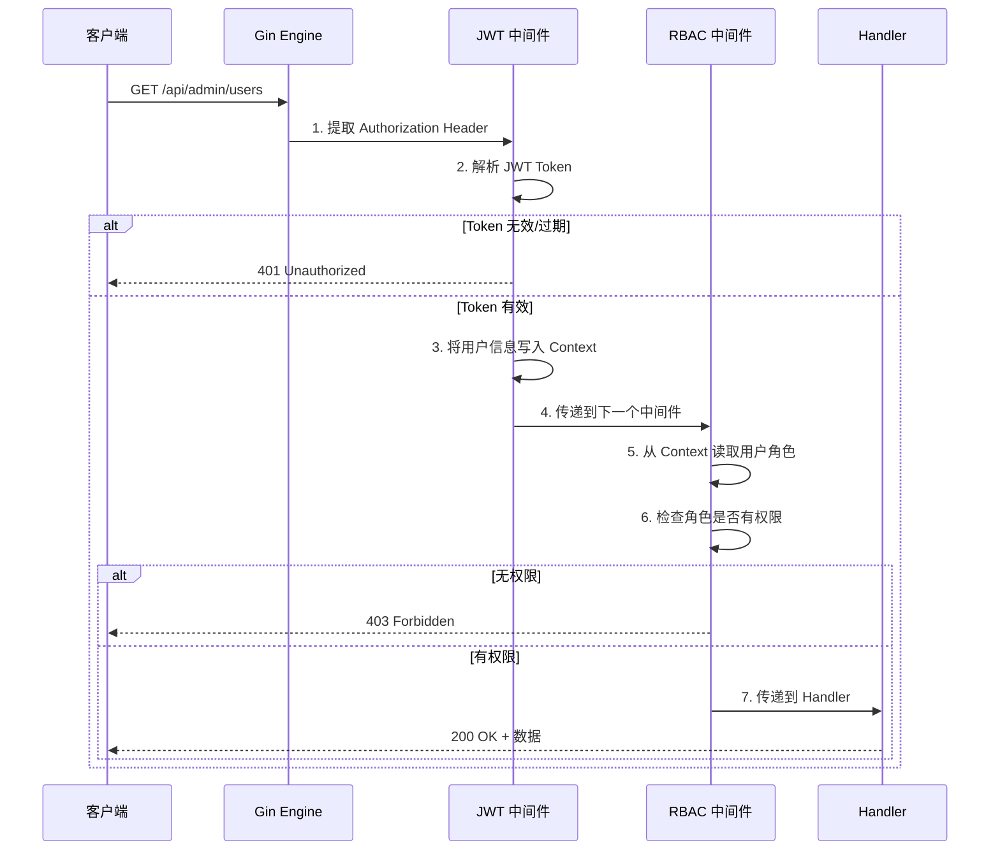

# Gin 鉴权中间件

## 概念说明

在 Gin 框架中，中间件（Middleware）是处理 HTTP 请求的拦截器，可以在请求到达 Handler 之前或之后执行逻辑。鉴权中间件是最常用的中间件之一，负责验证用户身份和检查权限。

**典型的中间件链：**

```
请求 → CORS → RequestID → Logger → Recovery → RateLimiter → JWT Auth → RBAC → Handler
```

## 核心原理

### Gin 中间件执行流程



### 路由级别权限控制

```go
// 公开路由（无需认证）
public := r.Group("/api")
{
    public.POST("/register", userHandler.Register)
    public.POST("/login", userHandler.Login)
}

// 需要认证的路由
auth := r.Group("/api")
auth.Use(JWTAuthMiddleware())
{
    auth.GET("/profile", userHandler.Profile)
    auth.POST("/refresh", userHandler.RefreshToken)
}

// 需要特定角色的路由
admin := r.Group("/api/admin")
admin.Use(JWTAuthMiddleware(), RBACMiddleware("admin"))
{
    admin.GET("/users", adminHandler.ListUsers)
    admin.DELETE("/users/:id", adminHandler.DeleteUser)
}
```

## 代码示例

> 💻 完整可运行代码：[code-examples/02-web-data/auth/gin-auth-middleware/](https://github.com/your-repo/code-examples/02-web-data/auth/gin-auth-middleware/)
> 🏷️ Demo 模式：纯 Go（使用 httptest 模拟请求，无需启动服务器）

## 常见面试题

### Q1: Gin 中间件的执行顺序？c.Next() 和 c.Abort() 的区别？

**难度**：⭐⭐ | **频率**：🔥🔥🔥

**标准答案**：

Gin 中间件按注册顺序执行。`c.Next()` 会暂停当前中间件，执行后续中间件和 Handler，然后回到当前中间件继续执行（洋葱模型）。`c.Abort()` 会阻止后续中间件和 Handler 的执行，但不会阻止当前中间件中 `c.Abort()` 之后的代码执行。

### Q2: 如何在 Gin 中间件中传递用户信息？

**难度**：⭐⭐ | **频率**：🔥🔥🔥

**标准答案**：

使用 `c.Set(key, value)` 在中间件中存储数据，在 Handler 中使用 `c.Get(key)` 或 `c.MustGet(key)` 获取。例如 JWT 中间件解析 Token 后，将用户 ID 和角色存入 Context，后续 Handler 可以直接读取。

## 常见陷阱

1. **中间件顺序错误**：Recovery 中间件应放在最前面，确保能捕获所有 panic
2. **c.Abort() 后继续执行**：调用 `c.Abort()` 后应立即 return，否则当前函数中后续代码仍会执行
3. **Context 键名冲突**：使用有意义的键名（如 `"user_id"`），避免与其他中间件冲突

## 参考资料

- [Gin 中间件文档](https://gin-gonic.com/docs/examples/custom-middleware/)
- [Gin GitHub](https://github.com/gin-gonic/gin)
