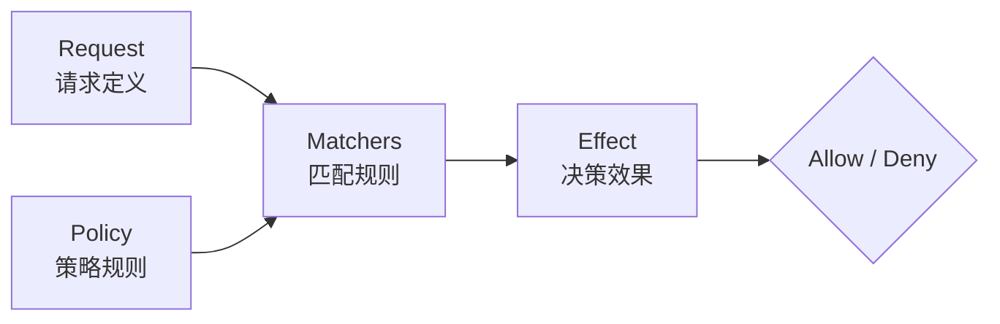

# Casbin 权限框架

## 概念说明

Casbin 是一个强大的、高效的开源访问控制框架，支持多种访问控制模型（ACL、RBAC、ABAC 等）。Casbin 的核心设计是将**访问控制模型（Model）**和**策略规则（Policy）**分离，通过配置文件定义模型，通过策略文件或数据库存储规则。

**Casbin 的核心优势：**

- 支持多种模型：ACL、RBAC（含层级）、ABAC、RESTful
- 模型与策略分离：修改权限规则不需要改代码
- 高性能：内存中执行策略匹配
- 多语言支持：Go、Java、Python、Node.js 等
- 持久化支持：文件、数据库（MySQL/PostgreSQL/Redis）

## 核心原理

### PERM 模型

Casbin 使用 PERM（Policy, Effect, Request, Matchers）元模型：



| 元素 | 说明 | 示例 |
|------|------|------|
| **Request** | 访问请求的定义 | `r = sub, obj, act` |
| **Policy** | 策略规则的定义 | `p = sub, obj, act` |
| **Matchers** | 请求与策略的匹配规则 | `m = r.sub == p.sub && r.obj == p.obj && r.act == p.act` |
| **Effect** | 多条策略匹配时的决策 | `e = some(where (p.eft == allow))` |

### RBAC 模型配置

```ini
# model.conf
[request_definition]
r = sub, obj, act

[policy_definition]
p = sub, obj, act

[role_definition]
g = _, _

[policy_effect]
e = some(where (p.eft == allow))

[matchers]
m = g(r.sub, p.sub) && r.obj == p.obj && r.act == p.act
```

### 策略规则

```csv
# policy.csv
p, admin, /api/users, GET
p, admin, /api/users, POST
p, admin, /api/users, DELETE
p, author, /api/articles, GET
p, author, /api/articles, POST
p, reader, /api/articles, GET

# 角色继承
g, alice, admin
g, bob, author
g, charlie, reader
```

### RESTful 路径匹配

Casbin 支持 `keyMatch`、`keyMatch2` 等内置函数进行 URL 路径匹配：

```ini
[matchers]
m = g(r.sub, p.sub) && keyMatch2(r.obj, p.obj) && r.act == p.act
```

```csv
p, admin, /api/users/:id, DELETE
# 匹配 /api/users/123、/api/users/456 等
```

## 代码示例

> 💻 完整可运行代码：[code-examples/02-web-data/auth/rbac-casbin/](https://github.com/your-repo/code-examples/02-web-data/auth/rbac-casbin/)
> 🏷️ Demo 模式：纯 Go（直接运行，无需 Docker）

## 常见面试题

### Q1: Casbin 的 Model 和 Policy 分别是什么？

**难度**：⭐⭐ | **频率**：🔥🔥

**标准答案**：

Model 定义了访问控制的模型结构（请求格式、策略格式、匹配规则、决策效果），是"规则的规则"；Policy 是具体的权限规则数据（谁对什么资源有什么操作权限）。Model 通常写在配置文件中，Policy 可以存储在文件或数据库中。

### Q2: Casbin 支持哪些访问控制模型？

**难度**：⭐⭐ | **频率**：🔥🔥

**标准答案**：

Casbin 支持 ACL（访问控制列表）、RBAC（基于角色，含角色层级）、ABAC（基于属性）、RESTful（基于 HTTP 方法和路径）等模型。通过修改 Model 配置文件即可切换模型，无需修改代码。

## 常见陷阱

1. **忘记加载策略**：创建 Enforcer 后必须确保策略已加载，否则所有请求都会被拒绝
2. **路径匹配不精确**：使用 `keyMatch2` 而非简单字符串比较，支持 RESTful 路径参数
3. **策略缓存**：修改数据库中的策略后需要调用 `LoadPolicy()` 重新加载

## 参考资料

- [Casbin 官方文档](https://casbin.org/docs/overview)
- [Casbin Go SDK](https://github.com/casbin/casbin)
- [Casbin 在线编辑器](https://casbin.org/editor/)
