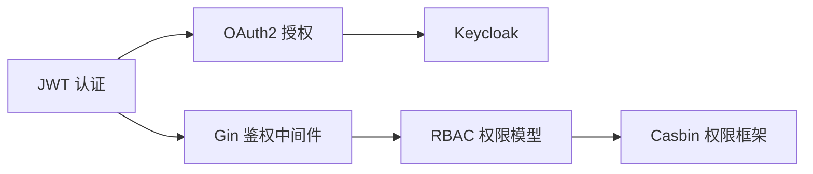

# 认证鉴权

> **前置依赖：** [Go 基础语法](/1-go-core/1.1-go-basics/) | [网络编程与 Web 框架](/2-web-data/2.1-web-framework/)

## 模块概述

认证（Authentication）解决"你是谁"的问题，鉴权（Authorization）解决"你能做什么"的问题。在现代 Web 后端开发中，JWT 是最主流的无状态认证方案，OAuth2 是第三方登录的事实标准，RBAC 是最常用的权限控制模型。

本模块系统讲解 JWT、OAuth2、Keycloak、RBAC、Gin 鉴权中间件、Casbin 权限框架等核心知识点，覆盖从 Token 签发到权限校验的完整链路。

## 知识点索引

### 认证方案

| 序号 | 知识点 | 难度 | 面试频率 | 预计时间 |
|------|--------|------|---------|---------|
| 01 | [JWT 认证](./01-jwt.md) | ⭐⭐⭐ | 🔥🔥🔥 | 50min |
| 02 | [OAuth2 授权](./02-oauth2.md) | ⭐⭐⭐ | 🔥🔥🔥 | 50min |
| 03 | [Keycloak 身份管理](./03-keycloak.md) | ⭐⭐⭐ | 🔥🔥 | 45min |

### 权限控制

| 序号 | 知识点 | 难度 | 面试频率 | 预计时间 |
|------|--------|------|---------|---------|
| 04 | [RBAC 权限模型](./04-rbac.md) | ⭐⭐⭐ | 🔥🔥🔥 | 40min |
| 05 | [Gin 鉴权中间件](./05-gin-middleware.md) | ⭐⭐ | 🔥🔥🔥 | 45min |
| 06 | [Casbin 权限框架](./06-casbin.md) | ⭐⭐⭐ | 🔥🔥 | 45min |

### 面试指南

| 📝 | [面试指南](./interview.md) | - | 🔥🔥🔥 | 60min |
|------|--------|------|---------|---------|

## 代码示例

> 💻 完整可运行代码：[code-examples/02-web-data/auth/](https://github.com/skyhe58/guide-go/tree/main/code-examples/02-web-data/auth/)

| 示例目录 | 对应知识点 | 运行方式 | Demo 模式 |
|---------|-----------|---------|----------|
| `jwt/` | JWT 签发与验证（含 Refresh Token） | `go run ./jwt/` | 纯 Go |
| `oauth2/` | OAuth2 第三方登录（GitHub） | `go run ./oauth2/` | 纯 Go |
| `keycloak/` | Keycloak 集成（Token 验证 + 用户信息） | `go run ./keycloak/` / `go run ./keycloak/ real` | 混合 |
| `gin-auth-middleware/` | Gin JWT 鉴权中间件完整链路 | `go run ./gin-auth-middleware/` | 纯 Go |
| `rbac-casbin/` | RBAC 权限控制（Casbin） | `go run ./rbac-casbin/` | 纯 Go |

## Docker 依赖

```bash
# 启动 Keycloak（keycloak/ 示例的 Part B 需要）
docker compose -f docker/docker-compose.auth.yml up -d
```

## 学习路径建议



1. **先学 JWT**：理解 Token 认证的核心原理，这是后续所有内容的基础
2. **再学 Gin 中间件**：将 JWT 集成到 Web 框架中，理解中间件链
3. **然后学 OAuth2**：掌握第三方登录的标准协议
4. **接着学 RBAC**：理解权限控制的经典模型
5. **最后学 Casbin/Keycloak**：了解企业级权限框架和 IAM 系统
